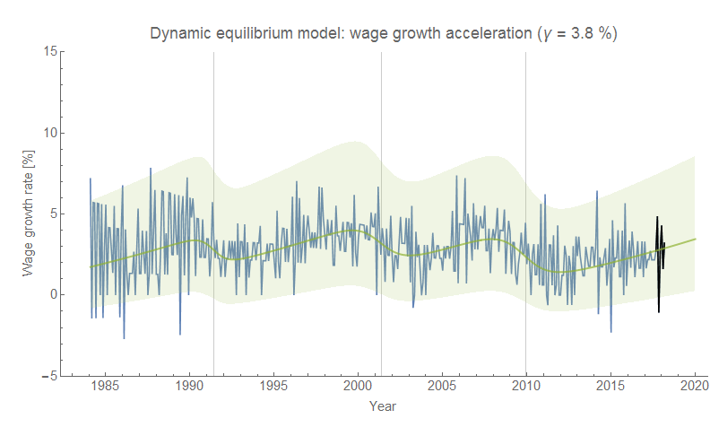
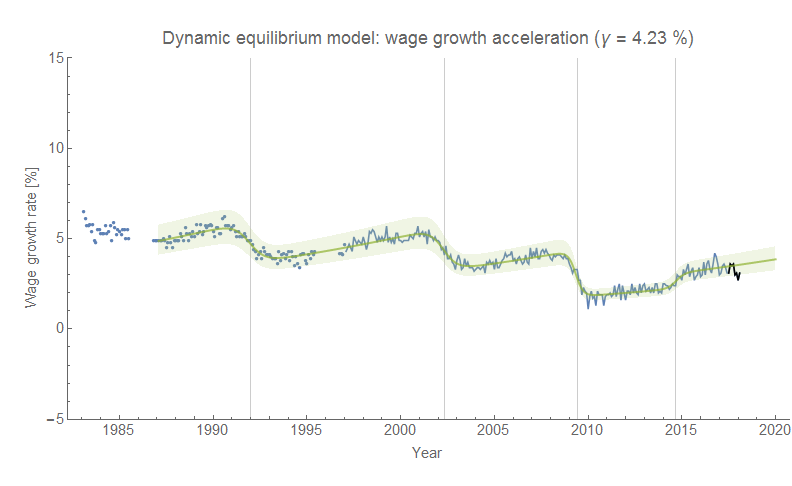
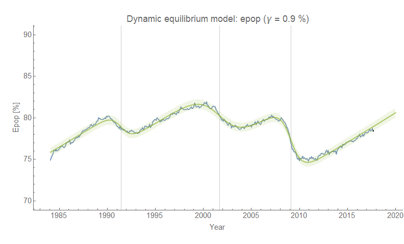
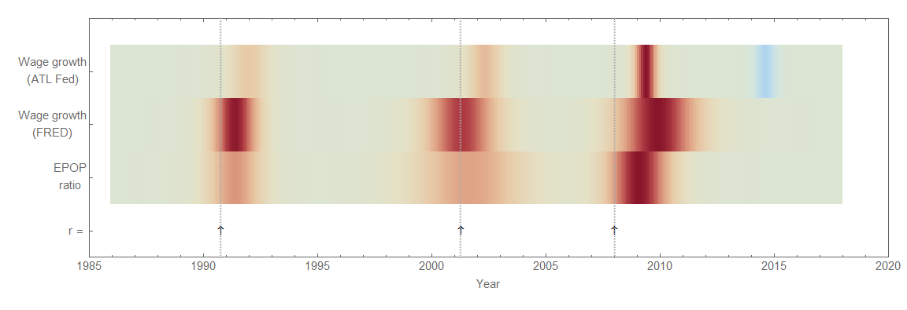
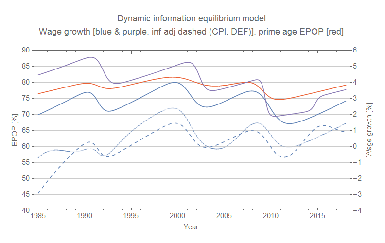
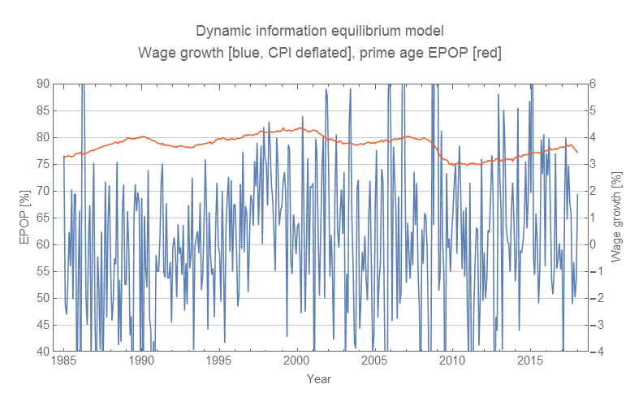

Kevin Drum [posted a blog post](https://www.motherjones.com/kevin-drum/2018/03/employment-growth-has-no-effect-on-blue-collar-wages/) wherein he supports the bold claim of the title "Employment Growth Has No Effect on Blue-Collar Wages". In fact, I think Drum himself thinks the claim is a bit too bold:

> _I would think that two years of employment growth—no matter where it’s starting from—would lead to at least some growth in blue-collar wages. But the correlation is actually slightly negative. This seems odd. What do you think the reason could be? Is prime-age employment completely disconnected from blue-collar employment? Or is it something else?_

His conclusion is actually supported by the data he presents. However the data he presents is incredibly noisy ([wage data](https://fred.stlouisfed.org/graph/?g=j3XN), especially after being adjusted for inflation & [employment population ratio growth data](https://fred.stlouisfed.org/graph/?g=j3XS)), so some back of the envelope chartblogging won't really see it. You need a model.

So I applied the dynamic information equilibrium model ([described in detail in my paper](https://papers.ssrn.com/sol3/papers.cfm?abstract_id=3094757)). Note that the wage growth data is extremely noisy. There is less noisy data from ATL Fed that [I blogged about awhile ago](https://informationtransfereconomics.blogspot.com/2018/02/dynamic-equilibrium-in-wage-growth.html); here they are side by side (click for high resolution):

The (prime age) employment-population ratio (EPOP) model is less noisy (the derivative linked above is still pretty noisy):

If we put these together in a [macroeconomic "seismograph"](https://informationtransfereconomics.blogspot.com/2018/03/shock-cluster-analysis-and-some-new.html) where we show the shocks to the dynamic equilibrium, we can see these measures all show the same general structure (click for higher resolution):

We can (barely) infer a possible causal relationship where EPOP drives wage growth (negative shocks to EPOP precede negative shocks to wage growth). This is not to say this is absolutely the true causal relationship, just that the other direction (wage growth cause EPOP changes) is basically rejected by this data. Plotting them versus time on the same graph lets us see that they're basically the same (I also show real wages deflated by the GDP deflator and CPI):

This relationship would not be visible were we not able to extract the trend using the dynamic information equilibrium model:

