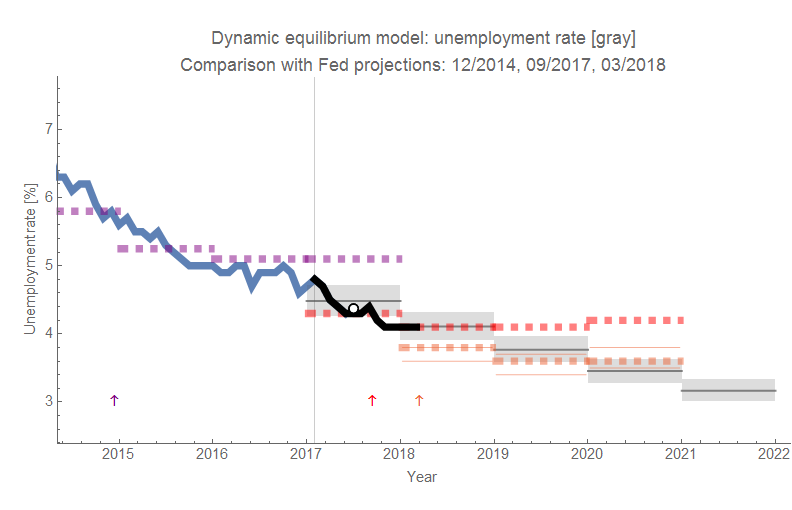

As unemployment continues to fall, the Fed has [once again revised its projections downward](https://www.federalreserve.gov/monetarypolicy/files/fomcprojtabl20180321.pdf) \[pdf\]. The latest projection is in orange (the limits of the "central tendency" are now shown as thin lines). I added a white point with a black outline to show the 2017 average (which was exactly in line with the dynamic information equilibrium model from the beginning of 2017 as well as in line with the Fed's projection ... _from September of 2017 with more than half the data for 2017 already available_). The vintage of the Fed forecasts are indicated with arrows. The black line is the data that has come in after the dynamic equilibrium forecast was made.

One thing I did remove from this graph was the "longer run" forecast that is nebulous. I had put them down as happening in the year after the last forecasted year. But the Fed is wishy-washy about it, and I thought they were wrong enough already without adding in some vague "longer run" point.
