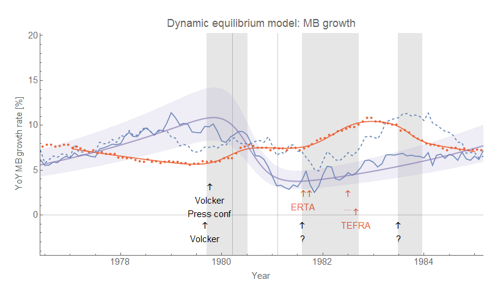
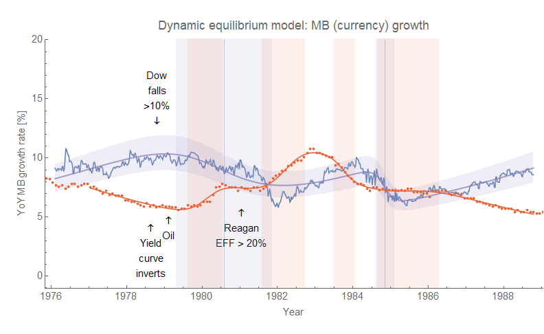

> _It's the 80s!
> Do a lot of coke and vote for Ronald Reagan!_ 

> —[Mystery Science Theater 3000](https://www.youtube.com/watch?v=bs0osMzTZQA)

David Andolfatto had a post asking the title question: [What anchors inflation?](https://andolfatto.blogspot.com/2018/03/what-anchors-inflation.html) The post represents a run-through of the monetarist view that the Volcker Fed anchored expectations through aggressive, manly credibility at the end of which Andolfatto asks whether fiscal policy had anything to do with it.

[Now my contention](https://informationtransfereconomics.blogspot.com/2018/03/trends-in-macro-observables-twitter.html)

But I also believe that the actual process of recessions are largely [social phenomena](https://informationtransfereconomics.blogspot.com/2018/03/dynamic-equilibrium-model-fertility-as.html) that can potentially be affected in their timing, severity and duration by political actions. That said: the 80s were complicated.

While Andolfatto claims that Fed policy under Volcker led to the recession, the recession (in terms of unemployment) had already begun in mid-1979 (first gray band in the graph below):

Additionally, there seem to be leading indicators ahead of the surge in unemployment (such as [JOLTS measures](https://informationtransfereconomics.blogspot.com/2017/07/jolts-leading-indicators.html) unavailable at the time, or per [a recent paper conceptions](https://informationtransfereconomics.blogspot.com/2018/03/dynamic-equilibrium-model-fertility-as.html)) so the recession had probably been building for several months before the unemployment rate spiked.

Oddly, a case can be made that the Fed's actions (based on the shock to the monetary base that Andolfatto uses) may have actually temporarily arrested the recession as the shock is ending as the shock to the monetary base is beginning. while this might be weird for a monetarist theory of recessions, it isn't weird for a social theory — the Fed was making announcements and people thought that something was being done. In the same way QE might have worked as symbolic action, Volcker's "decisive action" might also have symbolically alleviated fears.

Now some theories suggest (including the [Wikipedia article on the tax cut](https://en.wikipedia.org/wiki/Economic_Recovery_Tax_Act_of_1981)s) that the "double dip" recession was caused by the deficit ballooning under the ERTA driving up interest rates. However, the ERTA is signed when the second shock is already underway and doesn't take effect until later anyway. It is possible that the deficits actually arrested the progress of the second shock or even lead to the third positive shock to employment in 1983 (this third shock may also be the rebound of the [step response](https://informationtransfereconomics.blogspot.com/2017/11/unemployment-rate-step-response-over.html) — a ripple following on the heel of the previous shock). The ERTA was also phased in, but some of the tax cuts were reversed with TEFRA (selected timings are indicated on the graph in red text/arrow).

Again, in general there seem to be indicators (e.g. JOLTS, as mentioned above) that lead spikes in unemployment by several months meaning this second recessions causes could go as far back as 1980.

Another possibility to consider is that the downturn in base growth was caused by the factors behind the recession, not monetary policy. But as I show the monetary base adjusted for reserve requirements (dashed line) takes a hit at the beginning of 1979. To try and disentangle the different timings, I looked at the currency component of the base, which also shows a downturn beginning in early 1979:

This expanded graph also shows a fourth shock to unemployment (or part of the continuing step response ripple), and a second shock to monetary base growth in 1984 (following the second hit to unemployment). The currency component shows a shock beginning even earlier than the recession shock (purple vs red bands). This coincides with the small shock to the adjusted base. However if this is used as evidence that monetary policy caused the recession, it completely discounts the entire "Volcker Fed" story as Volcker wasn't even nominated until about 6 months later in July 1979.

But there is other evidence that the recessionary indicators were building far before the downturn(s) in monetary base growth. [The yield curve inverts](https://fred.stlouisfed.org/graph/?g=jadY) in late 1978, and the stock market falls more than 10% in the last two weeks of October 1978. Oil prices are raised by two OPEC countries in early 1979.

All indications point to the first 1980s recession being a "normal" one caused by essentially a general downturn in business optimism. The cause of the second one is harder to pin down but is plausibly the one caused by the Volcker Fed's attempt to control inflation. One story told (e.g. [on Wikipedia](https://en.wikipedia.org/wiki/Early_1980s_recession_in_the_United_States)) is that high interest rates took a toll on housing \[1\] and manufacturing. There is some evidence of this: the discount rate drops after the first recession is declared to be over, however soon after the Fed [begins to raise the discount rate and the effective Fed Funds rate (EFF) launches to over 20%](https://fred.stlouisfed.org/graph/?g=jafQ) around the time that Reagan takes office. With this spike, [construction jobs cease their recovery](https://fred.stlouisfed.org/graph/?g=jafi) and plummet again.

If the mechanics of the Phillips curve are as I described earlier, then the Fed did control inflation a bit by throwing people out of work. This inflation would begin to return  as soon as the recovery got underway; it was only the end of the demographic transition by the 90s that brought down trend inflation. In this model, the trade off was between a trend of slowly falling inflation and a temporary spell of rapidly falling inflation plus mass unemployment amid a trend of slowly falling inflation. It's possible the Fed's action arrested [women's increasing labor force participation](https://fred.stlouisfed.org/graph/?g=jaim), but this seems unlikely as it hasn't resumed as the effects of the 1980s recession fade into history (i.e. the current "equilibrium" of ~10 percentage points higher employment population ratio for men than women more likely represents a new social or technology-driven \[2\] equilibrium).

So in the end, the 80s recessions are a jumble of "normal" factors and a possibly unethical macroeconomic experiment by the Fed based on incomplete and most likely incorrect theories. But the best story in terms of causality is that there was a normal short recession building in late 1978 that becomes the one NBER says started in January of 1980. As this recession begins to fade without bringing down inflation enough, [the Fed hikes the discount rate initially to 13%, and then to 14% until employment starts to spike again](https://fred.stlouisfed.org/graph/?g=jaiY). NBER says this one started in mid-1981, but in fact it started to get underway around the time the discount rate heads up to 13% in early 1981. Lower inflation was acheived via mass unemployment, but that lower inflation would have arrived by the late 80s or early 90s anyway due to the fading demographic shift. The end of that demographic shift is what appears to have "anchored" inflation, not Fed action or fiscal policy.

PS I used this [paper \[pdf\]](http://www.carnegie-rochester.rochester.edu/Nov04-pdfs/GK.pdf) and this [history article from the Fed](https://www.federalreservehistory.org/essays/anti_inflation_measures) for some of the dates and news events.

**Footnotes**

\[1\] I have a personal anecdote from this period. My parents moved to Houston in 1979 when my dad got a job in the oil industry. We spent the first few years in an apartment and two rented homes until they finally were able to get a mortgage for a house in 1983 when interest rates came back down a bit.

\[2\] [Per this discussion](https://informationtransfereconomics.blogspot.com/2018/02/women-in-workforce-and-solow-paradox.html), it is possible that post-war household production technology development was behind a shift of women into the labor force.
