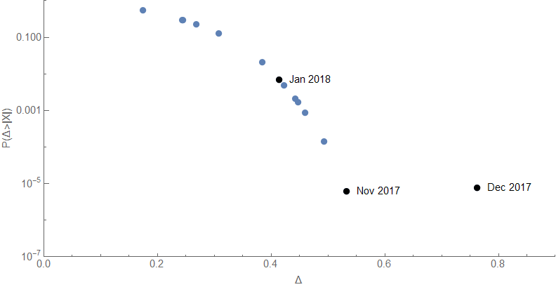
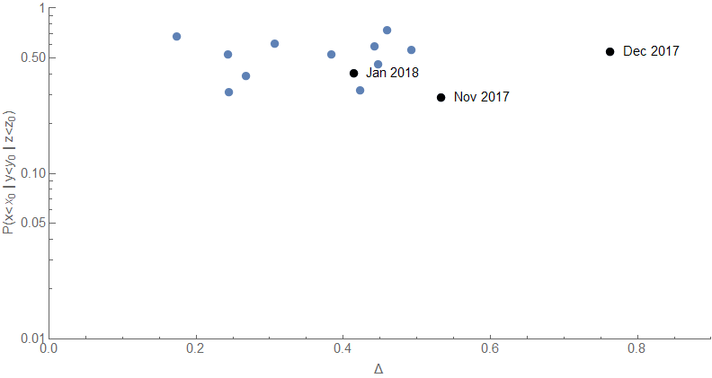

Another month, another [JOLTS data update](https://fred.stlouisfed.org/release?rid=192) from FRED. This time, we are getting a lot of data revisions, and the revisions to the quits rate are biased upward:

It turns out those data revisions erase most of the signs of a possible upcoming recession (i.e. the counterfactual) in both the quits rate and the hires rate (i.e. [the original conditional forecast](https://informationtransfereconomics.blogspot.com/2017/07/jolts-leading-indicators.html) was more accurate). Click for larger versions:

The gray band indicates the shock counterfactual — which has completely collapsed back to the original forecast. There still is a deviation in the job openings rate, but this data is also noisier in general:

**Update**

A rehash of [the analysis linked here](https://informationtransfereconomics.blogspot.com/2018/02/what-is-chance-of-seeing-deviations-in.html) tells us what my vague intuition claimed above — the data revisions have mostly eliminated the signs of recession in the joint probabilities of being further away from the original forecast (first graph is just probability that the distance from the forecast will be greater, second graph is the probability of at least one measure being further away \[1\]):

**Footnotes:**

\[1\] I.e. _P(ΔJOR² + ΔQUR² + ΔHIR² > Δ²)_ for the next point where _Δ²_ is the distance for the latest point versus _P(ΔJOR > Δ₁ || ΔQUR > Δ₂ || ΔHIR > Δ₃)_ for the next point where  _Δ = (Δ₁, Δ₂, Δ₃__)_.
