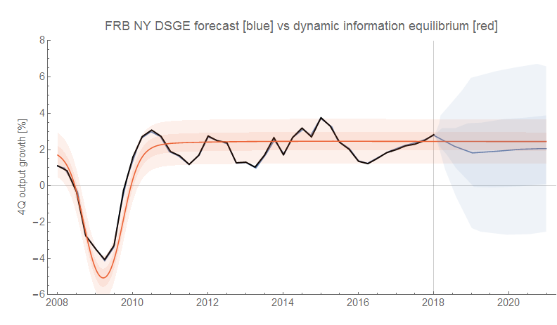
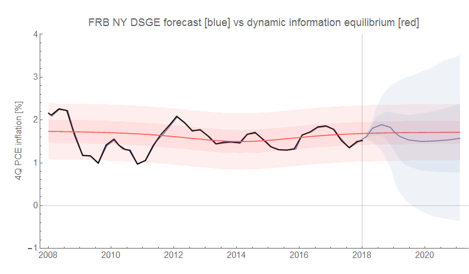

After [wrapping up the previous head-to-head forecast](https://informationtransfereconomics.blogspot.com/2018/01/losing-my-vestigial-monetarism.html) between the NY Fed DSGE model and a model using the information equilibrium framework, I'm starting up a new comparison between [their DSGE model](http://libertystreeteconomics.newyorkfed.org/2018/03/the-new-york-fed-dsge-model-forecast-march-2018.html) and the dynamic information equilibrium model (also shown at the first link and [described here](https://informationtransfereconomics.blogspot.com/2018/03/trends-in-macro-observables-twitter.html)).

These are the forecasts for output (4Q growth in RGDP) and inflation (4Q growth in core PCE inflation); I'm showing the 50% and 90% confidence intervals (the original FRB NY graphs show more intervals):

