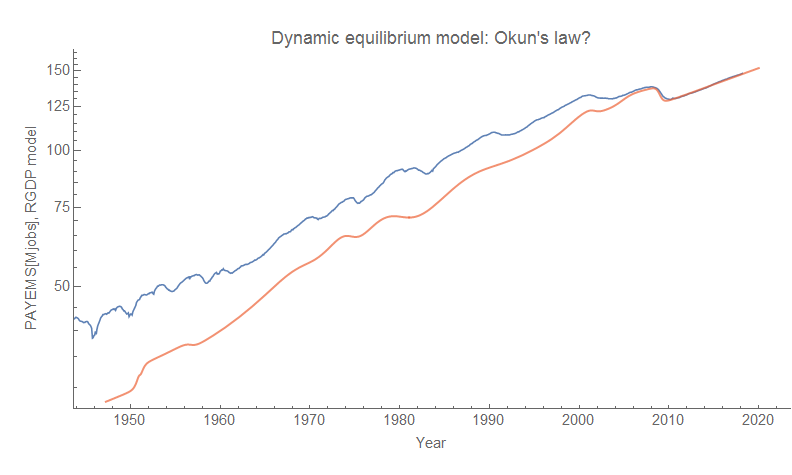
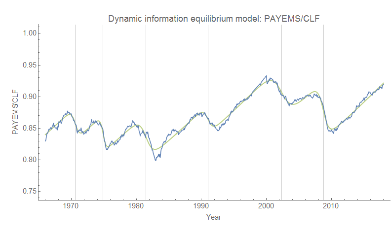
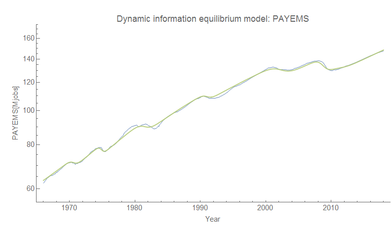
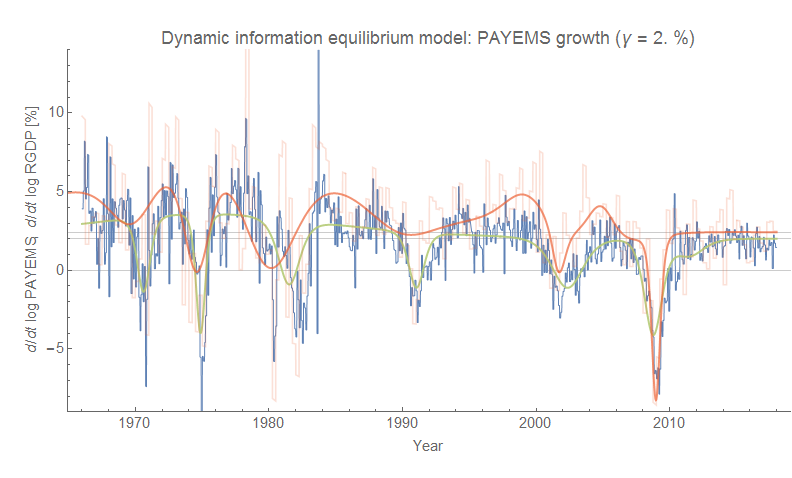

I was curious about how [the dynamic information equilibrium model of RGDP](https://informationtransfereconomics.blogspot.com/2018/01/24-growth-forever.html) (described in a presentation/Twitter talk available [here](https://informationtransfereconomics.blogspot.com/2018/03/trends-in-macro-observables-twitter.html)) matched up with an equivalent model of employment _L_ (FRED [PAYEMS](https://fred.stlouisfed.org/series/PAYEMS)) — they should to some degree because of Okun's law (for a more formal version in terms of information equilibrium "quantity theory of labor" see [here](https://informationtransfereconomics.blogspot.com/2017/03/the-quantity-theory-of-labor-and.html)). However a naive application doesn't work very well for basically the same reason that the "[quantity theory of labor and capital](https://informationtransfereconomics.blogspot.com/2016/03/a-quantity-theory-of-labor-and-capital.html)" outperforms the "quantity theory of labor": there is effectively a dynamic equilibrium shock that is different between labor and NGDP that is compensated by the use of capital in the former of the two models. Here's that naive version:

So I tried to correct for this by combining the dynamic equilibrium model for the civilian labor force (_CLF_) and another one for the "employment rate", i.e. _L/CLF_. Here is the _L/CLF_ model:

[here](https://informationtransfereconomics.blogspot.com/2018/01/immigration-is-major-source-of-growth.html)
[step response](https://informationtransfereconomics.blogspot.com/2017/11/unemployment-rate-step-response-over.html)

**_precede_** [my presentation](https://informationtransfereconomics.blogspot.com/2018/03/trends-in-macro-observables-twitter.html)

[an effective macro theory](https://en.wikipedia.org/wiki/Effective_theory)

**Footnotes:**
\[1\] Speculating, but maybe the fading of the step response is linked to the fading of the Phillips curve I mention [in my presentation](https://informationtransfereconomics.blogspot.com/2018/03/trends-in-macro-observables-twitter.html)?
\[2\] There are also significant deviations between the RGDP model and the RGDP data (faint red on the graph) in the case of the "Phillips curve" recessions of the 70s, 80s, and 90s. These could potentially be connected to the step response noted in [footnote](https://informationtransfereconomics.blogspot.com/2017/11/unemployment-rate-step-response-over.html) \[1\].
