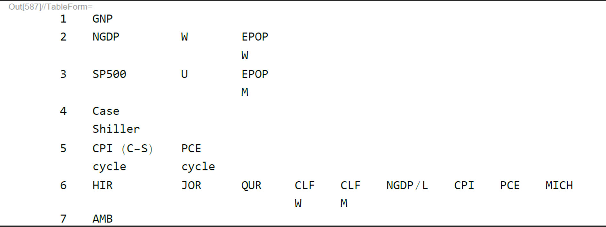
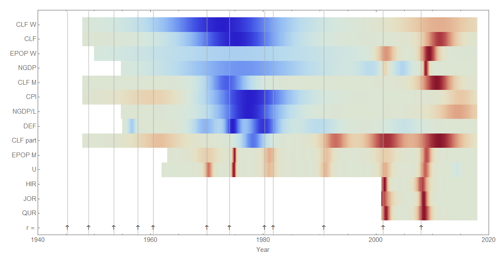
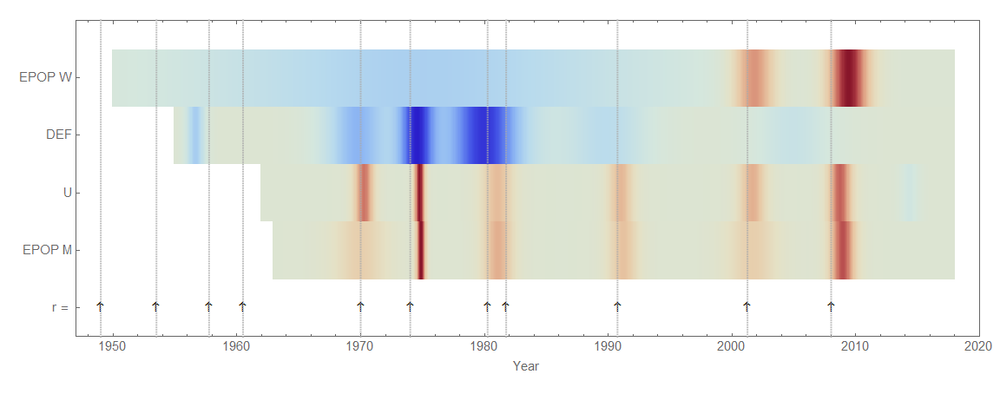
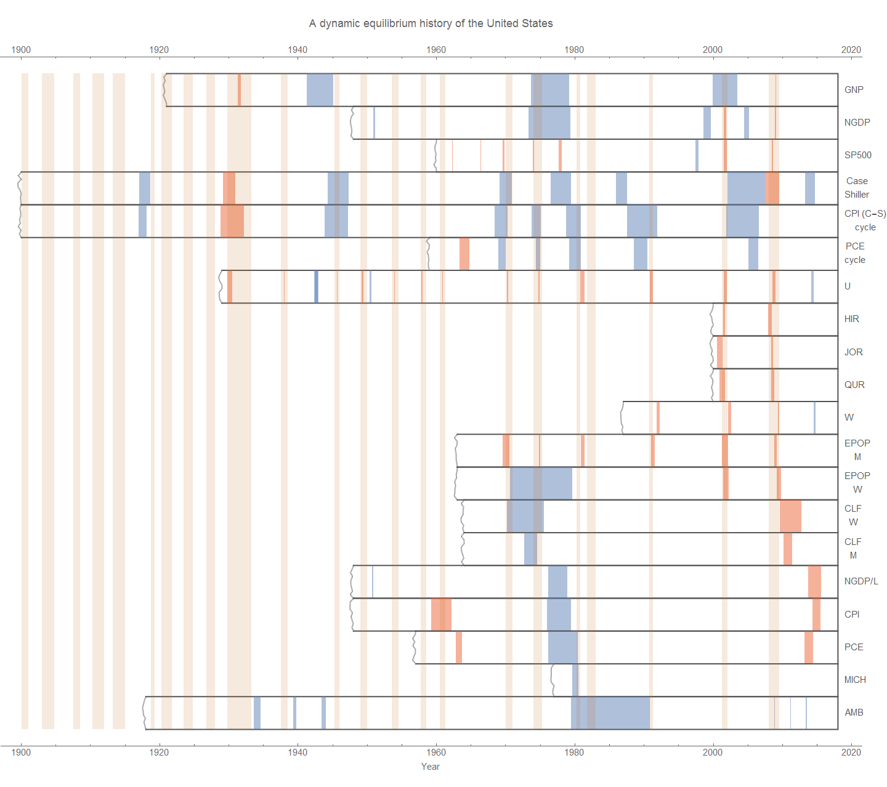
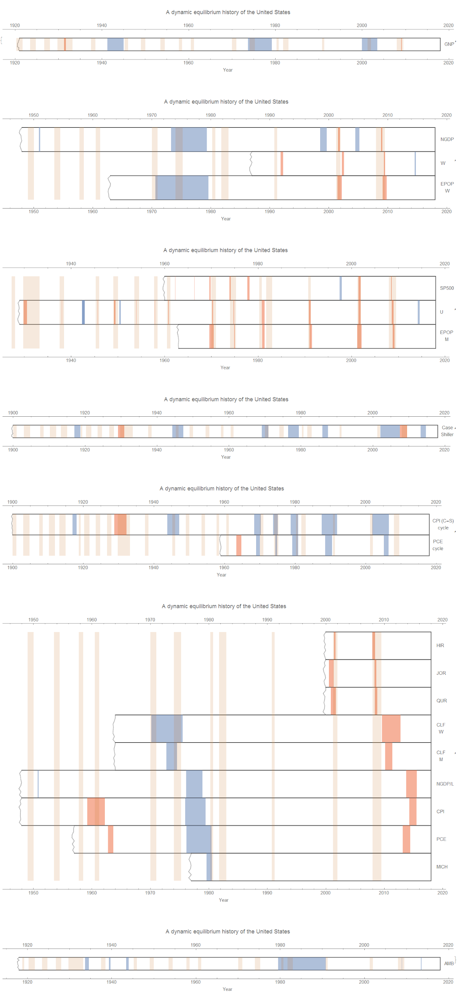

As part of my attempt to rewrite the macroeconomic history of the United States \[1\], I've been looking at all of the [dynamic information equilibrium model "seismograms"](https://informationtransfereconomics.blogspot.com/2018/02/women-in-workforce-and-solow-paradox.html) I can. I decided to try some machine learning algorithms to see if there's anything to be extracted. But first, I did some simple clustering using the [DBSCAN](https://en.wikipedia.org/wiki/DBSCAN) algorithm. I used only the shock centers (i.e. time) and tried both values (i.e. the years like 1977 or 2008) as well as differences (i.e. the time between shocks like 4 years). The former only seemed to cluster the vectors based on length which is an artifact of the available data. The latter did a bit better \[2\] and found the following groupings:

For the label definitions, see \[3\]. In this result, GNP, Case-Shiller housing index, and AMB are all on their own. I believe the JOLTS measures were associated with the CLF measures simply because they were too short — if more JOLTS data was available they'd probably be placed with the unemployment rate. But the most interesting clusters were #2 and #3 which associated NGDP with women's EPOP and the unemployment rate with men's EPOP. This is part of [the story about women entering the workforce as a driving factor in growth](https://informationtransfereconomics.blogspot.com/2018/02/women-in-workforce-and-solow-paradox.html) I've been telling (while men in the workforce are basically a cyclical component).

I've also been trying to come up with a better way to visualize the information — the solid bars (see footnote \[1\]) do nothing to indicate the relative magnitude of the shocks and only show one measure of the duration (using the width parameter). Here's a first attempt at a "continuous" visualization that also includes magnitude (relative to each individual measure):

In this color scheme, blue are positive (or "good") shocks which red are negative (or "bad") shocks. Inflation is categorized as "good" here. The "beige" regions are where the model is following the dynamic information equilibrium. The demographic shift of women entering the labor force (CLF W) can be seen to precede most of the other macroeconomic measures (NGDP, DEF, etc).

This selection shows the fading Phillips curve (shocks to employment coming alongside falling inflation — the red bands in U following on the falling side the blue bands in DEF fading out by the 2000s) best, with peak "Phillips curve" right in the middle of the shock to women's employment-population ratio:

It also shows how after the demographic shock to women's EPOP, it becomes correlated with men's EPOP (which is correlated with the unemployment rate).

**Footnotes:**

\[1\] This is part of a longer-term project of self-deprecating hubris. Here's the diagram so far (click for the actual higher resolution version):

\[2\] "Seismograms" of the clusters:

\[3\] Legend

GNP = Gross National Produc
NGDP = Nominal Gross Domestic Product
W = Wage growth
EPOP W (M) = Employment population ratio for Women (Men)
SP500 = S&P 500 stock index
U = Unemployment rate
Case-Shiller = Case-Shiller housing price index
CPI (C-S) (cycle) = Consumer price index (Case-Shiller data) (cyclical component)
PCE (cycle) = Personal Consumption Expenditures price index (cyclical component)
HIR, JOR, QUR = JOLTS hire, job opening, and quit rates
CLF W (M) = Civilian Labor Force level for Women (Men)
NGDP/L = Nominal GDP divided by total nonfarm employment
MICH = Michigan inflation expectations
AMB = St. Louis Adjusted Monetary Base
DEF = GDP deflator
CLF part= CLF participation rate

Cyclical component here means that the resolution of the search for shocks was higher ([bandwidth](http://reference.wolfram.com/language/ref/SmoothKernelDistribution.html) of the [kernel smoother](https://en.wikipedia.org/wiki/Kernel_smoother) was smaller). You can interpret these as fluctuations on top of the broad shocks in the low resolution CPI and PCE measures. Since the old "seismograms" don't include magnitude, it is hard to tell that the magnitude of the cyclical CPI/PCE is consistent with the broad shock measure (the largest cyclical shocks happen in the middle of the broad shocks, with the earlier and later ones being much smaller — see the continuous versions above).
