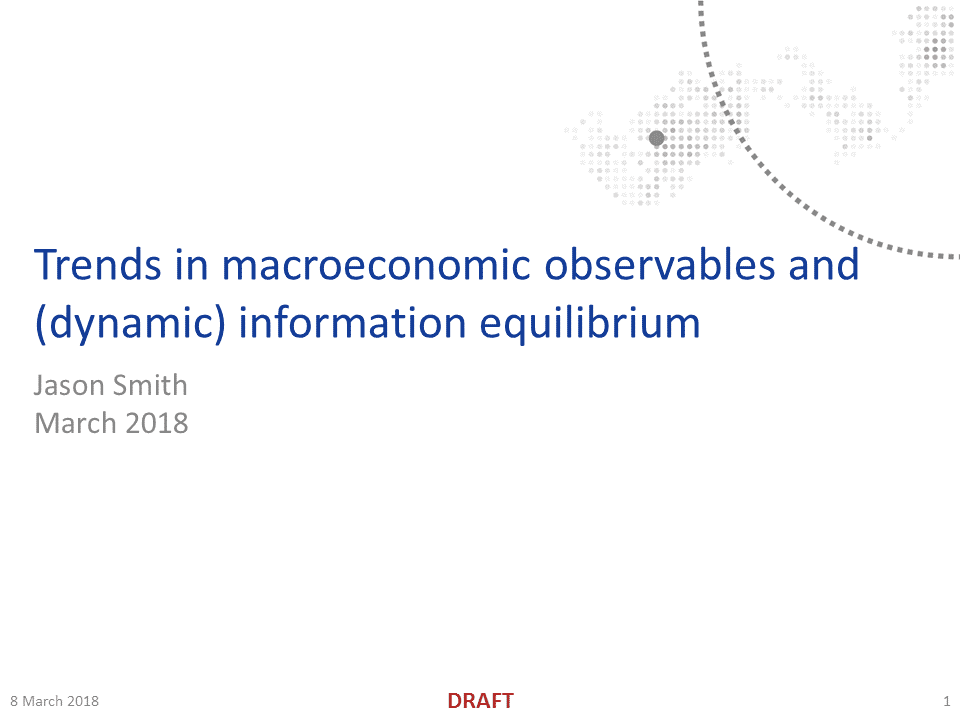

I did another "twitter talk" (see [here](https://twitter.com/infotranecon/status/971881574810533890)); in honor of International Women's Day, the subject was the demographic shift of women into the workforce and other trends in macro observables. [A pdf can be downloaded here](https://drive.google.com/file/d/1Hsln5HOo_cC6jhCe8YiUFBTs7A9h0Lpm/view?usp=sharing) (let me know if my Google Drive settings aren't working for you).

