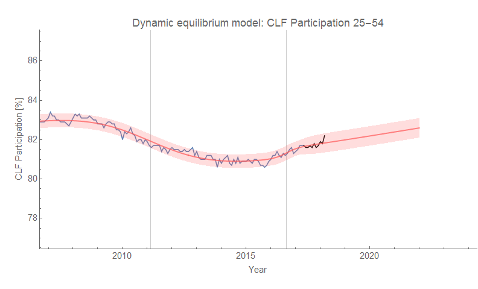
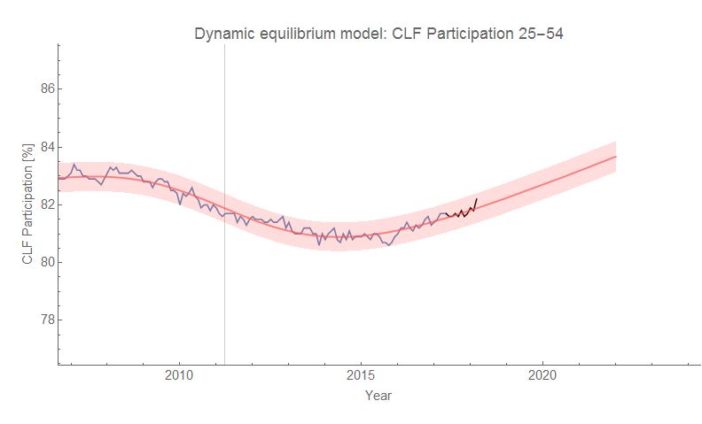
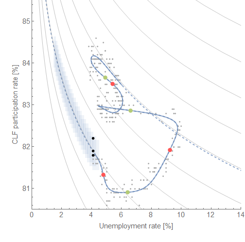
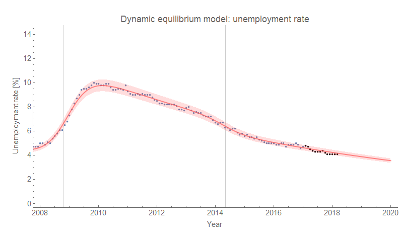
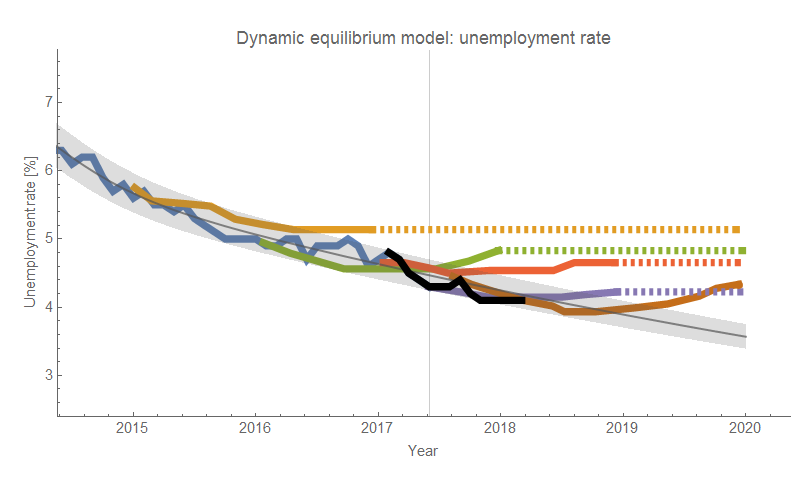
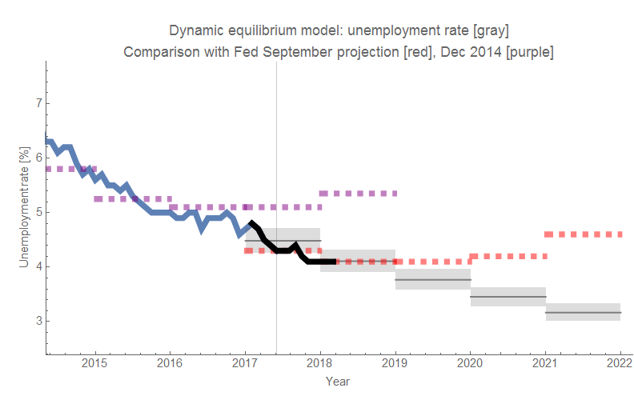

The latest [employment situation data](https://fred.stlouisfed.org/release?rid=50) is out and the latest data is still in line with the forecasts ([previous update was here](https://informationtransfereconomics.blogspot.com/2018/02/unemployment-and-labor-force.html)). I've been following the unemployment rate model _**for over a year now**_. A lot of people are talking about the increase in labor force participation (there's an especially big spike in "prime age" CLF, but even that spike is consistent with the expected fluctuations in the model. I'll just present the graphs in a gallery (the new data is in black, and the two comparisons are versus various vintages of the FRB SF forecasts and the Fed FOMC forecasts — as always, click for full resolution).

There are two models of the CLF participation rate (one posits an additional shock for reasons explained in a post [here](https://informationtransfereconomics.blogspot.com/2017/11/a-new-beveridge-curve-or-science-is.html)):

Also, here's the novel Beveridge-like curve between CLF participation and unemployment discussed in that same post:

And finally, here are the unemployment rate forecast graphs (this model was discussed in [my recent paper up on SSRN](https://papers.ssrn.com/sol3/papers.cfm?abstract_id=3094757)):

