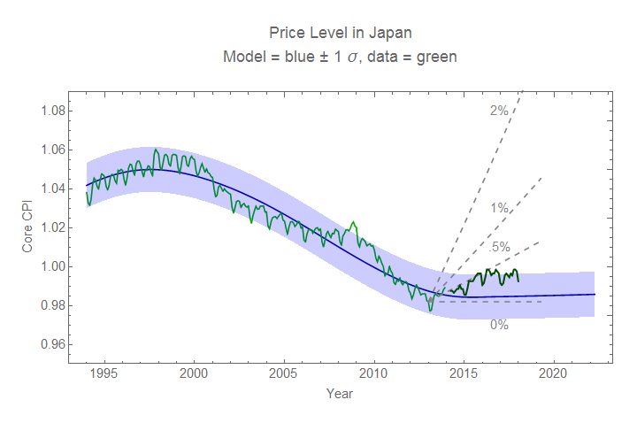

A little over a month ago, [I wrote a post](https://informationtransfereconomics.blogspot.com/2018/01/losing-my-vestigial-monetarism.html) about how I was laying the last of my "vestigial monetarism" to rest. I didn't explicitly talk about it, but that should also include the monetary model of Japan's consumer price index (last updated [here](https://informationtransfereconomics.blogspot.com/2016/08/japan-lack-of-inflation-update.html) I believe). 

The most recent data (adjusting for the VAT) is actually still consistent with the model:

Unlike a lot of other macro models, [this one didn't "die"](https://informationtransfereconomics.blogspot.com/2016/03/im-not-quite-dead-sir.html) (H/T [Noah Smith](https://www.bloomberg.com/view/articles/2016-03-10/an-economics-laboratory-where-theories-go-to-die)) because of Japan but rather because the dynamic equilibrium model of the US data was far more convincing than the equivalent US monetary model (read more about my thinking [here](https://informationtransfereconomics.blogspot.com/2018/01/losing-my-vestigial-monetarism.html)).

However, I'll continue to track the [dynamic equilibrium model of Japan's CPI](https://informationtransfereconomics.blogspot.com/2017/03/the-mystery-of-japans-inflation.html) (which is (also) doing fine):

