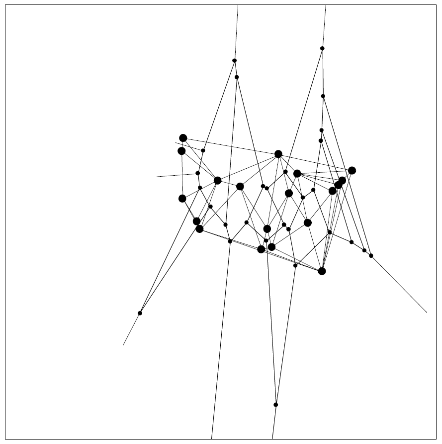

While the thesis of [this essay](https://theconversation.com/economists-are-unfairly-maligned-but-they-are-often-pretty-prejudiced-themselves-91456) by Esteban Ortiz-Ospina is fine, the map metaphor needs to go. Map metaphor?

> _The different views on what economists actually do can be nicely captured in metaphors. I find the cartography metaphor spot on: economists try to create and use maps to navigate the world of human choices._ 

> _If economists are cartographers, then economic models are their maps. Models, just like maps, make assumptions to abstract from unnecessary detail and show you the way._ 

> _Different maps are helpful in different situations. ... If you are hiking in the Alps and you want to find your way, you will want a map that gives you a simplified perspective of the terrain ... A map with elevation contour lines will be very helpful._ 

> _On the other hand, if you are an engineer trying to calibrate the compass in an airplane, ... you’ll want ... a map that highlights magnetic variation by showing you isogonic lines._

It's a common metaphor. Paul Romer used the metaphor [in one of his critiques of economics](https://paulromer.net/ed-prescott-is-no-robert-solow-no-gary-becker/). Alan Greenspan [used it as the title of a book](https://www.penguinrandomhouse.com/books/311165/the-map-and-the-territory-by-alan-greenspan/9780143125914/). [The metaphor derives from](https://en.wikipedia.org/wiki/Map%E2%80%93territory_relation) Alfred Korzybski, who was as best I can tell kind of a philosopher. The metaphor has its use \[1\], but I think its use in macroeconomics is problematic. 

The reason? An elevation map is still an empirically accurate description of elevation; a magnetic map is still an empirically accurate description of the magnetic field; Romer's subway map is still an empirically accurate description of the network topology. And in the case of various projections of the Earth's surface, we know how those maps distort the other variables! A DSGE model (to pick on one example) may be an abstract map of a macroeconomy, but it's not an empirically accurate one \[[pdf](https://www.federalreserve.gov/pubs/feds/2011/201111/201111pap.pdf)\].

Of course the abstraction of that DSGE model (or other models) is then used as a rationale for the lack of empirical accuracy, making the whole argument circular \[2\]. 

> **Economist:** Abstractions are useful for the variables they explain. 

> **Critic:** But they don't explain the data for even those variables. 

> **Economist:** It's an abstraction, so it doesn't have to explain data.

Now Olivier Blanchard would argue that I'm not talking about data for the right variables for the model in question (e.g. DSGE models don't forecast, they tell us about policy choices). However, 1) it is bad methodology to make _ad hoc_ declarations about which data a model can be tested on, and 2) this doesn't make any sense in the particular case of forecasting as I extensively discussed [in an earlier post](https://informationtransfereconomics.blogspot.com/2017/10/can-macro-model-be-good-for-policy-but.html) \[3\].

The map metaphor is only useful if your map is accurate for the variables it isn't abstracting. Now this isn't to say "econ is wrong LOL", but is a critique of how much economists (in particular macroeconomists) claim to understand. I'm not just talking about the econ blogs, news media, or "pop economics". David Romer's _Advanced Macroeconomics_ has lots of abstract models, but little to no references to empirical data. It's written like a classical mechanics textbook, but without the hundreds of years of empirical success (and known failures!) of Newton's laws. 

I'm in the process of moving and came across my old copy of Cahn and Goldhaber's _[The Experimental Foundations of Particle Physics](https://www.amazon.com/Experimental-Foundations-Particle-Physics/dp/0521521475/ref=as_li_ss_tl?ie=UTF8&linkCode=ll1&tag=arandomphysic-20&linkId=6f0d26a07e38c039132425aff9814aca)_. While a lot of quantum field theory and quantum mechanics lectures in physics are pretty heavy on the theory and math, there are also classes on the empirical successes of those theories. C&G is basically a collection of the original papers discovering the effects (or confirming the predictions) that are explained with theory. While Romer's book might be the macro equivalent of Weinberg's [_The Quantum Theory of Fields_](https://www.amazon.com/Quantum-Theory-Fields-Foundations/dp/0521670535/ref=as_li_ss_tl?s=books&ie=UTF8&qid=1521143156&sr=1-1&keywords=weinberg+quantum+field+theory&linkCode=ll1&tag=arandomphysic-20&linkId=ecb7791ee0c186f384f8cf7d0925bdd6), there is no book called "_The Empirical Foundations of Macro Models_".

This is not to say macroeconomics should have these things right now. In fact, it shouldn't have an analog of either Weinberg or C&G. Its modern manifestation is still a nascent field (the existence of a JEL code for macroeconomics is only a recent development as [documented by Beatrice Cherrier](https://beatricecherrier.wordpress.com/2014/10/16/a-history-of-the-jel-codes-classifying-economics-during-the-war-part-1/)), and while Adam Smith wrote about the "wealth of nations" even the data macro relies didn't start to be systematically collected until after the Great Depression. Physics has an almost 300 year jump on economics in that sense. I really have to say that is part of the allure for me. Going into physics, so much stuff has been figured out already. Macroeconomics seems a wide open, un-mapped frontier by comparison \[4\]. And that's why I dislike the map metaphor — there really aren't any accurate maps yet \[5\].

...

**Update**

PS There is a [paper](http://larspeterhansen.org/wp-content/uploads/2016/11/Emprical-Foundations-of-Calibration.pdf) \[pdf\] by Hansen and Heckman called _The Empirical Foundations of Calibration_, but that's 1) a paper, and 2) more of an attempt to motivate a case for calibration as an empirical approach. Calibration (and method of moments) is quite a bit less rigorous than validation. There is a University of Copenhagen course called _[Theoretical and Empirical Foundations of DSGE Modeling](https://kurser.ku.dk/course/a%C3%98ka08207u/2013-2014)_ that appears to relegate empirical evidence in favor of the models to a guest lecture at the end of the course. They do teach students to "Have knowledge of the main empirical methodologies used to validate DSGE models", but that just seems to be how one would go about validating them.

**Footnotes:**

\[1\] However, adherence to this metaphor would have prevented physicists from predicting the existence of antimatter, discovering the cosmological constant, understanding renormalization, coming up with supersymmetry, and finding the Higgs boson. These are all things that are based on taking the "map" (the mathematical theory) so seriously that one reifies  model elements to the point of experimentally validating them — or at least attempting to do so. Dirac's equation for electrons with spin had a second solution with the same mass and opposite charge: the anti-electron. Einstein's equations for general relativity in their most general form contain a constant (that Einstein declared to be his worst mistake; I do wish he had seen his "mistake" empirically validated). [Renormalization sometimes introduces additional scales](https://en.wikipedia.org/wiki/Dimensional_transmutation), such as the QCD scale, that are very important. Supersymmetry is required to make string theory make sense, and the Higgs boson was just a particular model mechanism to give mass to the W and Z bosons — it didn't have to be there ([there are other "Higgs-less" theories](https://en.wikipedia.org/wiki/Alternatives_to_the_Standard_Higgs_Model#List_of_alternative_models)).

\[2\] This is part of the critique of [Pfleiderer's"chameleon models"](https://www.gsb.stanford.edu/faculty-research/working-papers/chameleons-misuse-theoretical-models-finance-economics). Abstractions are made and used to make real world policy recommendations. When those abstractions fail to comport with real world data, the models are defended by saying they are abstractions.

\[3\] I'm also not sure those DSGE models are empirically accurate in modeling the distortions due to policy either.

\[4\] It being a "social" science, it may well be doomed to being wide open because no empirically accurate models will ever be found. You will pay the price for your lack of vision!

\[5\] For the record, I think there are some empirical regularities and some simple models that are probably fine (Okun's law comes to mind). But not enough to fill up a textbook, unless it's dedicated to e.g. VARs.
