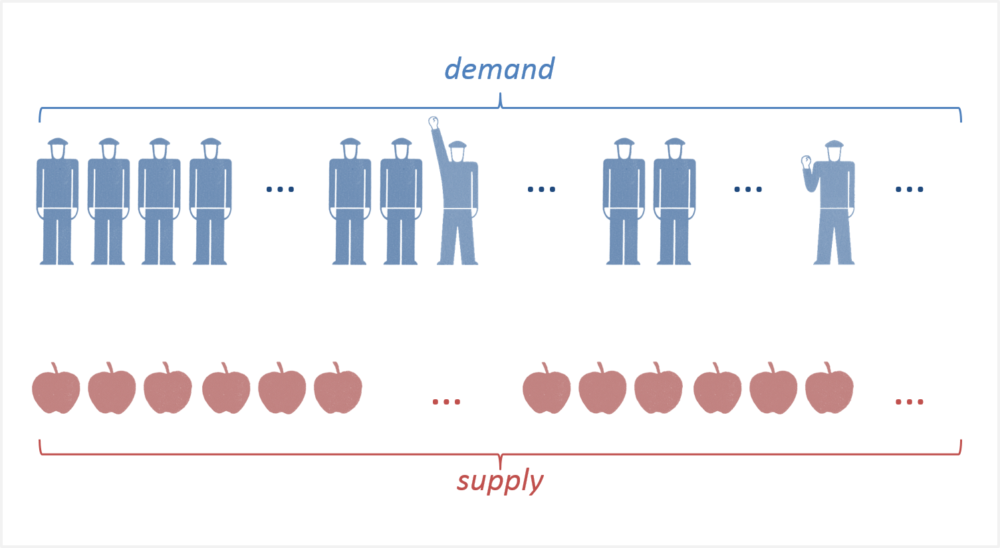
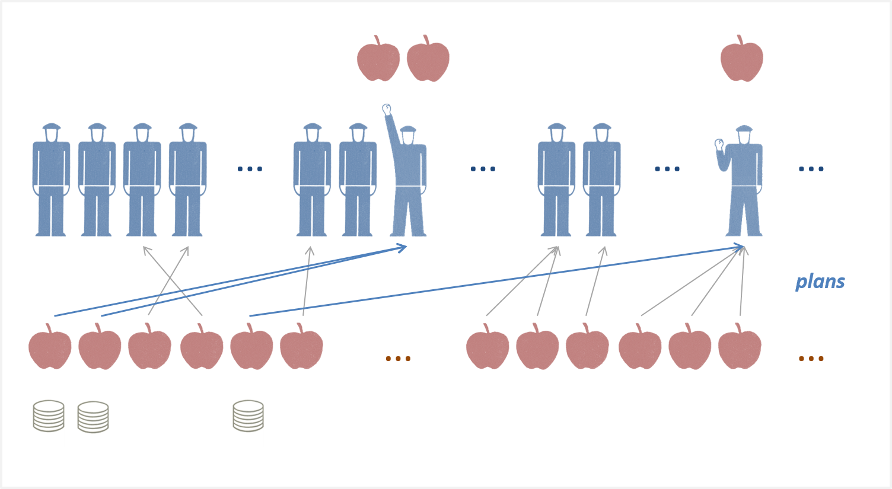
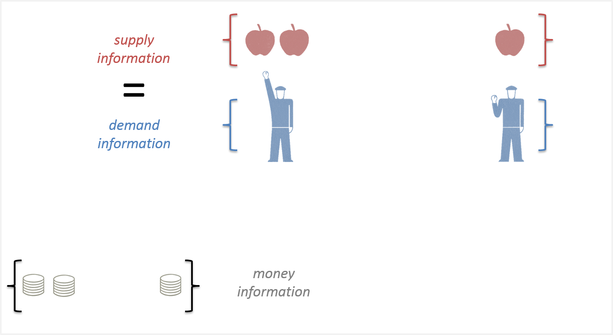

[David Glasner has posted](https://uneasymoney.com/2018/04/18/on-equilibrium-in-economic-theory/) an excellent introduction to his forthcoming paper on intertemporal equilibrium that talks about varying definitions and understandings.

Equilibrium can be one of the more frustrating concepts to talk about in the econoblogosphere because everyone seems to have their own definition — people from physics and engineering (as well as a general audience) often think in terms of static equilibrium (Glasner's "at rest"), and so say things like "_Obviously economies are not in equilibrium! They change!_". Of course, definitions of economic equilibrium that never apply are useless definitions of economic equilibrium ([like Steve Keen's definition here](https://informationtransfereconomics.blogspot.com/2016/02/attainable-definitions-of-equilibrium.html)).

I had a rambling draft post that [I published anyway](https://informationtransfereconomics.blogspot.com/2015/04/equilibria.html) three years ago that discussed several definitions of equilibrium, including [Noah Smith's claim](https://twitter.com/delong/status/591991812371288064):

> _Economists have re-defined "equilibrium" to mean "the solution of a system of equations". Those criticizing econ should realize this fact._

This muddle of language is why I try to do my best to say information equilibrium or dynamic information equilibrium in my posts (at least for the first mention) in order to make it clear which idea of equilibrium I am talking about. And that basic idea is that, in information equilibrium, the distribution of planned purchases (demand) contains the same amount of information entropy as the distribution of planned sales (supply). In information equilibrium, which I contend is a good way to think about equilibrium in economics, knowing one side of all the planned exchanges \[1\] is knowing the other. This implies that information must have traveled from one side of the exchange to the other. If I write down a number between one and a million and you write down the same number, it is extremely unlikely that I didn't communicate it to you. If I give you six dollars and you give me a pint of blueberries, it is even more unlikely that exchange happened by random chance. Information is getting from one party to the other.

But just like a definition of equilibrium that _never_ applies is useless, so is a definition of equilibrium that _always_ applies. And in the case of "information disequilibrium" ([non-ideal information transfer](https://informationtransfereconomics.blogspot.com/2016/09/basic-definitions-in-information.html)), there is information loss. If we consider demand the source of this economic information \[2\], information loss leads to lower prices and a deficiency in measured demand.

Glasner's mutually consistent intertemporal plans can easily be represented in terms of information equilibrium (the information required to specify one side of a series of transactions or expected transactions can be used to construct the other side). But the discussion in Glasner's post goes further, talking about the process of **_reaching_** an equilibrium of mutually consistent intertemporal plans. At this point, he discusses rational expectations, perfect foresight, and what he calls "correct foresight".

This is where the information equilibrium framework is agnostic, and represents an [effective theory](https://en.wikipedia.org/wiki/Effective_theory) description. There aren't any assumptions about even the underlying agents, except that they eventually fully explore the available (intertemporal) opportunity set. Random choices can do this (random walks by a large number of agents, q.v. [Jaynes' "dither"](https://informationtransfereconomics.blogspot.com/2015/02/jaynes-on-entropy-in-economics.html)), making the the observed states simply the most likely states (n.b. even for random exchanges, knowing one side of all the exchanges is still knowing the other side — i.e. information equilibrium). This is behind "maximum entropy"  (which basically means "most likely") approaches to various problems in the physical sciences as well as in "econophysics". For me [maximum entropy/information equilibrium](https://informationtransfereconomics.blogspot.com/2016/11/how-do-maximum-entropy-and-information.html) provides a baseline, and the information transfer framework provides a way to understand non-equilibrium states as well. [But random agents are just one tool in the toolbox](https://informationtransfereconomics.blogspot.com/2017/09/random-agents-one-tool-in-toolbox.html), and really the only requirement (for equilibrium) is that agents fully explore the opportunity set.

Over the years I've had many people upset with me in comments, emails, twitter, etc for the behavior-agnostic aspect of the approach. _People aren't random! Of course human behavior is important!_ I've been called arrogant, or been laughed at for my "hubris". However, I think it is even greater hubris to claim to know how human behavior works \[3\]. This modest approach comes from my physics background. There was a kind of "revolution" in the 70s and 80s where physicists went from thinking the "Standard Model" and other theories were akin to literal descriptions of reality to thinking they were effective theories that parameterized our ignorance of reality. I'm not sure this lesson has been fully absorbed, and many physicists think that e.g. string theory is the beginning of a 'final fundamental theory' instead of just a better effective theory at scales near the Planck scale. But nearly all particle physicists understand that the Standard Model is just an effective theory. That's actually a remarkable shift in perspective from the time of Einstein where his general theory of relativity was thought to be fundamental \[4\].

Effective theory has been a powerful tool for understanding physical systems. I like to think of the maximum entropy/information equilibrium approach as an effective theory of economics that's agnostic about the underlying agents and how they reach intertemporal equilibrium. It is true that being agnostic about agents or how equilibrium is reached limits the questions you can address, but so does assuming an incorrect model for these things. But it is good for addressing really basic questions like what economic growth rates can be or what is "equilibrium" when it comes to the unemployment rate. [My recent paper](https://papers.ssrn.com/sol3/papers.cfm?abstract_id=3094757) using information equilibrium answers this in a way that I have not seen in the literature (that tend to focus on concepts like NAIRU or search and matching): "equilibrium" in the unemployment rate are the periods of constant (in logarithm) falling unemployment between recessions. The 4.1% unemployment (SA) from March represented the equilibrium, but so did the 4.5% unemployment rate from March of 2017. In the past 10 years, unemployment was only away from equilibrium from 2007 to 2010 and again for a brief period in 2014. But every other point from the 9% in 2011 to the 4% today represents information equilibrium \[5\].

So while it is a simpler approach, information equilibrium allows for more complex ideas of what "equilibrium" means. I think that makes it useful for modeling economic systems, but it comes with a dose of modesty keeping you from pushing your own "gut feelings" about how humans behave.

...

**Footnotes:**

\[1\] There is no reason to restrict these to binary exchanges or "barter"; it is fully general, but purely binary exchanges over a series of time steps represent a simpler example. Here's what I am talking about in a more visual representation. You have some supply (apples) and some demand (people who want to buy apples):

A set of (potentially intertemporal) plans of exchanges occurs (money flows the opposite direction of goods):

The resulting distribution of supply exchanged for money has the same information as the original distribution of demand:

This is information equilibrium. As a side note, if everything is in information equilibrium, the resulting distribution of money exchanged [also contains exactly the same information](https://informationtransfereconomics.blogspot.com/2018/01/money-is-aether-of-macroeconomics.html) under only two possible conditions: there is one good, or the economy has an effective description in terms of aggregate demand and aggregate supply (i.e. effectively one good). Otherwise, money exchange _destroys_ information (you don't know what the money was spent on).

\[2\] This is a "sign convention" because it could easily be the other way (the math works out somewhat symmetrically). However, we buy things by giving people tokens we value instead of sellers divesting themselves of "bad" tokens so this sign choice is more user-friendly than, say, [Ben Franklin's choice of negative and positive charges](https://xkcd.com/567/). This sign convention means that prices in terms of tokens with positive value go up when demand goes up and down when supply goes up, while the other is held constant.

\[3\] Not saying this of most economists, because most see e.g. rational agent models as approximations to reality. Of course, some don't. But a lot of other people out there seem to have very strong opinions about how humans behave that are "ignored" by mainstream economists.

\[4\] Einstein's special relativity in the case of string theory would be an effective description in the 4-D bulk with an underlying Poincare invariance on the full 10 or 11 dimensions. But the basic idea of special relativity as a symmetry principle is still considered fundamental. (I think! Haven't kept up with the literature!)

\[5\] This is different from Roger Farmer's idea of any unemployment rate being an equilibrium unemployment rate [I discuss here](https://informationtransfereconomics.blogspot.com/2015/04/equilibria.html). According to Paul Krugman's interpretation, Farmer doesn't necessarily believe there is a tendency for unemployment to come down from a high level. The information equilibrium version, **_this tendency to come down is the equilibrium_** (regardless of level).
