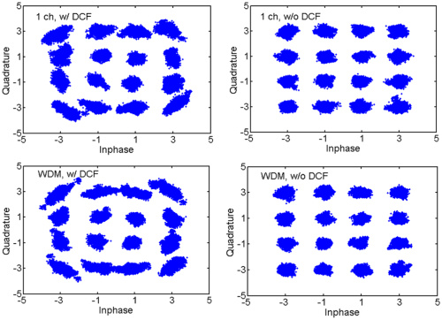
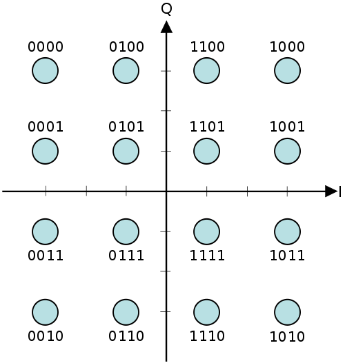
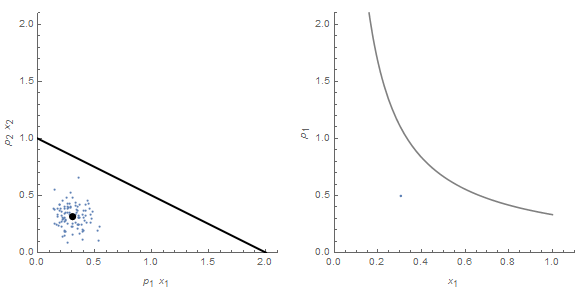
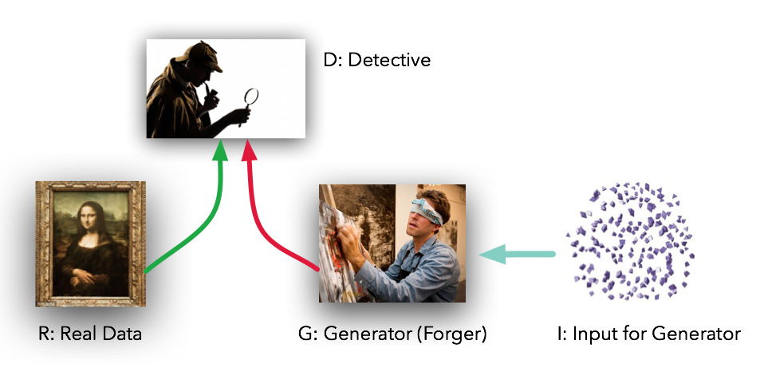
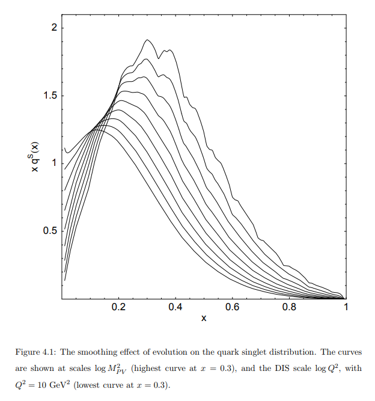

One of the most difficult aspects of this work is that economics already has some ideas about information. Well, _knowledge_ — not information theory _information entropy_ which is more a probability measure for data than meaningful data itself. The ability to transfer information is _**necessary**_ to transmit knowledge, but not _**sufficient**_. The different terminology leads to difficulties like these twitter threads with [Roger Farmer](https://twitter.com/farmerrf/status/989892389555683329) and [David Glasner](https://twitter.com/david_glasner/status/989601468805271552) when I say that a price cannot possibly convey the information it is claimed to convey in economics.

It is very true that I could fluctuate a single number and transmit a lot of data. If that number is an electric field, this is the basis for wireless communication. There are various schemes of modulating the amplitude, frequency, and phase of an electric field  that pack a lot of bits into a short time (high bit rate). For example [Quadrature Amplitude Modulation](https://en.wikipedia.org/wiki/Quadrature_amplitude_modulation) (QAM) is a common technique for doing this. The amplitude and phase relative to a carrier wave are shifted and make the signal appear in one of several locations on a "[constellation diagram](https://en.wikipedia.org/wiki/Constellation_diagram)" (or IQ plot for In-phase and Quadrature) like this:

Each point can be assigned several bits like the second diagram (a Gray-coded QAM-16). The information entropy of the possible data in the above diagram is log(16) ≈ 2.8 [nats](https://en.wikipedia.org/wiki/Nat_\(unit\)) You can further use various error correcting codes to reach [arbitrarily close to the "Shannon limit"](https://en.wikipedia.org/wiki/Low-density_parity-check_code) on the number of nats/bits per second in a given bandwidth in the presence of noise.

The information content of prices (or price changes) is based on the information entropy of the distribution those changes are drawn from. The information entropy of a normal distribution is ½ log(2π_e_σ²) where σ² is its variance. No coding schemes, no bandwidths, no meaningful "Shannon limit". Prices derive their information carrying capacity from the processes underlying them, not mathematical codes.

When I say that prices cannot possibly convey the information they are claimed to convey in economics, I am saying the underlying distribution of states for the objects being sold in a market transaction and the distribution of the prices do not have even remotely comparable information entropies (and often don't even have the same dimension with the former's much larger than the latter's). A car that sells for 500 dollars less than its blue book value could have been in an accident or a flood — or both. There are some fascinating stories about people trying to do this kind of thing with some of the digits in bids for the FCC spectrum auctions \[[pdf](ftp://www.cramton.umd.edu/papers2000-2004/00jre-collusive-bidding-lessons.pdf)\] \[1\]. But by and large, details about the item being sold and the distribution it was drawn from are being destroyed by the price mechanism. A unique car is not specified by some unique price, but rather the irrelevant details of the car (was my Honda built in the US or Japan, and by which route did it arrive at the dealer) are usefully wiped away \[2\]. The price does not contain that kind of information — it's not even close.

A simple illustration of this can be made using the model in Gary Becker's 1962 paper _Irrational Behavior and Economic Theory_. In that paper, he illustrated a demand curve by letting agents randomly, but uniformly, select a region of the opportunity set for two goods bound by a budget constraint. As the price for one good changes, the shape of this opportunity changes causing the price to trace out a demand curve like this:

Because we have a uniform distribution _P_ and undifferentiated widgets, the price **_can_** convey the information about the underlying degrees of freedom. However, the same price time series can be associated with an entirely different distribution:

Instead of a uniform distribution, we have a normal distribution in the same opportunity set. The difference in information entropy between the uniform distribution and the normal distribution _Q_ (which still has the same price time series) is exactly the information that is lost by using the price mechanism to determine the underlying distribution. The [Kullback-Liebler (KL) divergence](https://en.wikipedia.org/wiki/Kullback%E2%80%93Leibler_divergence) _D(P||Q)_ would measure a difference between assuming the distribution is _P_ when it is actually _Q_.

In general information is lost. The actual economic situation contains expectations, future plans, constraints, and random events. The price just plays a game of "warmer/colder". This can easily be seen to work for some kind of binary search, looking for a hidden object in a room. "Colder. Warmer. Colder. Warmer. Warmer. Warmer." until another player calls out, "I found it!" The amazing thing is that this seems to work for markets with a much more complex problem to solve. And I'm not sure we have really found the right framework to understanding exactly how this works ... until recently. Of course, my blog post here is speculative; however this is the sort of thing that is needed to understand how the price mechanism, which destroys so much information about the underlying distributions, manages to get those distributions to match when markets are working.

In machine learning, there is an algorithm that trains a neural network called a [Generative Adversarial Network](https://en.wikipedia.org/wiki/Generative_adversarial_network) (GAN). A good explanation of how these GANs work was given [here](https://medium.com/@devnag/generative-adversarial-networks-gans-in-50-lines-of-code-pytorch-e81b79659e3f), and I'll reproduce their metaphor and diagram:

Imagine a forger (generator _G_) blindly trying to reproduce a real painting (_R_). The object of the game being played here is for the forger to fool a detective (_D_) into thinking a forged painting is real. The detective is using that aforementioned KL divergence, a measure that destroys about as much information about the distributions it is comparing (distributions of color in paintings) as the price mechanism does (distributions of supply and demand). That this works at all is surprising. That it works really well is astounding.

It has recently been conjectured that what is happening in some of these machine learning/deep learning algorithms is what is called the "information bottleneck". [Here is a popular article in _Quanta_ magazine](https://www.quantamagazine.org/new-theory-cracks-open-the-black-box-of-deep-learning-20170921/); [here's a more technical paper](https://arxiv.org/abs/1503.02406). The idea is that deep learning works by destroying irrelevant information, forcing it through a "bottleneck" (minimum of mutual information) \[3\].

The price mechanism may create precisely such a bottleneck. Instead of Hayek's "system of telecommunications " where prices are "communicating information" \[4\], we may have prices destroying irrelevant information. Or we may not. The information bottleneck and analogies with GANs may be completely wrong. Regardless, something more complicated than simple _transmission_ of information must be going on \[5\]. It's simply impossible for a price to carry that much information.

**Footnotes**

\[1\] GTE put in some of its supposedly anonymous bids as something like 13,000,483 dollars or 20,000,483 dollars. The "483" spells "GTE" on a telephone keypad in the US. Others would contain codes for particular blocks of the frequency spectrum. There are some similar ideas with prices that end in ".99" representing "cheap" (my local liquor store says that its prices that end in ".97" represent an industry-wide lowest price). But by and large, people are not communicating the yields of soybean harvest using codes in the last digits of the price on a commodity exchange.

\[2\] Note this is separate from the asymmetric information (which is really asymmetric _knowledge_) in the case of Akerlof's _[The Market for Lemons](https://en.wikipedia.org/wiki/The_Market_for_Lemons)_. Regardless of whether the seller rationally holds back on negative knowledge about the car's state, the price itself still cannot convey as much information as there are possible car states. Only if you have undifferentiated widgets and uniform distributions does this become possible (discussed later in the post).

\[3\] Deep learning has also been connected to [renormalization in physics](https://www.quantamagazine.org/deep-learning-relies-on-renormalization-physicists-find-20141204/) (another _Quanta_ article that links to the original paper), and it is possible both of these are related to the information bottleneck. Renormalization is a process by which the details of processes at one scale are integrated out to produce effective (and usually simpler) processes at another scale. In fact, in my thesis I used renormalization ("DGLAP evolution") instead of the _ad hoc_ smoothing procedure used by the people who created the model to remove the effects of using a finite basis:

The finer details of the model — requiring a lot of information to specify —  at one scale were removed and only relevant information —  requiring less information — at the other scale was kept.

\[4\] _The Use of Knowledge in Society_ (1945)

\[5\] Interestingly, [Christopher Sims' work](https://informationtransfereconomics.blogspot.com/2016/09/channel-capacity-and-rate-distortion-in.html) has found that agents do not respond to much of the information in prices either. This makes more sense in the information bottleneck picture (where the prices are destroying information) than Hayek's telecommunications picture.
