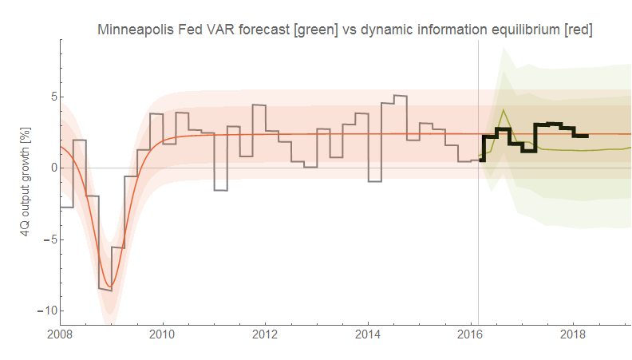
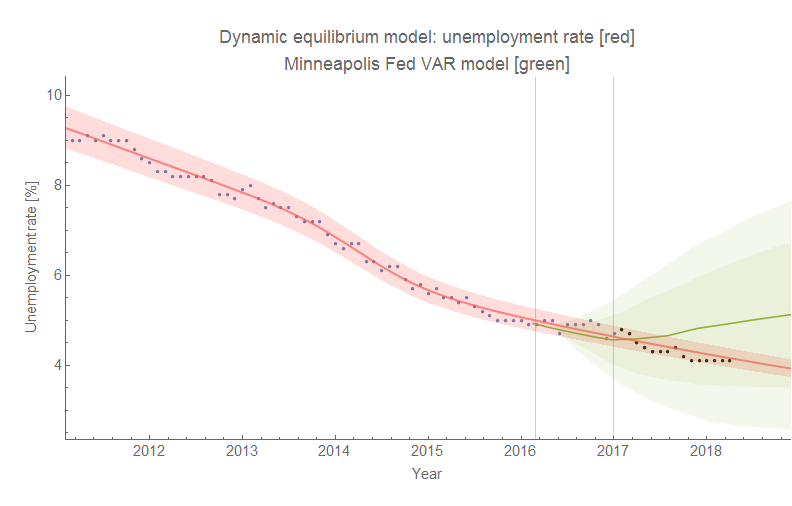
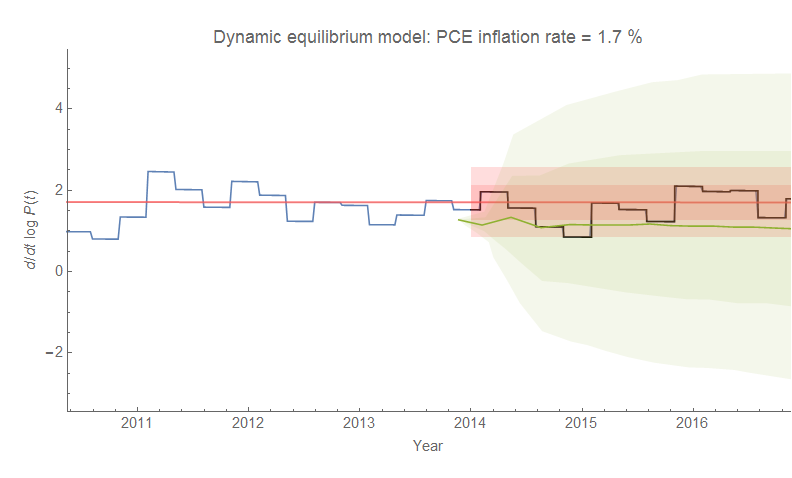

On my Twitter link to [this post on forecasts](https://informationtransfereconomics.blogspot.com/2018/04/new-gdp-numbers-and-validating-some.html), [@UnlearningEcon asked](https://twitter.com/UnlearningEcon/status/989950630423822338) about the performance of the dynamic information equilibrium models versus Vector AutoRegressions or VARs (instead of DSGE models). The [Minneapolis Fed has a VAR model](https://www.minneapolisfed.org/economy/district-data-archive/mf-var-forecast) with forecasts of various vintages available. Exact matches weren't available, but the dynamic equilibrium model over the past 10 years forecasts roughly constant PCE inflation and RGDP (and constantly declining unemployment rate) so these forecasts are sufficient to get a feeling for the relative performance. The dynamic equilibrium models are in red/red-orange and the MF VARs are in green.

The error bands of the MF VAR are larger (both show 70% and 90%), but the MF VAR gets the first couple of quarters after the forecast point pretty close because of the method it uses \[1\]. How about the unemployment rate? Like the [FRB SF structural models](https://informationtransfereconomics.blogspot.com/2018/04/employment-situation-forecasts-compared.html) (which are given with out confidence levels), the MF VAR shows an eventual rise in the unemployment rate that hasn't appeared in the data (the vertical lines show the forecast starting points for the MF VAR and my model):

The forecast error bands are much smaller for the dynamic information equilibrium model. And finally, here is core PCE inflation:

This shows the MF VAR model alongside a constant PCE inflation = 1.7% model, which is equivalent to the dynamic information equilibrium model over the same period (see [here](https://informationtransfereconomics.blogspot.com/2018/01/losing-my-vestigial-monetarism.html)). Again, the error bands are much smaller.

Overall, the error bands of the VAR models are larger, and the only improvement over the dynamic equilibrium models is in the AR process forecasts of the data points immediately after the forecast dates (which can be added to the dynamic equilibrium models as discussed in footnote \[1\]). As the dynamic equilibrium models are much simpler than macro VARs, this is a definite feather in their cap.

**Footnotes**

\[1\] One thing I did want to note is that I tend to give the confidence limits for a forecast that are independent of the most recent point in the data — effectively, an AR(0) process. Modeling using e.g. an ARMA(2,1) processes gives you an estimate of the next point that tends to be better for some economic time series because of mean reversion as well as the details of the ARMA(2,1) model itself. But after a couple data points in most macro models, the confidence limits of the ARMA(2,1) approach the AR(0) process. I'll show you with a graph (click to enlarge):

The 90% confidence using just the standard deviation (σ) of the input data of the forecast is shown in dashed red (the "AR(0)" forecast). This is the model error band I usually give. An ARMA(2,1) process shows some interesting fluctuations, but over time the error in the model parameter estimates average out into a measure of the standard deviation of the input data (1.6 σ for 90%). For a lot of macro models, the result is usually a good first point or two, followed by what is essentially the AR(0) forecast. It rarely seems worth the effort, but I have shown it for some forecasts like the one for the S&P 500:

That one is useful because the AR(0) band in red is based on data all the way back to the 1950s, while the more complicated AR process (in blue, but mixed with the red looks purple) is based only on the past few years. That the means and error both come close to converging is a sign of consistency between the approaches and a good check on my math/code.
