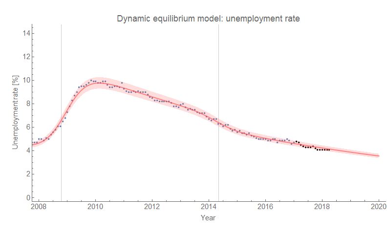
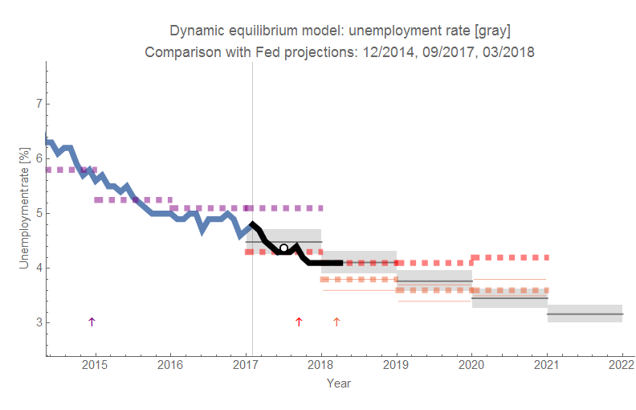
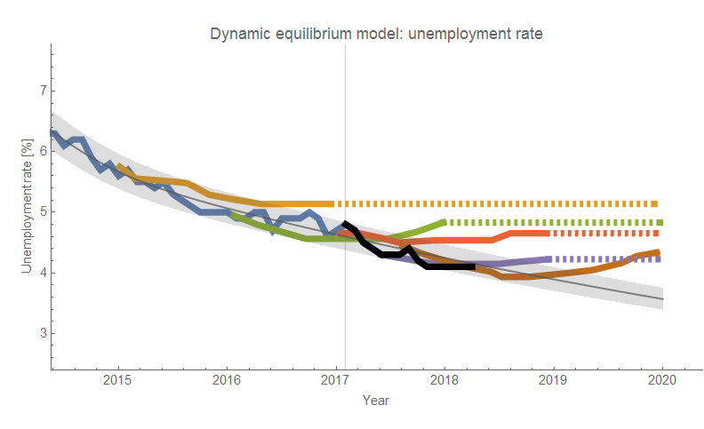
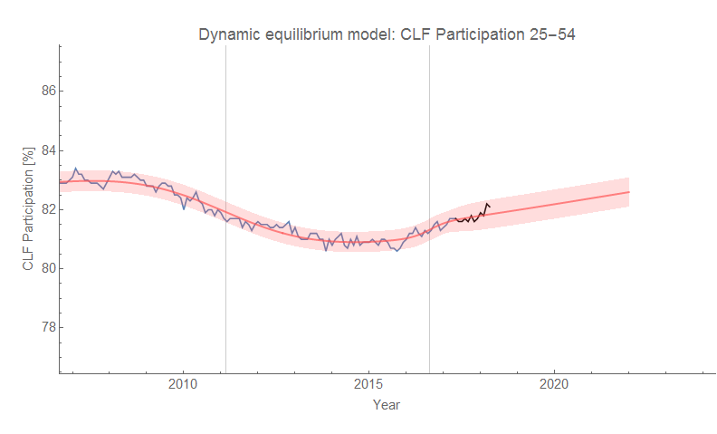
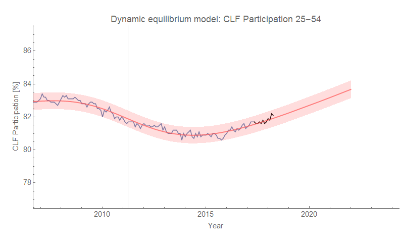
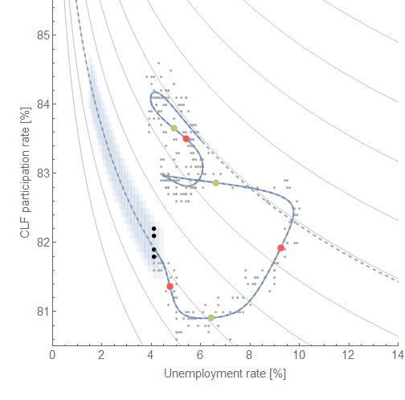

Another month, and another 4.1% unemployment rate. The latest [unemployment situation data](https://fred.stlouisfed.org/release?rid=50) is available, and it's all consistent with the forecasts. The unemployment rate is consistent with a forecast from January 2017 (so over a year of data):

Here is the same forecast compared to forecasts from the FRBSF and the FOMC (click to enlarge):

Funny enough the old FOMC forecast from December 2016 is doing better than [the most recent one from their March meeting](https://informationtransfereconomics.blogspot.com/2018/03/fed-revises-its-projections-again.html).

Here are the two models of the prime age labor force participation (with and without a shock, [as discussed here](https://informationtransfereconomics.blogspot.com/2017/11/a-new-beveridge-curve-or-science-is.html)), as well as the novel "Beveridge curve" (at the same link):

