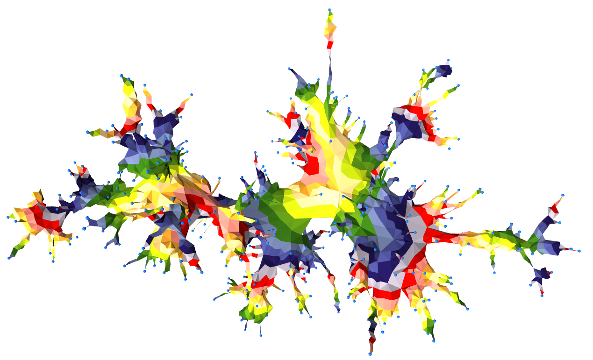

When I got into economics as a hobby, I went through three phases. First, I assumed like I do with most fields that the experts in the field are in general on the up and up. Disagreements on e.g. macro policy were the result of legitimate disagreements about how the economy worked. Second, after playing around with the data, [reading Noah Smith on the subject](http://noahpinionblog.blogspot.com/2013/04/the-reason-macroeconomics-doesnt-work.html), and having followed those macro disagreements long enough to find some of them to be completely baseless in terms of empirically successful theory, I concluded a lot of it (except for the empirical work) was useless. While you should generally distinguish between macro and micro theory, the macro theory was based on the micro theory and the pieces of the macro theory that seemed most problematic were precisely those related to the micro theory. I was on board with the critics, but my personal preference is not to just lob criticism but rather produce viable alternatives. That's where my blog started five years ago. Recently I've entered my third phase where I've realized there is a econ criticism industry repeating the same tired critiques — but crucially also misses the actual problems (or just makes the same mistakes!) I set out to find alternatives to:

-   You're never going to create an economic model of human being that is in any way accurate, and even if you got close the aggregate model would be intractable. Be agnostic about human behavior.
-   Don't use your gut feelings to choose which things to include in models or how to include them. Money causing inflation sounds reasonable, but it's not empirically supported except for hyperinflation. (And don't use that empirical finding out of scope!)
-   Don't make those models more complex than the data can support. A macro model with tens of interacting variables at best will only be validated after 50 more years of time series data, putting it only slightly above philosophical speculation in meaning.

I made these points [in a criticism of an "economic way of thinking" just yesterday](https://informationtransfereconomics.blogspot.com/2018/04/the-economic-way-of-thinking.html). But that's also why I'm basically on board with [Noah Smith's recent article](https://www.bloomberg.com/view/articles/2018-04-25/critics-of-economics-are-dwelling-in-the-past) about econ critics sounding like a broken record in both the metaphorical senses of repeating themselves and using an outdated method.

But also the litany of "successful economic theory" basically validates my itemized view above and two can even be represented using the information equilibrium framework. Noah lists "\[a\]uction theory, random-utility models, matching theory, gravity-trade models ...". I haven't taken on auction theory yet, and [only noted](https://informationtransfereconomics.blogspot.com/2015/07/random-utility-discrete-choice-models.html) the similarities between random utility discrete choice (which is more concerned with the [state space of choices available to the agents](https://informationtransfereconomics.blogspot.com/2015/11/monkeys-and-markets.html)). However the other two I've already looked at on my blog ([here](https://informationtransfereconomics.blogspot.com/2017/09/search-and-matching-ii-theory.html) and [here](https://informationtransfereconomics.blogspot.com/2015/09/information-equilibrium-and-gravity.html), as well as [my recent paper](https://papers.ssrn.com/sol3/papers.cfm?abstract_id=3094757)). These models don't make a lot of assumptions about human behavior ("random" behavior in one), don't include things that aren't empirically supported (gravity models include distance despite it being mysterious from a theoretical perspective), and aren't very complex.

All of this was prolog to another way to look at the gravity model that uses one bit of information in the paper Noah cites by [Thomas Chaney](http://www.nber.org/papers/w19285) \[1\] that makes it even easier to write down an information equilibrium model. The scales of the trade state space should be set by the value of the output of one country ($NGDP_{a}$), the value of the output of the other country ($NGDP_{b}$), and also determined by the number of the firms engaged in trading ($K$). This establishes three [information equilibrium relationships](https://informationtransfereconomics.blogspot.com/2016/09/basic-definitions-in-information.html):

In the paper, Chaney notes that the distribution of firms engaged in trade essentially scales with inverse distance $D$ via Zipf's law (which is another information equilibrium relationship $K \rightleftarrows 1/D$ \[2\]) with fewer, larger firms engaged in long range trade, so that we finally obtain:

The precise value of the parameters are based on the relative information of elements of each state space (and are usually just fit empirically). What's additionally interesting is that the information transfer framework allows for [non-ideal information transfer](https://informationtransfereconomics.blogspot.com/2016/09/basic-definitions-in-information.html), meaning that in general this relationship is just a bound on trade:

Sometimes you receive less information than is transmitted, and here the cause is precisely the lack of information flowing per footnote \[1\].

...

**Update 26 April 2018**

Per a comment from [@unlearningecon](https://twitter.com/UnlearningEcon/status/989502419691294720), here is some data (digitized from [here \[pdf\]](http://dave-donaldson.com/wp-content/uploads/2015/12/Lecture-16-Gravity-models-empirics.pdf)) using OECD countries showing the gravity model as a bound:

**Footnotes**

\[1\] Also in the paper Chaney makes the same assumption about fully exploring the state space that information equilibrium does:

> _As long as the individuals that make up firms engage in direct communication with their clients and suppliers, and as long as information permeates through these direct interactions, one ought to expect that aggregate trade is close to proportional to country size and inversely proportional to distance._

\[2\] Also maybe of interest: [information equilibrium models of building height](https://informationtransfereconomics.blogspot.com/2016/06/the-urban-environment-as-information.html).
