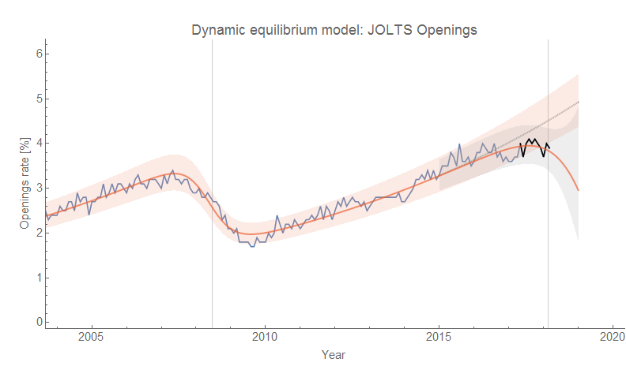
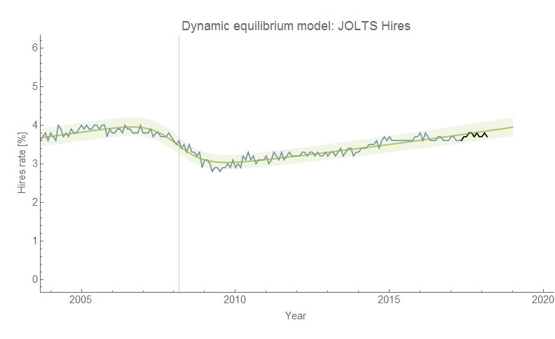
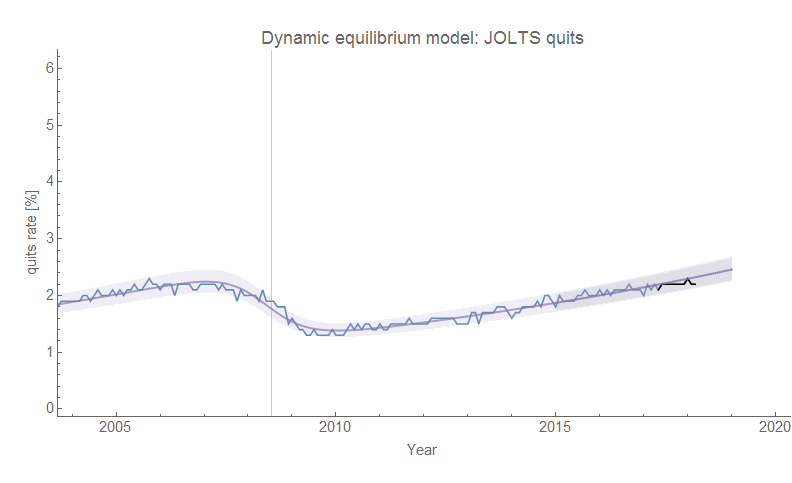
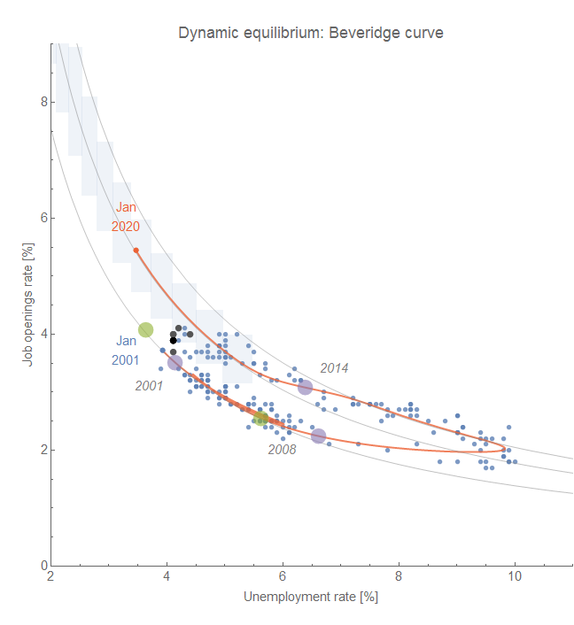
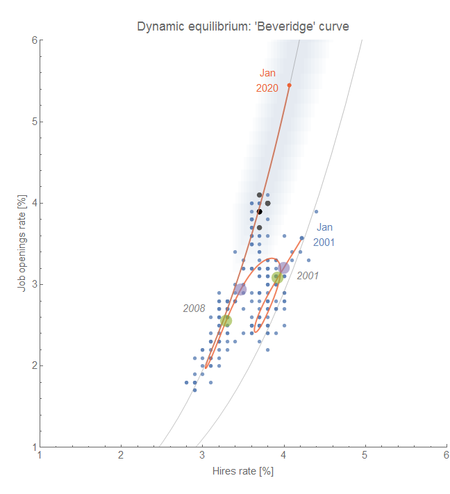

The latest [JOLTS data](https://fred.stlouisfed.org/release?rid=192) is out today, so it's once again time to see how the forecasts are doing ([last month had a lot of data revisions](https://informationtransfereconomics.blogspot.com/2018/03/jolts-data-day.html)). The model of the "Great Recession" showed that [JOLTS hires were a leading indicator of that recession](https://informationtransfereconomics.blogspot.com/2017/07/jolts-leading-indicators.html), however an attempt to glean data from the early 2000s recession [had JOLTS openings as the leading indicator](https://informationtransfereconomics.blogspot.com/2018/03/dynamic-equilibrium-model-fertility-as.html) (which should be taken with a grain of salt because the time series starts mid-recession making the timing estimates uncertain). If we are seeing the leading indicators of a recession with the latest data, then it looks like job openings are the one to watch:

The data is deviating from the forecast that assumes no recession, and the counterfactual recession shock is (still) showing a likely downturn with the latest data. I might even go out on a limb and say the 2019 recession is underway — having begun sometime this year. However the other JOLTS measures remain consistent with the no-recession forecast, only hinting at a future recession by a negative bias to the error:

The Beveridge curve (of unemployment versus job openings) is another way to represent the deviation in the job openings data (unemployment per the links above is a lagging indicator by almost a year):

There is another "Beveridge curve" (now I'm just referring to the whole class of relationships between labor market measures as "Beveridge curves", which I believe is not standard in economics but would be the kind of thing that physicists might say ([e.g.](https://en.wikipedia.org/wiki/Equation_of_state))) that was inspired by [Nick Bunker's article anticipating the data release from today](http://equitablegrowth.org/research-analysis/employers-may-be-behind-the-problems-with-u-s-hiring/). While I don't believe in the way he frames the data (his description of a declining "vacancy yield" in terms of possibly changing conditions is, in the dynamic equilibrium model, a normal result of equilibrium) his look at hires and vacancies prompted me to look at the two measures together:

Since hires and openings (vacancies) are positively correlated, this results in a proportional relationship between the two rates (a negative correlation between openings and unemployment results in inverse proportionality). Recessions can cause the economy to move from one equilibrium (gray line) to another. This measure probably won't be as good of a representation because the timing of recession shocks (green and purple dots) are closer (a few months) than for openings and unemployment rate (almost a year in the previous graph) and the series are correlated leading to less of a dynamic range and more "backtracking" along the paths (i.e. both fall in a recession).

Overall, the picture appears to be a looming recession with job openings (vacancies) showing the first signs — but also the only signs.

...

PS The details of the model are described [in my paper up at SSRN](https://papers.ssrn.com/sol3/papers.cfm?abstract_id=3094757).
