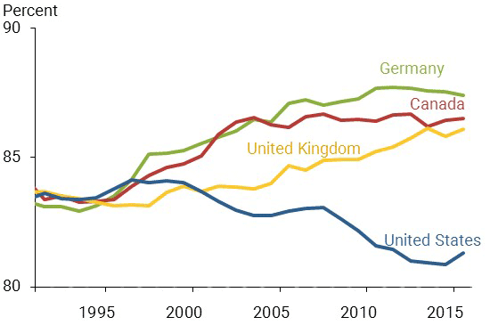
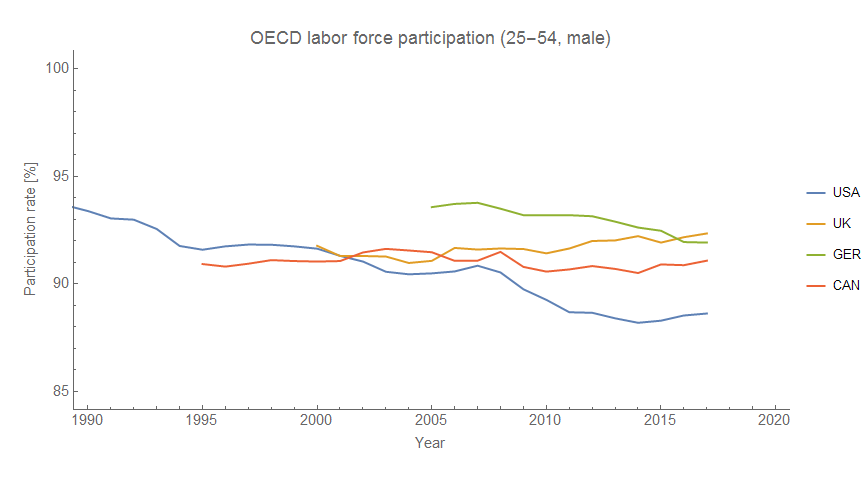
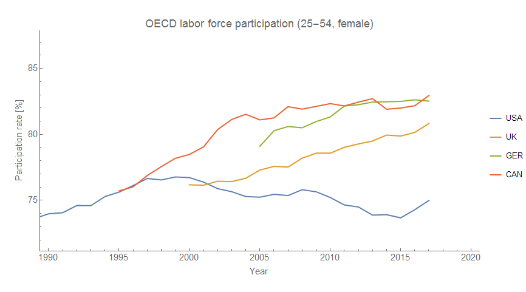

There's [a recent article from the FRB SF](https://www.frbsf.org/economic-research/publications/economic-letter/2018/april/raising-speed-limit-on-future-growth/) on economic growth prospects that contains the chart above with the following discussion:

> _This chart compares the percentage of prime-age workers in the labor force in Germany, Canada, the United Kingdom, and the United States. In these other advanced economies, labor force participation of prime-age workers has increased overall and now stands far—several percentage points—above the rates observed in the United States._

> _Which raises the question—why aren’t American workers working?_

> _The answer is not simple, and numerous factors have been offered to explain the decline in labor force participation. Research by a colleague from the San Francisco Fed and others suggests that some of the drop owes to wealthier families choosing to have only one person engaging in the paid labor market (Hall and Petrosky-Nadeau 2016). And I emphasize paid here, since the other adult is often staying at home to care for house or children, invest in the community, or pursue education. Whatever the alternative activity, some of the lost labor market participation seems related to having the financial ability to make work–life balance choices._

I went to the OECD data and found that the stagnation in labor force participation in the US compared to other countries is almost entirely a phenomenon of female labor force participation:

US female labor force participation increases until the late 90s, and then stagnates (becoming correlated with male labor force participation). In the other countries shown, female labor force participation is mostly still increasing. What caused **_that?_**

I've [mentioned before](https://informationtransfereconomics.blogspot.com/2018/03/its-80s.html) that it is not out of the question that increasing female labor force participation was involved in the surge of inflation peaking in the 70s, and that the Volcker Fed's actions worked by arresting that increase. However, given that there hasn't been a subsequent recovery, it is more likely that female labor force participation in the US just reached a new equilibrium — an equilibrium that is different from the equilibrium in Canada, Germany, or the United Kingdom.

One glaringly obvious culprit is the miserliness of family leave provisions in the US. The [FMLA of 1993](https://en.wikipedia.org/wiki/Family_and_Medical_Leave_Act_of_1993) was passed as the issue made its way to the political forefront in the 90s (likely due to labor force participation — both total and female — reaching its highest levels in history), but the provisions of the FMLA are laughable when compared to those of other countries (where many improvements to and beyond ILO standards were made in the 90s and early 2000s \[[pdf](http://paa2004.princeton.edu/papers/41254)\]). Women's labor force participation thus stagnated in the US, while policies allowed it to continue to grow in Canada, Germany, and the UK.

That story is hardly definitive, and there could be many other factors (for example, parts of the US are more like Western Europe in terms of social institutions while others are not leading to an admixture of different "cultures" meaning the 'equilibrium' participation rate being essentially an average of the UK and, say, Turkey). The story from the FRBSF that increased wealth in the US has lead to one parent staying home is not entirely implausible. I haven't fully immersed myself in the literature here, so this should be considered more formulating the question than providing an answer. The main point is that recent labor force participation stagnation in the US appears to be primarily due to women's labor force participation stagnating.
