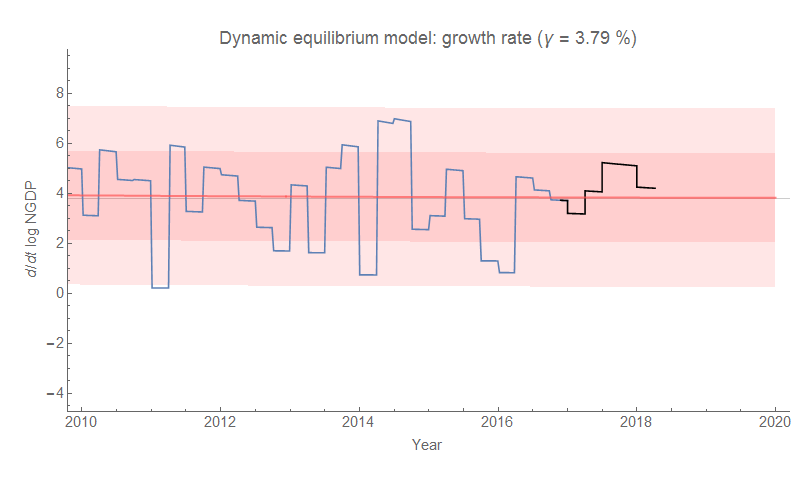
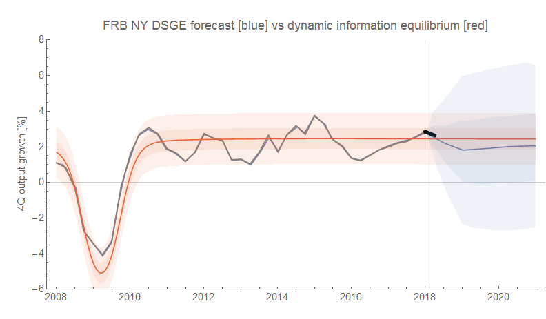

The latest GDP numbers for the US are out, so it's time to see if there are any surprises in the forecasts. As usual, no. The dynamic information equilibrium models are all doing fine.

Here's the RGDP forecast (red-orange) alongside a forecast from the FRB NY DSGE model (blue); the latest data is black (just like the rest of these graphs):

Here are two models of PCE inflation; the existence of a shock in 2013 is uncertain, but it doesn't really matter for the recent data:

The negative shock centered in 2013 was hypothesized on the basis of the relationship between inflation the labor force and a similar (and more well-defined) shock to CPI inflation. The Great Recession induced a decline in labor force participation that has subsequently showed up in inflation. As both these shocks fade, the "lowflation" in the aftermath of the Great Recession is ending (see links [here](https://informationtransfereconomics.blogspot.com/2018/03/cpi-data-and-end-of-lowflation.html) and [here](https://informationtransfereconomics.blogspot.com/2018/01/is-low-inflation-ending.html)).

And finally, here are the level and growth rate of NGDP/[PAYEMS](https://fred.stlouisfed.org/series/PAYEMS) (which I also write _NGDP/L_ or _N/L_) which is essentially Okun's law (see [here](https://informationtransfereconomics.blogspot.com/2017/03/the-quantity-theory-of-labor-and.html)):

**Update**

