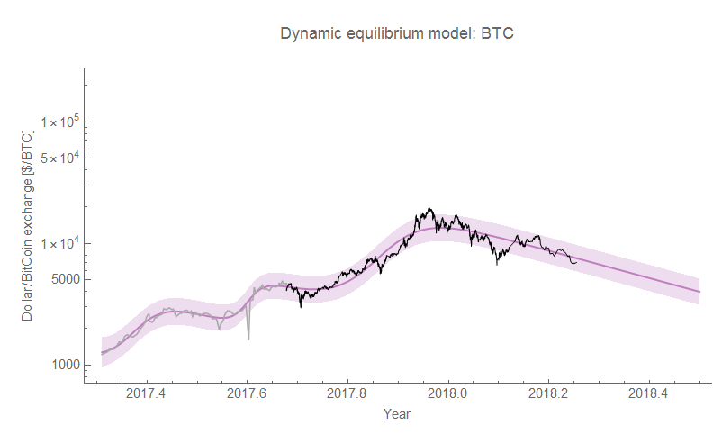
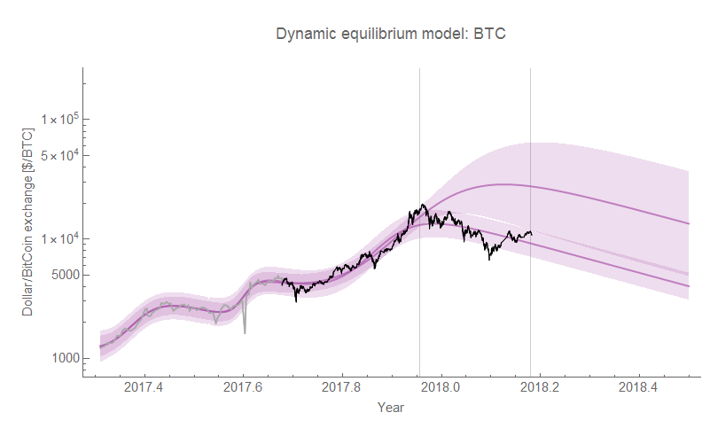
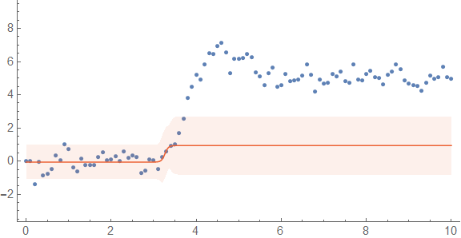
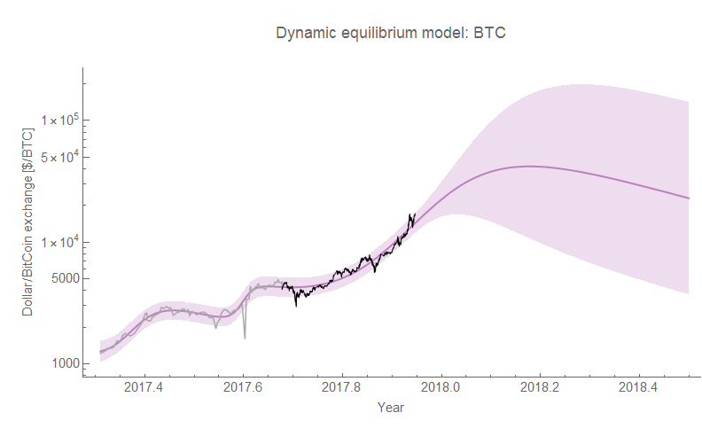

I've been tracking the bitcoin exchange rate using a dynamic information equilibrium model [since last year](https://informationtransfereconomics.blogspot.com/2017/10/bitcoin-model-fails-usefulness-criterion.html) \[1\]. While I found that the model is useless for forecasting, it can still provide decent _post hoc_ descriptions of the data:

Part of the impasse to being useful as a forecasting model is that the data shows signs of both a) large shocks, and b) "overshooting". Here we can see two forecasts (one in December, the other from the beginning of March \[2\]):

The dynamic equilibrium model itself is just a prediction that in the absence of non-equilibrium shocks the slope is constant (as you can see with the parallel lines). This constant slope has remained a good description of the bitcoin exchange rate since the late 2017 shock.

The bitcoin data, like some other economic data analyzed with the dynamic equilibrium model (unemployment), appears to have what in physics is called a "[step response](https://informationtransfereconomics.blogspot.com/2017/11/unemployment-rate-step-response-over.html)": "ringing" that occurs when a sharp shock hits the system. The fundamental reason for this "ringing" is that the system doesn't have sufficient "bandwidth" to support the infinite number of frequencies required to describe a sharp shock (in an economic system, both units of time as well as the number of economic agents determine this \[3\]).

However there is also a problem with fitting the underlying logistic function shock model in that it can both undershoot and overshoot. I put together some simulated data using a step response function and added an AR(2) process for noise. As the data comes in, the logistic function fit first undershoots and then overshoots the underlying "step" as I've noticed before in e.g. [unemployment data](https://informationtransfereconomics.blogspot.com/2017/04/determining-recessions-with-algorithm.html):

As of yet, I don't know if there is a solution to this problem (and there may not be as estimating parameters of exponentials is always difficult).

**Footnotes:**

\[1\] Here is the evolution of that forecast:

\[2\] Note that the March forecast was predictive of the data for the next month (at the top of the post). As long as we're not in the middle of a non-equilibrium shock, the model is a good description of the data.

\[3\] One possible reason for the disappearance of the step response in unemployment data is a combination of an increased number of people in the labor market along with the flexibility in time periods people can be employed — in the past, you might have had to start on a Monday or even the 1st of the month because of firms' payroll schedules. Workers wouldn't e.g. work 3 days, then be unemployed for 1 day, and then work again for 10 days (or if they did, they didn't consider themselves "unemployed" during that 1 day).
