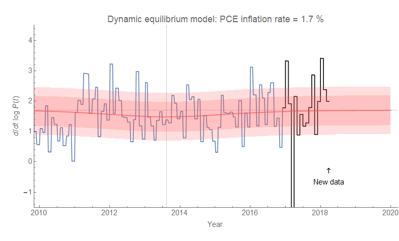
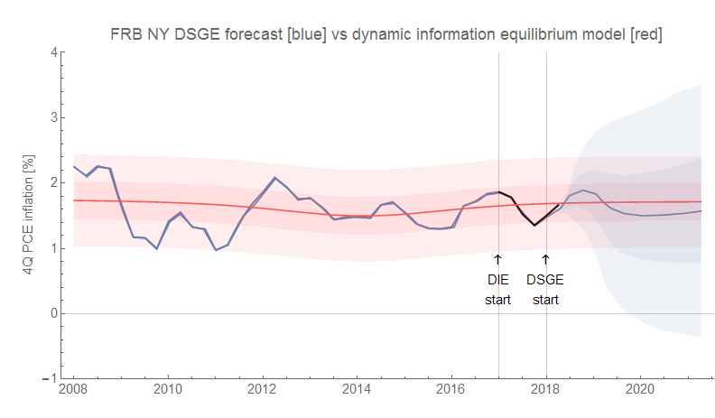

The latest [monthly PCE inflation data](https://fred.stlouisfed.org/series/PCEPILFE#0) is out and so I'll continue to document the performance of the dynamic information equilibrium model forecast. Here's the basic version with post-forecast data in black (error bands are 70% and 90% confidence):

And here is a head-to-head with the FRB NY DSGE model (that I should have updated [in this post alongside GDP](https://informationtransfereconomics.blogspot.com/2018/04/new-gdp-numbers-and-validating-some.html) because quarterly data came out last week; also note [the post comparing with Minneapolis Fed VAR models](https://informationtransfereconomics.blogspot.com/2018/04/comparing-my-forecasts-to-vars.html)):

The second graph has 50% and 90% confidence intervals (and is 4Q inflation instead of continuously compounded annual rate of change) to match with the DSGE model. As always, click for higher resolution graphs.
