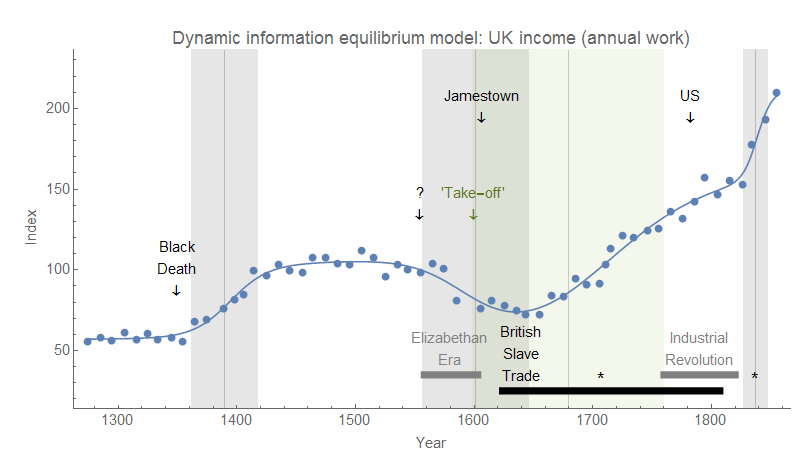

> _First, the reaction of wages to the Black Death (around 1350-1450) is much smaller in terms of annual wages compared to day wages. ..._ 

> _Second, and probably most noticeable, is the onset of sustained growth in annual earnings much earlier than the actual Industrial Revolution. Both the GDP per capita and the annual earnings series \[begin\] to accelerate around 1650. ..._ 

> _That increase predates even the most aggressive dating of the industrial revolution in terms of specific technologies ..._

That is from [Dietrich Vollrath's great new blog post](https://growthecon.com/blog/When-Growth/) on (estimated) economic growth in England from 1260-1850. A new time series for income from Jane Humpries and Jacob Weisdorf calls into question some traditional interpretations of economic history. I thought I'd try the [dynamic equilibrium model](https://informationtransfereconomics.blogspot.com/2018/01/new-paper-up-at-ssrn.html) on the new time series to see if it is possible to tease any further information from it.

I show the model fit with the non-equilibrium transitions on the graph (three positive, and one negative). The story largely corrobborates Vollrath's contention that a sustained growth 'take-off' pre-dates the industrial revolution. In fact, the dynamic equilibrium model indicates the rapid growth of of the 17th and 18th centuries begins in the early 1600s. The latter two shocks roughly correspond with shocks to [estimated energy consumption in the US (asterisks)](https://informationtransfereconomics.blogspot.com/2017/09/the-long-trend-in-energy-consumption.html). A more likely interpretation is that the initial 'sustained' growth was due to colonization of the Americas (the burst almost perfectly fitting between the founding of Jamestown and the American revolution) and the slave trade (tentatively marked here by colonization of Barbados and Wilberforce's abolition). However 'sustained growth' is not the right description for a slavery and colonization-based economy; as the industrial revolution comes along, this growth was fading.

The black death still seems to be the trigger for the increase in real income in the 14th and early 15th century in this new time series, but there is a negative shock in the 16th century that doesn't correspond to any bad news that I can see in the economic history. It actually corresponds to the "Elizabethan era", which is hailed as a golden age of England. This makes me think that this is due to a nominal shock rather than a real one. The most likely culprit is the "[price revolution](https://en.wikipedia.org/wiki/Price_revolution)" (see also [here](https://informationtransfereconomics.blogspot.com/2015/09/the-price-revolution-and-non-ideal.html)) and the accompanying inflation due to the Spanish plundering the New World — real income is down because of a shock to inflation without an accompanying shock to nominal growth.

The overall picture I want to leave with is that "sustained growth" does not seem to be the best and only interpretation of what we think of as the modern era of economic growth. In fact, rather than an era of sustained economic growth, what we may have are a series of nearly overlapping large shocks (colonial era in the 1600-1700s, railroads in the 1800s, the world wars 1900-1940s, and women entering the workforce 1970s, see [here](https://informationtransfereconomics.blogspot.com/2017/03/three-centuries-of-dynamic-equilibria.html) for these events in the UK inflation time series). This means that unless some new non-equilibrium shock is in the future, we cannot expect sustained economic growth.

...

**Update 4 April 2018**

Per David Glasner's comment below, I did want to clarify that by "sustained growth" I mean the rapid sustained growth of the modern era of industrialization (1700s to the 1900s). In the absence of non-equilibrium shocks, [the dynamic equilibrium picture indicates sustained real US growth of about 2.4% per year](https://informationtransfereconomics.blogspot.com/2018/01/24-growth-forever.html).
