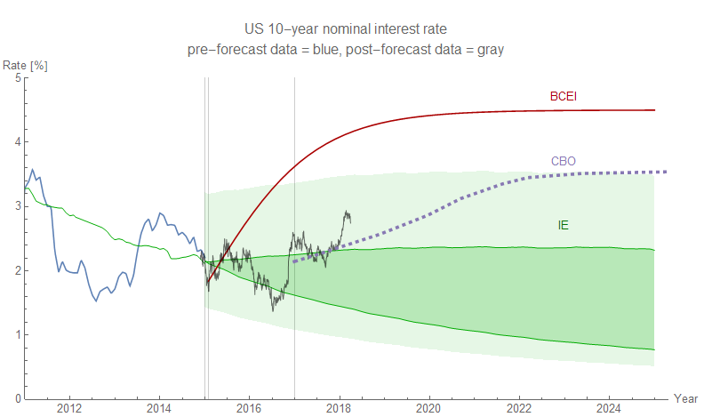
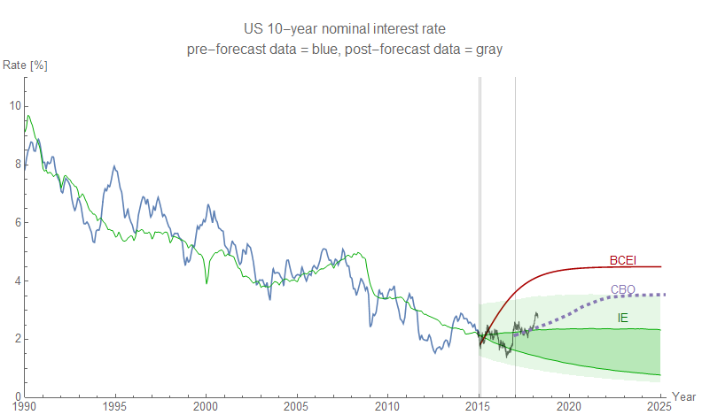

Two of the more hubris-laden forecasts I've made are for the stock and bond markets, specifically the [S&P 500](https://informationtransfereconomics.blogspot.com/2017/01/what-about-s-500.html) (a dynamic information equilibrium model) and the [10-year Treasury rate](https://informationtransfereconomics.blogspot.com/2015/08/comparison-of-interest-rate-predictions.html) (a basic information equilibrium model). The latest gyrations of both are well within the expected model error. Note that the 10 year forecast is the forecast of the green line which represents the trend around which the data fluctuates — by about 1.3 percentage points RMS (this error is shown as a lighter green band) — while the S&P forecast shows the 90% confidence bands for the data. Click to see the full resolution versions.

