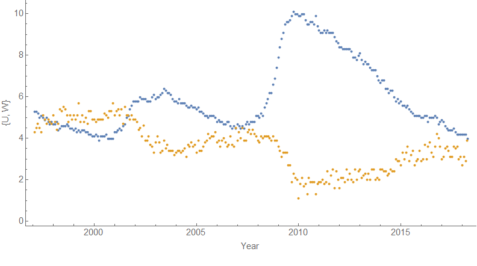
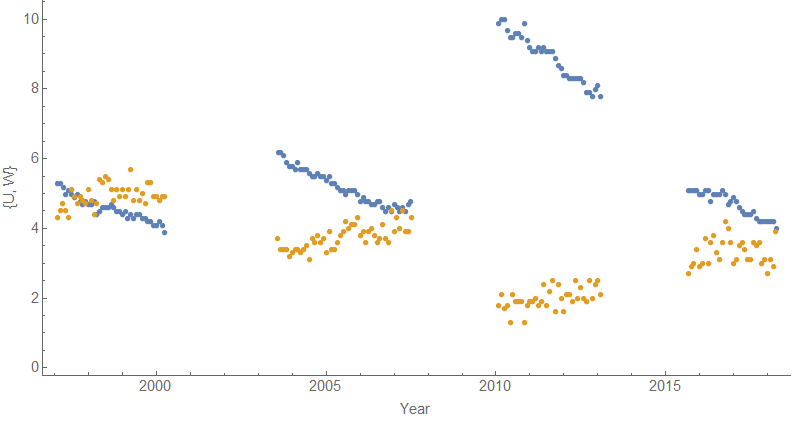
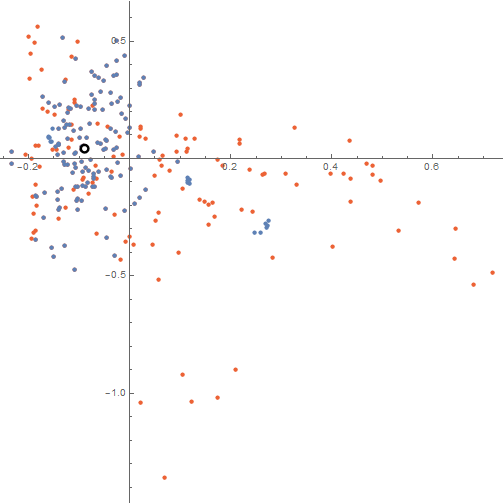
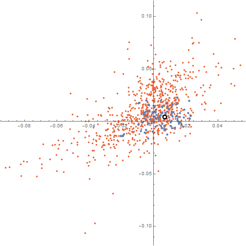
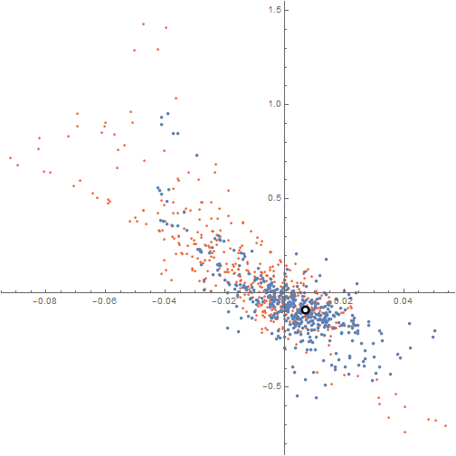
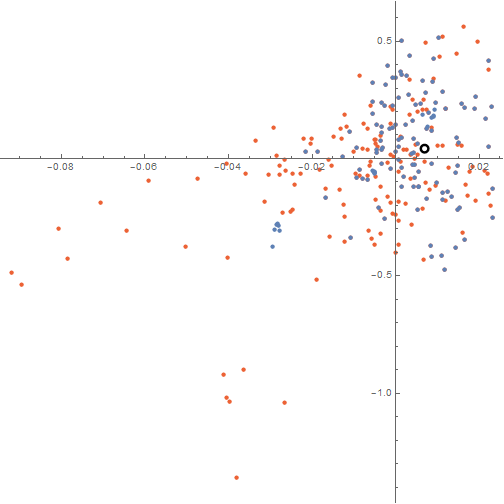

I thought I'd try to create a better visualization that uses [the dynamic information equilibrium model](https://papers.ssrn.com/sol3/papers.cfm?abstract_id=3094757) to understand relationships between macroeconomic observables that I talked about [in my post from yesterday](https://informationtransfereconomics.blogspot.com/2018/05/labor-force-participation-and-wages.html). I'll first work through the process visually for the relationship between the unemployment rate and wage growth. First, if we look just at the data, there's a hint of an inverse relationship (high unemployment means low wage growth):

However, a lot of the data is in a period where one or both time series is undergoing a non-equilibrium shock (i.e. recessions, but also one positive shock in 2014). Let's excise that data (I discarded data that was within "two-sigma" of the center of the shock, see footnote [here](https://informationtransfereconomics.blogspot.com/2018/01/canadas-below-target-inflation.html)):

We can see that inverse relationship much clearer now. However, we can also see that the inverse relationship has nothing to do with the _level_, but rather the _slope_. In the dynamic information equilibrium model, it's the logarithmic slope (i.e. log differences).

In order to show how much removing the non-equilibrium shocks helps us see that relationship between the (logarithmic) slopes, I've estimated the local slope across the entire data set (red) and also using the excised equilibria (blue):

The black and white point is the dynamic equilibrium estimated from the minimum entropy procedure [described in my paper](https://papers.ssrn.com/sol3/papers.cfm?abstract_id=3094757). You can see that removing the non-equilibrium periods collapses the data around the dynamic equilibrium point.

The same thing happens when comparing e.g. the employment population ratio for men and women, as well as comparing the employment population ratio for men with wages and unemployment \[1\]. Here are those graphs (click for larger versions):

...

**Footnotes:**

\[1\] I only used men in these cases because a large segment of the data for women's employment population ratio contains the approximately 40-year period (from 1960-2000) of non-equilibrium demographic shift of women entering the workforce.
