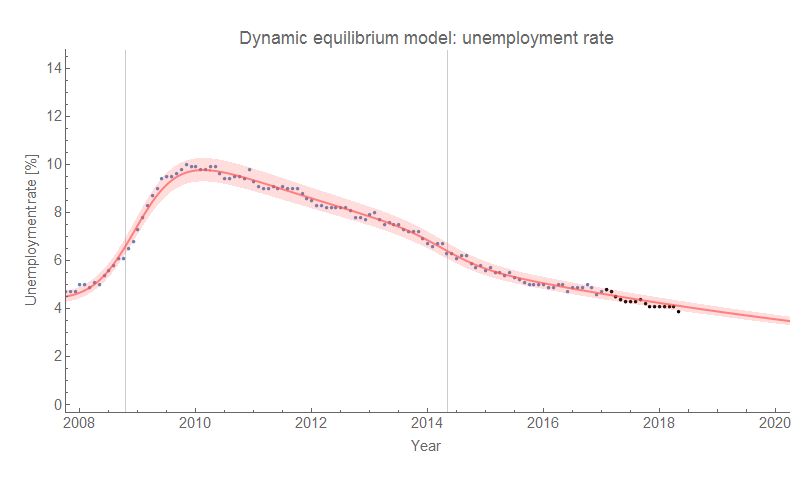
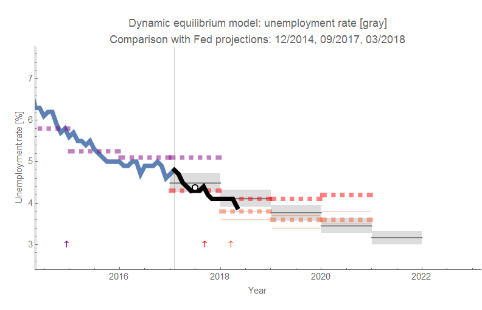
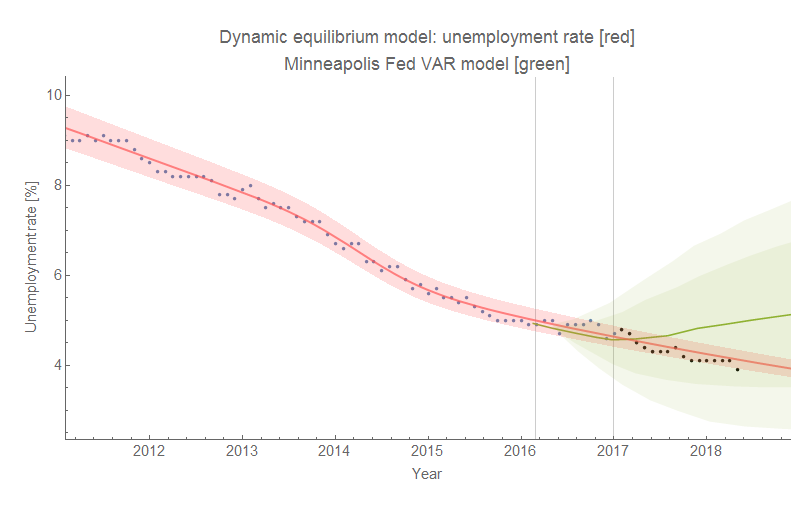

The [unemployment rate](https://fred.stlouisfed.org/series/UNRATE) showed its first fall in a few months, to 3.9% from 4.1%. Overall, the forecasts (model described [here](https://papers.ssrn.com/sol3/papers.cfm?abstract_id=3094757)) from the beginning of 2017 (!) are doing fine almost one and a half years out. At least my forecasts. The historical forecasts from the FOMC and FRBSF look more and more like they're just playing catch-up with reality (and the Minneapolis Fed remains biased high). Eyeballing it, the lifetime of accuracy from the FRBSF forecast is about four to six months.

