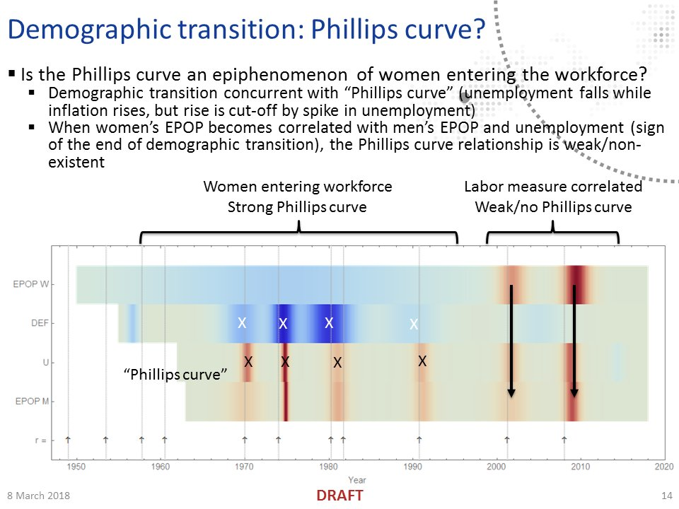

The [St. Louis Fed has an article](https://www.stlouisfed.org/publications/regional-economist/second-quarter-2018/gender-risk-unemployment) about the difference between the unemployment rate for women and for men, producing the data in this graph:

If we look at the data alone, it looks like this measure is positive until it drops to zero/negative  after the 1980s recessions. However, women's labor force participation was accelerating during this time (effectively adding more women looking for work) — which had other effects [such as potentially creating the Philips curve](https://informationtransfereconomics.blogspot.com/2018/05/labor-force-participation-and-gravity.html). If we subtract an estimate of this effect (I admit I just eyeballed this fit using a dynamic equilibrium shock which is approximately Gaussian in shape), we essentially get a flat curve with dips for recessions:

It's imperfect (especially the 1950s, which may have a bit of e.g. [post-war labor force re-entry](https://informationtransfereconomics.blogspot.com/2018/05/labor-force-participation-and-gravity.html)), but this representation of the data helps mitigate an "optical illusion" — the sudden drop in the 80s now just looks like a recession dip super-imposed on the declining dynamic equilibrium shock.

...

PS The other differences noted in the article are likely due to the fact that the dynamic equilibrium is logarithmic — falling from a higher unemployment rate falls faster than falling from a lower unemployment rate. The figure about gender differences in time shows the difference between the era of women entering the workforce and  e.g. the 2008 recession where [women's labor measures become correlated with men's](https://twitter.com/infotranecon/status/971881574810533890) (click for larger image):

