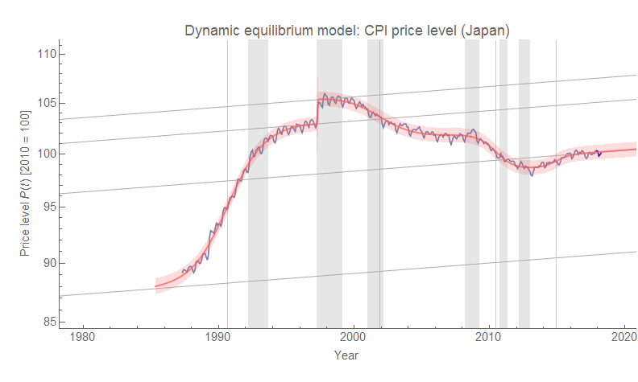
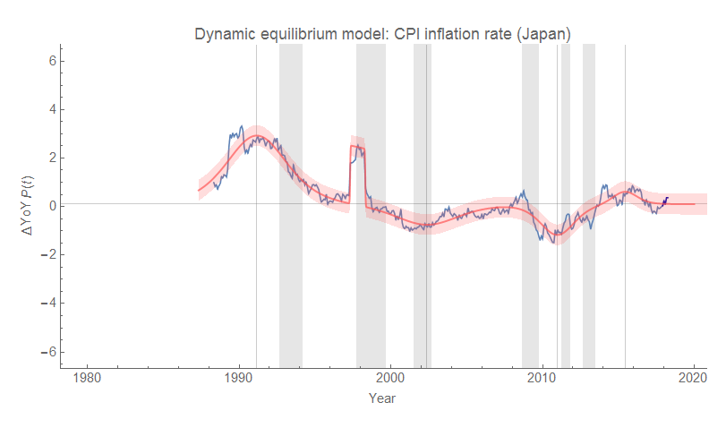
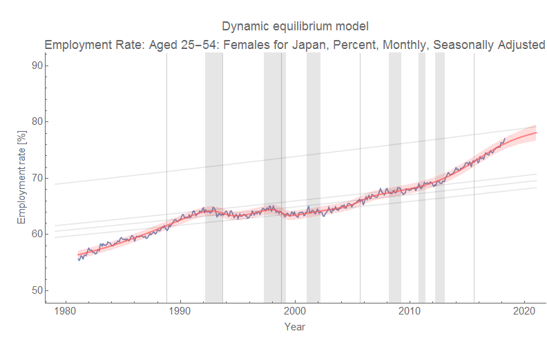
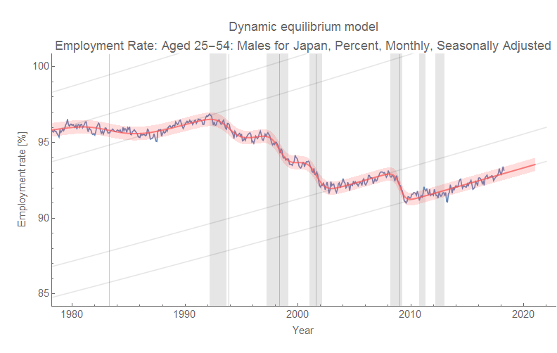
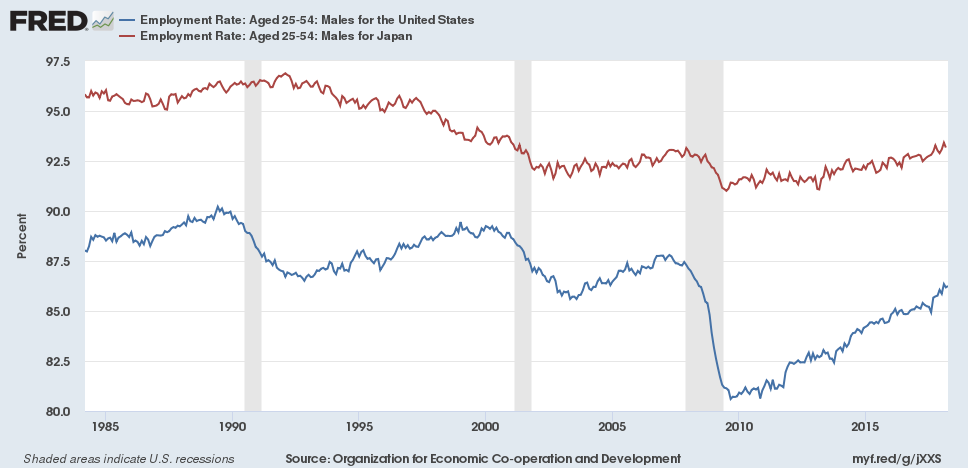
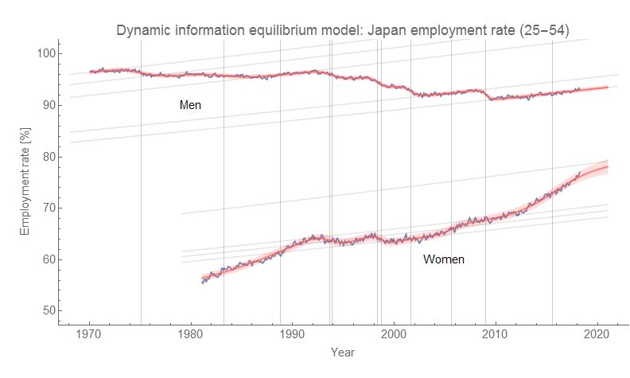

Noah Smith has called Japan the place [where macro models go to die](https://www.bloomberg.com/view/articles/2016-03-10/an-economics-laboratory-where-theories-go-to-die), and [recently tweeted](https://twitter.com/Noahpinion/status/999407818309451776) about high employment and low inflation creating a definite puzzle. However, in the dynamic information equilibrium model, Japan seems mostly like a normal economy just will really low equilibrium inflation (0.1% per year). 

In the data below, I removed the effect of the VAT increase in 2014, but not the 1997 one (I actually modeled it as a shock to the price level). The reason I did this is that the 1997 shock comes roughly when the CPI is at equilibrium (0.1% inflation) after the previous transition is ending, while the 2014 comes right in the middle of a transition/shock that follows the Great Recession.

I also left off the data from the 70s and 80s because it contains at best half a transition which makes it problematic for the parameter estimation algorithms especially when including multiple shocks. It's not that I wouldn't be able to find a fit, it's just that I'd have to carefully adjust intial conditions — a process that is tedious and wouldn't add any useful information besides saying inflation surged in the 70s. (Which we know; it's the recent lack of inflation that makes Japan a difficult case for macro models.)

Also note that I switch randomly between references to the labor force, labor force participation, and the employment rate. It should all be employment rate (per the data). But as Japan's _un_employment rate is low and fairly constant, there isn't a lot of difference between the basic structure of these different measures of employment. I therefore elected to write this paragraph instead of editing and correcting the references in this post.

The basic story is as follows:

-   CPI surge follows the surge in women’s labor force participation in the 70s and 80s. This increase in the employment rate is cut off by early 90s recession.
-   Early 1990s recession shows loss of employment for both men and women, and cuts off the inflation surge.
-   The [1997/8 Asian financial crisis](https://en.wikipedia.org/wiki/1997_Asian_financial_crisis) negatively impacts employment (for both men and women), but not inflation (the 97 blip is due to VAT tax changes).
-   Early 2000s recession impacts both employment and inflation in a normal fashion.
-   The Great Recession impacts inflation and men’s employment, but just cuts off the surge in women’s employment that began after the early 2000s recession. After the Great Recession, women’s employment rate begins to surge again (while men’s just grows at its equilibrium rate). The recent inflation "surge" (to just 1%) closely follows this rise.

This is all to say Japan has a pretty normal relationship between employment and inflation in terms of dynamic equilibrium (i.e. rates of change): when employment falls, so does inflation. [The overall employment rate](https://fred.stlouisfed.org/series/LREM25TTJPM156S) increased from the 70s until the 90s (inflation was higher), fell though the 90s (Japan's "lost decade" where inflation fell), and began to increase again in the 2000s (with a pause at the Great Recession). Inflation caught up a small amount, and it is possible it will continue to increase with the increasing size of the labor force (inflation lags labor force increases).

However, Japan does not have a normal relationship between unemployment and inflation in terms of numerical values. Equilibrium inflation is almost zero, so the labor force can increase at its equilibrium rate and inflation will be almost zero. A surge in the employment rate causes inflation to rise ... _**to 1%**_. But that 1% is 1% above equilibrium; it would be analogous to US inflation rising to 2.7% (PCE), 3.5% (CPI), or 3.4% (DEF). That would be major news in macro! But since we expect Japan to have 2% inflation for some reason (I guess the BoJ said it wanted 2% inflation at one time), we see 1% inflation as a "failure" of monetary and/or fiscal policy \[1\].

Japan seems to have low inflation because it has a very low employment rate dynamic equilibrium: it is about 1/3 the rate of the US (see graph below), so if US core inflation is 1.7%, we might expect Japan to have an equilibrium inflation rate of 0.6%. In that context, 0.1% isn't that far off from this back of the envelope estimate. This is probably directly related to low population growth. Australia, with its higher population growth, [has a higher equilibrium inflation rate](https://informationtransfereconomics.blogspot.com/2018/03/economic-growth-in-australia-1960.html) (deflator inflation of 2.8% compared to US of 2.4%).

**Update 26 May 2018**

Here's the picture with both employment rates from women and men in Japan at the same scale (click to embiggen):

**Footnotes:**

\[1\] If "[Abenomics](https://en.wikipedia.org/wiki/Abenomics)" is responsible for the increase in women in the workforce, then Abenomics "worked". If we just think of Abenomics as fiscal and monetary policy, those appear to have done nothing.
