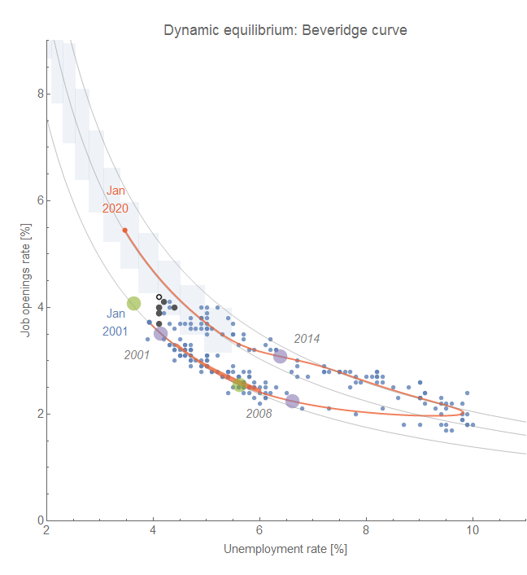

**Update:** Ha! Apparently economists see today as extraordinary, but [I predicted this back on 10 January 2017](https://informationtransfereconomics.blogspot.com/2017/01/a-dynamic-equilibrium-in-jolts-data.html).

> There's now 1.0 unemployed worker per job vacancy, the lowest rate on record. [#JOLTStwitter](https://twitter.com/hashtag/JOLTStwitter?src=hash&ref_src=twsrc%5Etfw) going nuts. (Series starts in 2001.) [pic.twitter.com/q2tokzgIqe](https://t.co/q2tokzgIqe)
>
> — Justin Wolfers (@JustinWolfers) [May 8, 2018](https://twitter.com/JustinWolfers/status/993866603514269696?ref_src=twsrc%5Etfw)

**Update:** Here is the most recent data (black) overlaid on the original forecast [from here](https://informationtransfereconomics.blogspot.com/2017/01/a-dynamic-equilibrium-in-jolts-data.html) (which also shows the original code):

**Original post:**

I was busy running around doing work stuff today, so I won't belabor the fact that the latest [JOLTS data](https://fred.stlouisfed.org/release?rid=192) doesn't really change things from [the previous assessment](https://informationtransfereconomics.blogspot.com/2018/04/jolts-forecasts-and-leading-indicators.html).

