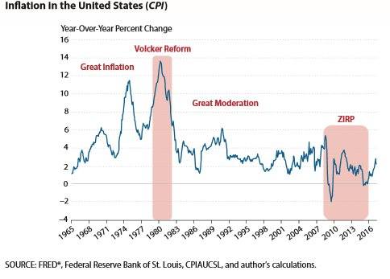
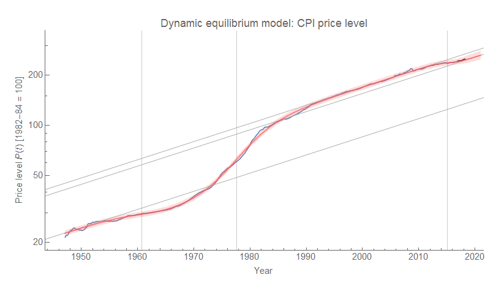
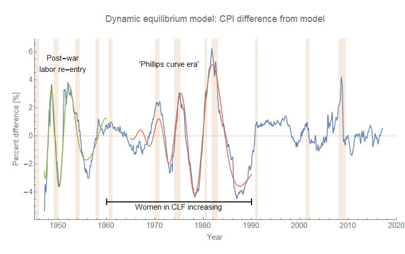
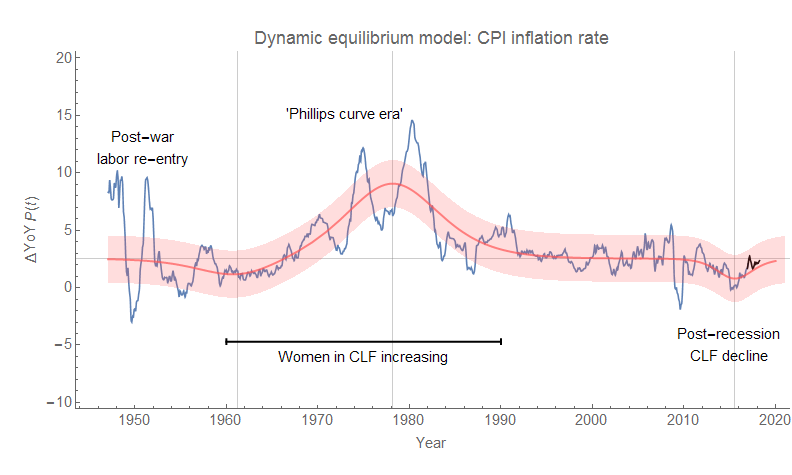
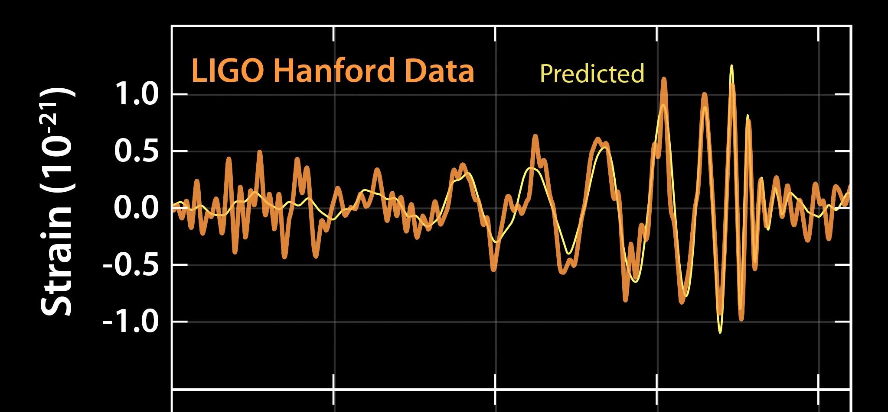

The latest in a long line of arguments about how monetary policy controls the economy comes to us in the form of [a report by William Gavin](https://files.stlouisfed.org/files/htdocs/publications/review/2018/04/16/monetary-policy-regimes-and-the-real-interest-rate.pdf) \[pdf\] published by the St. Louis Fed about how monetary policy and the Fed is responsible for a bunch of macroeconomic observables (of course). The report produces this graph of CPI:

I guess that's one way to look at it. However, the dynamic information equilibrium model of CPI, that [I  have been tracking the forecasts of for some time](https://informationtransfereconomics.blogspot.com/2018/03/cpi-data-and-end-of-lowflation.html), provides an alternative macroeconomic history. Let's look at the overall model:

[see Twitter thread here](https://twitter.com/infotranecon/status/971881574810533890)[download pdf here](https://informationtransfereconomics.blogspot.com/2017/05/explore-more-about-information.html)

The periods of large error are associated with transitions of people into the labor force (as well as a strong Phillips curve per the link above). Aside from those periods, the error is only about ~1% (in CPI level, i.e. a CPI of 100.0 ± 1.0). From this, we can re-make the graph at the top of this post:

So was it the Fed's actions, or are the trends and fluctuations in CPI [primarily due to the labor force](https://informationtransfereconomics.blogspot.com/2016/01/its-people-economy-is-made-out-of-people.html)? It's true that any view of CPI data is going to be model dependent (of course, the dynamic equilibrium model is empirically accurate and has done a good job of forecasting). But what I found to be fascinating is that those fluctuations in CPI highlighted above in green and red look just like [chirps](https://en.wikipedia.org/wiki/Chirp). In fact, the data looks remarkably like the gravitational wave chirps measured with LIGO:

These chirps are formed by inspiraling black holes or neutron stars — as their orbits around each other shrink (due to shedding energy via gravity waves), the period of the orbit gets shorter and shorter resulting in higher and higher frequencies until the orbiting pair shed all of their orbital energy and collapse into a black hole.

What if the mechanism of people entering the workforce creates these oscillations in CPI, which cause more people to fluctuate in and out of the workforce with the accompanying recessions and recoveries? It's an hypothesis, but the chirp wave forms (red and green above) fit the data pretty well.
