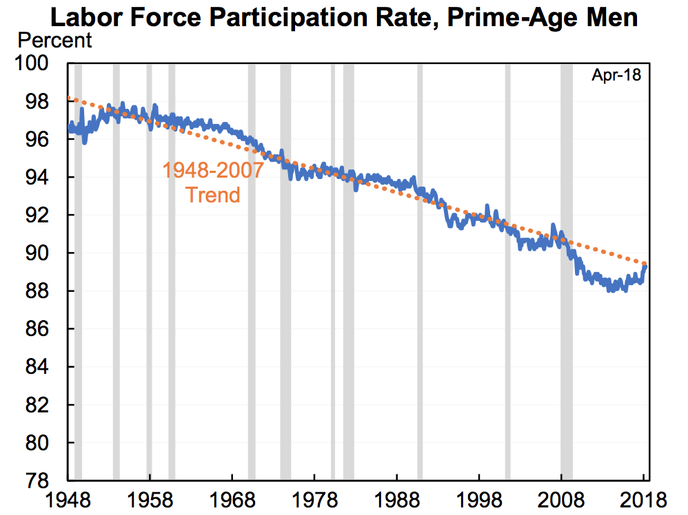
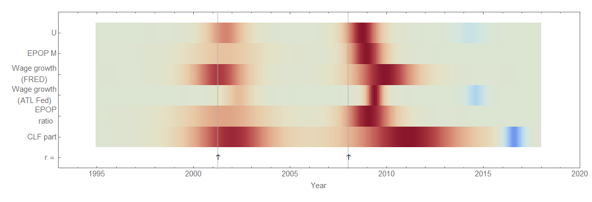

[Nick Bunker wrote a Twitter thread](https://twitter.com/nick_bunker/status/996006320871497728)[dynamic equilibrium approach](https://papers.ssrn.com/sol3/papers.cfm?abstract_id=3094757)

Click for larger versions. There are two models because the existence of a small positive non-equilibrium shock is a hypothesis ([discussed here](https://informationtransfereconomics.blogspot.com/2017/11/a-new-beveridge-curve-or-science-is.html)) possibly related to one apparent in the unemployment data, and which also leads to a novel "Beveridge curve" between unemployment and CLF participation:

The red and green points represent the center of the shocks to the two measures. Unlike [the more traditional Beveridge curve](https://informationtransfereconomics.blogspot.com/2017/10/the-beveridge-curve.html), the non-equilibrium shocks are more spread out in time making the curves more difficult to see (and therefore why they hadn't been posited to exist). Their "equilibrium" (i.e. following the curves) values are directly related (rising CLF participation rate is directly proportional to declining unemployment).

In his Twitter thread, Bunker also references [a graph from Jason Furman](https://twitter.com/jasonfurman/status/994347524868722688) talking about the non-stationary trend in men's employment population ratio. It's times like these when I feel like the information equilibrium framework may really be a novel insight into macro; where Furman notes a negative trend, in [my blog post from over a year ago](https://informationtransfereconomics.blogspot.com/2017/01/dynamic-equilibrium-employment.html) I noted a positive trend (dynamic equilibrium) interrupted by recessions:

The decline is essentially due to a Poisson process (or similar) of recessions on top of an **_increasing_** trend. Since the recessions occur often enough with a great enough magnitude, the result is a general decline. In fact, the dynamic equilibrium forecast of an **_increasing_** EPOP has held up for over a year (a naive application of that secular trend would have been wrong by almost a full percentage point):

The other measure Bunker discusses is wage growth; I began tracking a forecast of the Atlanta Fed's wage growth data with the dynamic equilibrium model [here](https://informationtransfereconomics.blogspot.com/2018/02/dynamic-equilibrium-in-wage-growth.html):

Note that this also shows a non-equilibrium shock in the post-recession period. This is a model of dynamic equilibrium in wage growth, not levels, and so represents a constant wage "acceleration" \[1\].

Putting all of this information on a "[macroeconomic seismograph](https://informationtransfereconomics.blogspot.com/2018/03/shock-cluster-analysis-and-some-new.html)", we can see the causal structure in the past two recessions (which are slightly different):

Click for higher resolution. A general trend appears of 1) a shock to unemployment, 2) a shock to wage growth, followed finally by 3) a shock to CLF participation. In between shocks there is a direct relationship between falling unemployment, rising wage _growth_, rising employment-population ratio, and rising CLF participation dynamic equilibria. However, the shocks to CLF participation are wide (the red and blue areas on the diagram above) so the limited areas where the variable follows the dynamic equilibrium (gray) make CLF less useful of a measure (it's more often away from equilibrium) — answering one of Bunker's questions.

But additionally, these dynamic equilibrium models describe the data well since the 1960s (where it exists) meaning they have a _single_ dynamic equilibrium. There's no empirical backing to the concept of "slack" where wage growth might slow as unemployment or CLF participation reach some value. [Unemployment will continue to fall](https://informationtransfereconomics.blogspot.com/2018/05/down-down-down-unemployment-rate.html) until it rises again due to a recession. Wage growth will continue to rise until that recession happens. Those two things will happen with a 1-to-1 relationship, except where the non-equilibrium shock of recession has a different causal structure in the two time series.

(_d/dt_) log (_d/dt_) log _W_ ~ (_d/dt_) log _U_ ~ (_d/dt_) log _EPOP_ 

outside of a recession.

**Footnotes:**

\[1\] Continuously compounded wage growth is (_d/dt_) log _W_. Wage "acceleration" is (_d/dt_) log (_d/dt_) log _W_. It is the latter which appears to have a dynamic equilibrium.
