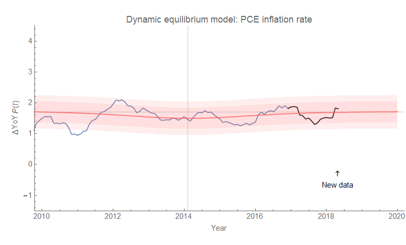
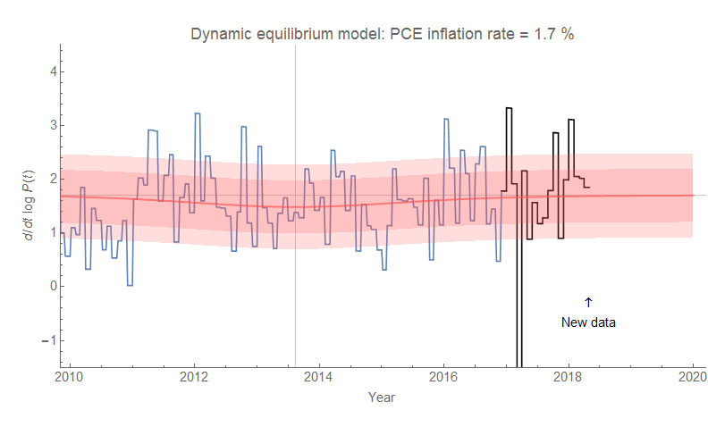

Here is how the forecast of [core PCE](https://fred.stlouisfed.org/series/PCEPILFE#0) inflation is doing (both log derivative/"continuously compounded annual rate of change" and year-over-year). Click to [embiggen](https://en.wiktionary.org/wiki/embiggen) ...

