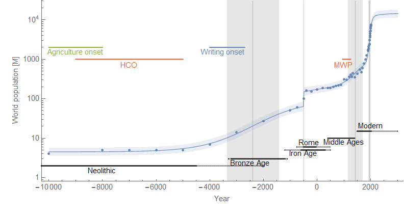
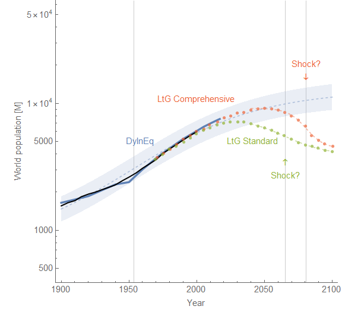
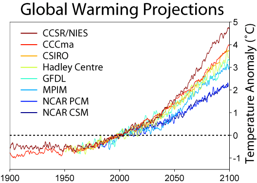
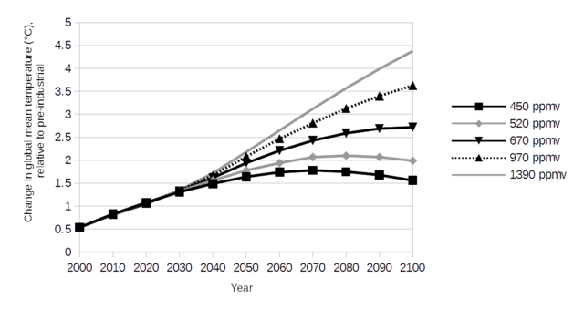

Via Twitter, [C Trombley](https://twitter.com/C_Trombley1/status/996842283520708608) was looking at a model of growth used in a report called "[Limits to Growth](https://en.wikipedia.org/wiki/The_Limits_to_Growth)" \[LtG\] from the 1970s and a more recent [update looking at the forecasts](http://www.ecsim.org/Vista/archivos/TURNER%20G%20-%20TLG%2030%20years%20comparison%20to%20reality.pdf) \[pdf\]. I'm just going to focus on the population growth model because [I happened to put one together using the dynamic information equilibrium model last year](https://informationtransfereconomics.blogspot.com/2017/11/dynamic-information-equilibrium-world.html) based on (likely problematic for multiple reasons) estimates of world population since the Neolithic (click to expand):

Let me show a couple of the scenarios in LtG (red, green) alongside the dynamic information equilibrium model (blue dashed) (click to expand):

The blue line is the data used for the dynamic equilibrium model and the black line was the data available to LtG. The dynamic equilibrium model is basically consistent with the two LtG scenarios — except for the presence of non-equilibrium shocks centered in 2065 and 2080 with widths of 55 and 24 years respectively.

Before 2030, the data is essentially log-linear which means there's a big problem. The problem is that that the data required to estimate the future deviations in the LtG model from log-linear growth was not available in the 70s, is not currently available, and won't be available until at least 2030. That is to say we don't have any knowledge of the parameters for the process responsible for those futures. Given we have never observed a human population crash of that magnitude (literally a decline billions of people) happening over those timescales (a few decades), the estimates for the model parameters resulting in those paths are pure speculation \[1\].

Now you may ask: why doesn't the dynamic equilibrium model also have this problem? As you can see in the top graph of the estimates of human population since the Neolithic, we actually have multiple shocks to validate the approach. But the more important point is that the latest shock estimated was centered in the 1950s and therefore we have more complete knowledge of it. It's true that estimating the magnitude of an incomplete shock [may lead to under- or over-shooting](https://informationtransfereconomics.blogspot.com/2018/04/overshooting-bitcoin-case-study.html). But the model isn't positing a deviation from log-linearity about which **_all_** of the information needed to estimate it lies in the distant future.

This isn't to say that the LtG models will be wrong — they could get lucky! The Borg might land and start assimilating the population at a rate of a few million a year (until we develop warp drive in 2063 and begin to fight back) \[2\]. But you should _**always**_ be skeptical of models that show we are on the verge of a big change in the future \[3\].

**Footnotes:**

\[1\] In fact, looking at the shocks I'd surmise that the LtG model just assumes the population in the 1970s was approximately the "carrying capacity" of the Earth so something must get us back there in the long run.

\[2\] I loosely based this scenario on _Star Trek: First Contact_.

\[3\] I will inevitably get comments from ignorant people: _What about climate models?_ None of these show a qualitative change in behavior and basically just represent different estimates of the rate of temperature increase:

And the policy models just show the effects of different _assumptions_ (not their feasibility or likelihood):

The analogy with the LtG model would be if the LtG model just assumed a particular path for birth/death rates (it does not; in fact, it claims to predict them).
