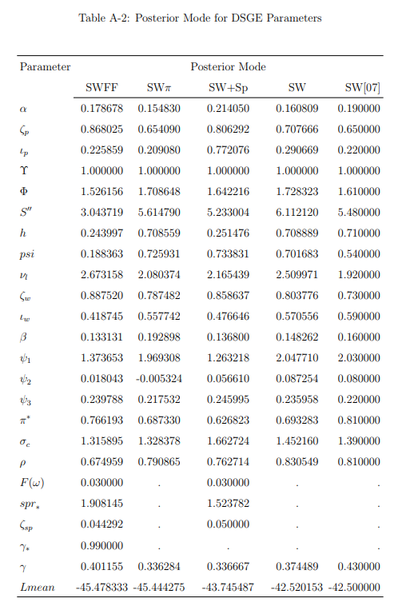

With all the tired and plain wrong critiques of economics out there that are easily shot down by even the most critical student of economics, I thought I'd try my hand at writing at one that might pass muster. [I did write a book](https://www.amazon.com/dp/B0754X3PYF/ref=as_li_ss_tl?ie=UTF8&linkCode=ll1&tag=arandomphysic-20&linkId=8a7279b2ce0918e22bda104998049da3), but it was more aimed at taking a new direction; this will be a more specific critique.

First, let me avoid the common mistake of using the word "economics" but then exclusively talking about macroeconomics: my critique is being leveled at macroeconomics (macro). This is not to say I don't also have criticisms of microeconomics or growth theory, but rather let me just focus on macro because that is what most people are interested in. I'm pretty sure the comeback "Auction theory is successful!" isn't really going to cut it with the _[Post Crash Economics Society](http://www.post-crasheconomics.com/)_ or in general anyone whose life was turned upside-down by the Great Recession.

Second, let me avoid the common mistake of saying macroeconomists don't think about _X_. They do. There's a good chance they've thought about _X_ much more than you have. Instead, let me focus on how macroeconomists _think about thinking_ about _X_ — the context, the spoken and unspoken narratives, the institutional knowledge.

And finally, let me avoid the common mistake of decrying the use of math in economics (this time in general). Mathematics is an extraordinarily useful tool. I know — I'm a physicist. I don't think economists have "physics envy", but the charge does carry a nugget of truth that I'll get to later.

Many critics claim that macroeconomists failed because they were unable to predict the global financial crisis and global recession. Some critics of "mainstream" macro echo that claim and further claim that unrepresented schools of economic thought did in fact predict the crisis. Regardless of the truth of those claims, the real issue is that it is not currently known with any empirical certainty if financial crises or recessions are predictable (or whether the former cause the latter). There are decent thought experiments as to why financial crises or asset bubbles _should_ be impossible to predict. This is frequently misinterpreted as an argument that bubbles can't exist. However I have to admit as a scientist that if you can only identify a bubble after it has popped it is at least plausible that the concept might not be useful.

But that real issue — that we don't know if major macroeconomic events are predictable — is further complicated by the fact that macro doesn't even know if macro time series of measurements like GDP or the unemployment rate are predictable _outside_ of recessions. The best performing forecasting models tend to be things like vector autoregressions (VARs), but these models essentially 1) choose some set of macro observables, 2) measure their drifts, periodicities, variances and covariances, and 3) project into the future based on that knowledge. While this is a perfectly scientific undertaking, the understanding it delivers is little more than saying the time series are correlated randomness of a certain variety. The relative success of these kinds of models compared to models based on actual macroeconomic theory derived from thinking about people making decisions in some way or another should be a source of deep embarrassment for macro theory and theory-based models. It's as if the proverbial monkeys were able to type up Hamlet while the theorists were replacing the ribbon. However we still have economists like [Olivier Blanchard](https://piie.com/blogs/realtime-economic-issues-watch/need-least-five-classes-macro-models) and [Lawrence Christiano](http://faculty.wcas.northwestern.edu/~lchrist/research/JEP_2017/DSGE_final.pdf) \[pdf\] touting DSGE models as still useful for running policy experiments, or claiming they aren't designed for forecasting.

This failure points to the failure of what [Noah Smith called](http://noahpinionblog.blogspot.com/2015/08/the-macromicro-validity-tradeoff.html) big unchallenged assumptions. Theory-heavy models have lots of these, from the Euler equation ([relating agents' view of the future to present consumption](https://www.bloomberg.com/view/articles/2016-07-26/economists-give-up-on-milton-friedman-s-biggest-idea)) to the Phillips curve (relating inflation and unemployment, [i.e. the real economy](https://mainlymacro.blogspot.com/2017/02/nairu-bashing.html)). VARs have fewer assumptions — some assumptions still go into the choice of which macro time series to use. It is my impression that these unchallenged assumptions about the kinds of ingredients to use in macro models are the reason why including more of them leads to worse forecasting even when the economy is not in a recession. This is also why I think the foray into machine learning (championed by, for example, [Susan Athey](https://www.gsb.stanford.edu/stanford-gsb-experience/news-history/susan-athey-applying-machine-learning-economy)) might be extremely helpful for macroeconomics. Imagine if every machine learning model put zero weight on the interest rate!

This brings us to those meta-narratives. A lot of those theory-heavy macro models are generally based on the idea that the central bank's monetary policy and the government's fiscal policy are the drivers of GDP and inflation, and the sources of recoveries from recessions — or even their cause. The theoretical variables are interest rates, the price level, unemployment, and output (alongside their future values as expected by agents with ideal or bounded rationality). Economists [like Paul Romer claim](https://paulromer.net/the-trouble-with-macro/) that the so-called Volcker disinflation of the 1980s represented "a clean test" of the importance of monetary policy, and that questioning whether the Fed under Volcker caused the 1980s recessions should be seen as a "[yellow caution flag](https://paulromer.net/letter-from-an-aspiring-macroeconomist-with-response/)". Now Paul Romer isn't the only economist, but similar sentiments are expressed in graduate texts like David Romer's _Advanced Macroeconomics_. There are even people not named Romer that [have written papers](http://www.carnegie-rochester.rochester.edu/nov04-pdfs/gk.pdf) \[pdf\] about it. There is actually insufficient evidence to confirm or reject this narrative of events, and there are signs it might be the result of _post hoc ergo propter hoc_ reasoning. For example, the yield curve inverts — often a good indicator of an upcoming recession in the US — and the stock market tanks in 1978, prior to Volcker's nomination to the Fed or the implementation of any change in monetary policy. Also note that [a fall in conceptions](https://www3.nd.edu/~kbuckles/BHL_fertility.pdf) \[pdf\] appears to precede economic decline measured by the unemployment rate by several quarters. Turnaround in Job Openings and Labor Turnover Survey data also tend to come before more traditional measures of economic decline. Neither of these were measured as indicators by macroeconomists at the time. There could have been many signs that the 1980s recession was already underway that went unreported because they are difficult to measure, or, as in the case of conceptions, not discovered until later. Note that the existence of possible leading indicators aren't the same thing as predicting recessions because macroeconomists don't know if they even have in hand the indicator with the longest lead nor know whether that indicator can be predicted.

Up another level of metaphysics, macroeconomics does not fully understand what a recession is aside from a general slowdown in economic activity. While heuristics such as two consecutive quarters of negative GDP growth are sometimes used, the NBER assembles a group of economists after a candidate for a recession appears to look at a large number of indicators and declare when that recession, if it is one, started and ended. Sometimes their results are not universally accepted — e.g. the early 2000s recession is given a fairly low probability [using this metric](https://fred.stlouisfed.org/series/RECPROUSM156N). Now there is nothing wrong with this. Astronomers have revised their definition of what a planet is as recently as 2006. Physics has no idea what dark energy is. However, this lack of understanding does not seem to give macroeconomists pause when making assumptions about what a recession is or its cause in specific situations such as Del Negro _et al_ [adding financial frictions to explain the 2008 recession \[pdf\]](https://www8.gsb.columbia.edu/rtfiles/finance/Macro%20Workshop/fall%202013/Marc%20Giannoni.pdf) that are independent of whether the model can describe other recessions. As Dani Rodrik says in his book _Economics Rules_, one model with a particular set of assumptions is applied to one specific situation while another with another set of assumptions is applied to another situation — usually the models and assumptions are selected _post hoc_. He says that's the "art" of economic theory. 

It's not the assumptions' realism or lack thereof that's the issue. The issue is that these models are the mathematical analog of Kipling's "just-so" stories. The leopard got its spots in this particular way, and that doesn't help you understand how the cheetah got its spots. As Feynman said in his famous [Cargo Cult Science commencement address](http://calteches.library.caltech.edu/51/2/CargoCult.htm) at CalTech in 1974:

> _When you have put a lot of ideas together to make an elaborate theory, you want to make sure, when explaining what it fits, that those things it fits are not just the things that gave you the idea for the theory; but that the finished theory makes something else come out right, in addition._

The model that is used to make the 2008 recession come out right doesn't make something else come out right, in addition. All too often, that's what the defense "macroeconomists actually do study _X_" really means: there is a just-so model that has been used to explain _X_. 

It's not just macro that has this problem; it has been brought up in evolutionary biology for example. It doesn't seem that there is a lot of internal criticism in macro of this kind of model-building, and in fact some economists [actively seek out these kinds of stories](https://krugman.blogs.nytimes.com/2013/12/02/immaculate-stability-wonkish/). I also believe that it is a lack of an immune response of internal criticism to this kind of model-building lets a lot of "schools of thought" (usually just different sets of story elements) proliferate. Before I get the "there are no 'schools of thought'" rejoinder from a macroeconomist, let me just say that the aforementioned graduate macro text says:

> _Where the major macroeconomic schools of thought differ is in their hypotheses concerning \[recessionary\] shocks and propagation mechanisms._

While Romer says hypotheses, these tend to be more sets of assumptions about what a recession is.

The close relative of the just-so story is the escape from the self-imposed straitjacket; I can't do any better than the blog [_Mean Squared Errors_](https://meansquarederrors.blogspot.com/2016/09/houdinis-straightjacket.html) in describing this:

> _Consider the macroeconomist. She constructs a rigorously micro-founded model, grounded purely in representative agents solving intertemporal dynamic optimization problems in a context of strict rational expectations. Then, in a dazzling display of mathematical sophistication, theoretical acuity, and showmanship (some things never change), she derives results and policy implications that are exactly what the IS-LM model has been telling us all along. Crowd — such as it is — goes wild._ 

> _And let's be clear: not even the most enthusiastic players of the macroeconomics game imagine that representative agents or rational expectations are, in any sense, empirical realities. They are conventions, "rules of the game." That is, they are arbitrary difficulties we impose on ourselves in order to demonstrate our superior cleverness in being able to escape them._ 

> _They are, in a word, Houdini's straightjacket \[sic\]._

The meta-narratives that require these particular mathematical modeling elements end up making even the simplest macro models incredibly complex. The model of Del Negro _et al_ contains an entire DSGE model, but the idea that a financial crisis can cause a recession doesn't really need that complex of a model — unless you're proving _something else_. It's only the fact that a DSGE model with Euler equations, Phillips curves and various microfoundation assumptions is the starting point for adding financial frictions that requires the complexity. And then, for all that complexity, the model doesn't actually do all that well (e.g. the shape of post-recession inflation is completely wrong):

This lackluster model has over 20 parameters (left-most column; the financial frictions correspond to the parameters that aren't in the other versions):

This is where that nugget of truth about physics envy comes in. Proving the existence of a just-so story that keeps the meta-narrative faith requires a level of complexity that far exceeds the accuracy of the model. When George Box said "all models are wrong", he was advising against building exactly this kind of Rube Goldberg device. The physics envy charge is leveled at exactly this kind of unnecessary complexity that doesn't result in better, more empirically accurate models. The charge is best understood as an attempt to answer the question: _Why would macroeconomists do this?_ It can't be because they just enjoy algebra. _I don't know; maybe they're just happy to write out lots of LaTeX symbols like in physics papers ... physics envy?_ Well, that's the best answer I've heard because otherwise it doesn't make sense!

One of the problems with the now [standardized critique](https://www.bloomberg.com/view/articles/2017-07-14/so-many-critics-of-economics-miss-what-it-gets-right) of unrealistic assumptions, failing to predict the crisis, or failing to add whatever "better" ingredients the author of the critique either personally researches or simply likes more is that it's so easily batted down because it's a caricature of macroeconomic theory from the 1990s or even the 1890s (in a similar way that many critiques of string theory are based on the state of string theory in the 1990s). More often than not the "better" ingredients (evolutionary biology, nonlinear dynamics, more accurate accounting) are simply another set of assumptions chosen to fit a narrative and build just-so stories — but a narrative and just-so stories the critic prefers. They aren't any more empirically accurate than the macro they're criticizing (and often haven't been used to construct models to compare with data at all — which is hilarious when coupled with the standard critique that macro isn't empirical).

Macro has no natural immunity to just-so stories because it doesn't have a robust internal criticism of them; it has to stick to debunking the caricature. This made me think that the "standardized critique" may well have adapted to macro like a virus adapts to a cell. When a macroeconomist sees the standard elements of the critique, the immediate response is to attack those: _Macro does study X! Macro is empirical! The rest of economics is fine! Auction theory!_ These smack-downs increase the profile of the critique, and allow the critic's just-so story to invade the minds of many more readers.

There you have it: my critique of macro that avoids many of the pitfalls of the "standard critique". Macroeconomic theory simply isn't good enough to have _**any**_ big unchallenged assumptions. They should all be challenged. Challenge the meta-narratives. Does monetary policy even matter? Is inflation always and everywhere a demographic phenomenon? Do people's decisions have any effect at all? Shut down just-so stories. Ask what else the model makes come out right, in addition. It's fine to use math and unrealistic assumptions to question these narratives, just make sure to use data.

**\*  \*  \***

**Update 12 May 2018**

It didn't fit in the narrative above, but one other criticism I had (that I talked about here in my post [_Lazy econ critique critiques_](https://informationtransfereconomics.blogspot.com/2017/08/lazy-econ-critique-critiques.html)) where some set of unrealistic assumptions or just-so story is used to explain macro/aggregated data but then the results are turned around to draw conclusions about the _**agents**_ obeying those unrealistic assumptions. Unrealistic microfoundations are fine if they lead to empirically accurate theories, but you cannot then turn around and use those empirically accurate theories to draw conclusions based on those "microfoundations". A representative agent in a DSGE model may yield something reasonable for macro data (GDP, inflation), but you cannot turn around and say that individual rational behavior yields the result and policy impacting that behavior at the individual level would cause things to change. The representative agent (just as an example here of some kind of assumption) may give you a way to describe the macro data well, but it's an **_effective_** agent. You can't cross levels from an effective agent at the macro scale to actual agents at the micro scale and assume your unrealistic assumptions don't wildly impact the micro-level results.

Aside from the example given in the link about infectious disease, the neo-Fisher debate where Woodford applied bounded rationality/finite belief revision crosses scales from properties of micro agents to macro effects. [I talked about it here](https://informationtransfereconomics.blogspot.com/2015/11/on-limits.html) (where I also found that the way macroeconomists treat limits is problematic). When the finite time to revise beliefs is taken as an actual property of actual humans that is proposed to have a the macro effect in the model, Woodford mistakes his effective agents for real ones.
