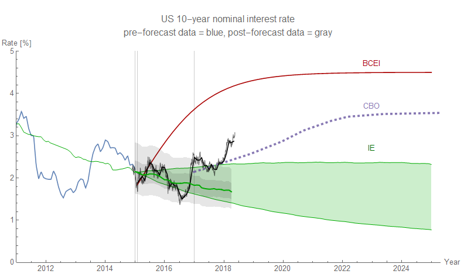

Checking in on my forecasts of the S&P 500 and the 10-year interest rate (click to expand):

The 10 year rate has [increased its deviation from the model](https://informationtransfereconomics.blogspot.com/2018/05/three-sigma-deviation-in-10-year-rate.html), but the S&P 500 is tracking the forecast fairly well despite heading towards a deviation in early 2018.

Also, I shared this set of counterfactual recessions using the [JOLTS job opening rate](https://informationtransfereconomics.blogspot.com/2018/04/jolts-forecasts-and-leading-indicators.html) on Twitter. Each frame is a different assumption for the center of a possible recession between 2018.5 (~ July 2nd) and 2020 (December 31st) in steps of 0.1 year (36.524 days) because metric system is best:

A center of 2019.8 produces a shock with amplitude parameter _a_₀ = 1.4 ± 0.6 and width parameter _b_₀ = 0.9 ± 0.2 year. That's somewhat wider and larger than the 2008 recession (_a_₀ = 0.84 ± 0.01 and  _b_₀ = 0.37 ± 0.03 year), but largely consistent with it. A center of 2018.8 produces a smaller shock of comparable width (_a_₀ = 0.6 ± 0.1 and  _b_₀ = 0.8 ± 0.2 year). I chose a year + 0.8 because that puts us in October which has a history (actually exactly at October 19th which was the date of 1987's "Black Monday", close to 1929's "Black Tuesday", as well as around the time of the biggest losses of the 2008 recession). The silver lining of a 2018.8 recession would be potential amplification of a "blue wave" in the midterm elections. Such a recession would likely also send the interest rate data closer to the model as well.

The only signs of a recession (in the information equilibrium framework) are the abnormally high interest rates and the negative deviation in the job openings data. If those evaporate, then so does any evidence of a possible recession. There are other more traditional signs out there as well, [such as yield curve inversion](http://econbrowser.com/archives/2018/05/how-many-times-have-the-10y2y-and-10y3m-concurrently-broken-the-1-and-0-5-thresholds-w-o-subsequent-recession).
