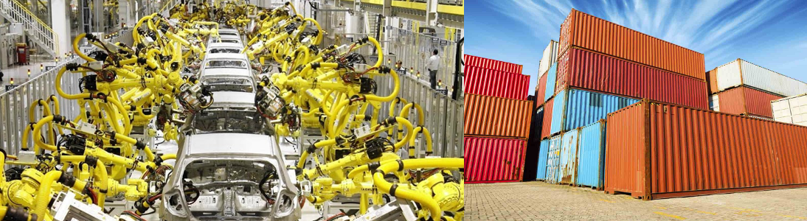
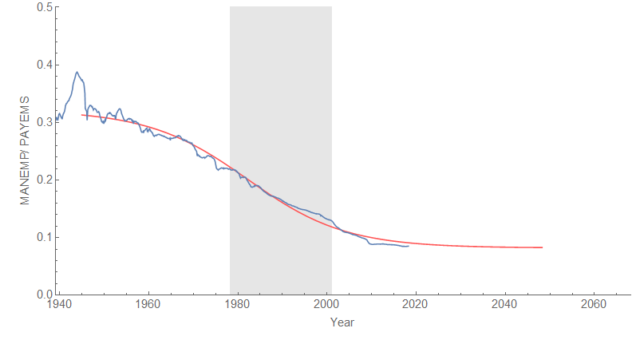
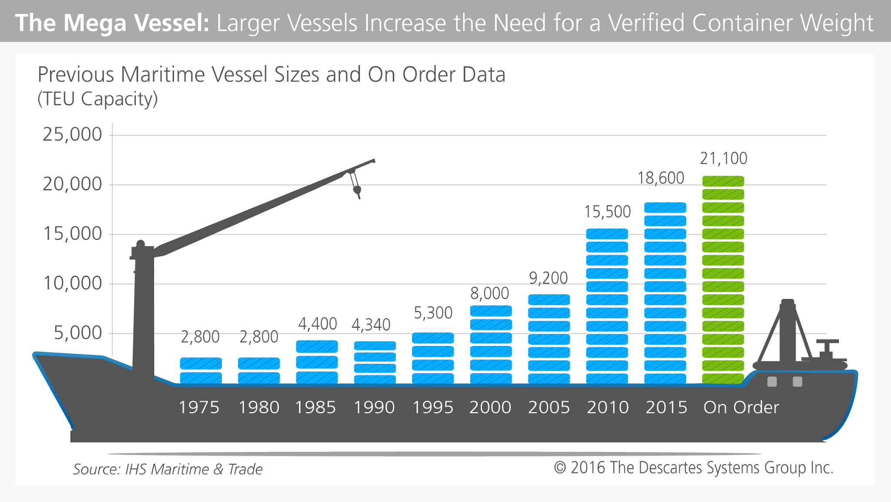

There is an ongoing debate as to whether automation or trade is responsible for the decline in [manufacturing jobs in the US](https://fred.stlouisfed.org/series/MANEMP) (or as I put it, robots versus shipping containers); a new article in Quartz makes the case that it's the latter. Leaving aside the question of whether it is good or bad for a country to lose manufacturing jobs (and another country gain them), I decided to try and look at this with [the dynamic information equilibrium model](https://papers.ssrn.com/sol3/papers.cfm?abstract_id=3094757) to answer the question: robots, or shipping containers?

I used the ratio of manufacturing jobs to all jobs ([MANEMP](https://fred.stlouisfed.org/series/MANEMP) over [PAYEMS](https://fred.stlouisfed.org/series/PAYEMS) on FRED), and tried to see if a single shock can explain the data. The result is plausible (I ignored the WWII build-up and decline):

Click to enlarge. This model has one shock centered on 1989.6 with [a width](https://informationtransfereconomics.blogspot.com/2018/01/canadas-below-target-inflation.html) of about 40 years (1969 to 2009). However, the empirical accuracy can be improved by adding a second shock:

These shocks are centered on 1981.6 and 2004.1 with widths of 40 and 9 years respectively. We have overlapping eras from 1962 to 2002 and 1995 to 2014 that would could tentatively label the robot shock and the shipping container shock. It is actually surprising that we can resolve two shocks (they could plausibly merge together into a single shock like the model above). I am not sure of the source, but an article [here](https://www.robotics.org/blog-article.cfm/The-History-of-Robotics-in-the-Automotive-Industry/24) says that GM introduced its first industrial robot prototypes in 1961. [Here is an _Atlantic_ article](https://www.theatlantic.com/technology/archive/2011/08/unimate-the-story-of-george-devol-and-the-first-robotic-arm/243716/) about industrial robots and their origins that sources the 1961 date to [here](https://www.assemblymag.com/blogs/14-assembly-blog/post/89323-happy-big-5-0-robot). There's some more information [here](https://www.robotics.org/joseph-engelberger/unimate.cfm) with an early appearance on the Tonight Show in 1966:

The shipping container shock appears in the data on the maximum size of shipping container vessels, which [starts to take off after 1995](https://talkinglogistics.com/2016/02/11/the-impact-of-solas-on-ocean-shipping-and-data-management/):

It's not that the size of the vessels was driving shipping, but more likely the other way around. In the aftermath of the end of the cold war, [globalization](https://en.wikipedia.org/wiki/Globalization) began as barriers to trade came down (and the free market ideology behind it flourished).

The relative size of the two shocks is about 3 to 1 (i.e. it was mostly robots), but the modern politics behind a move toward increasing trade barriers and tariffs is more likely due to the more recent shock. The robots had already taken over the US in the early 2000s. The shipping container shock came to manufacturing that was more difficult to automate. However, that shock is also mostly over in the US.

So the story behind manufacturing jobs in the US looks like it was first decimated by robots, but then finished off by shipping containers.
