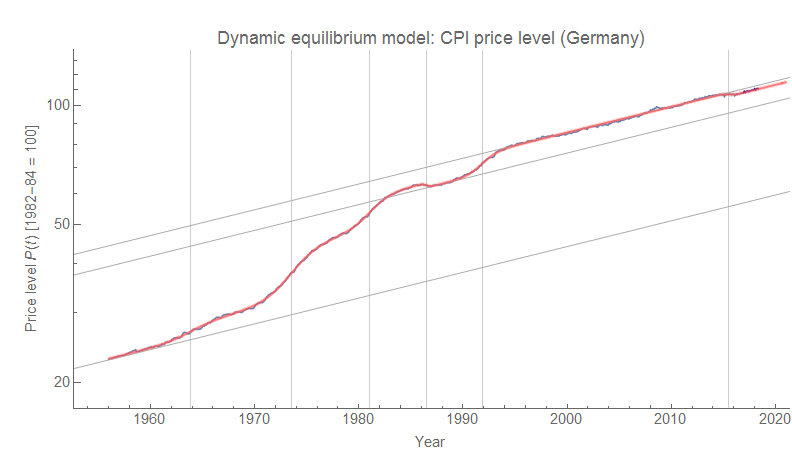
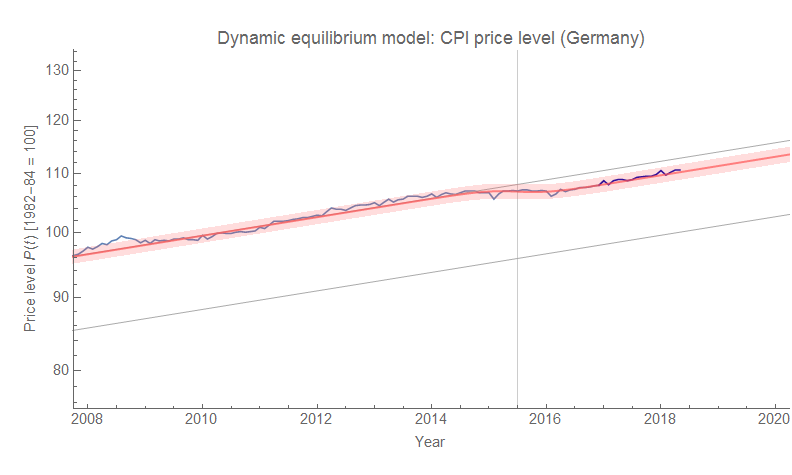
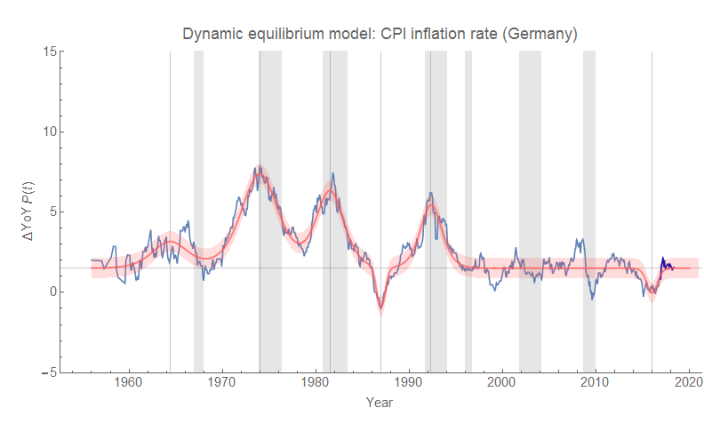
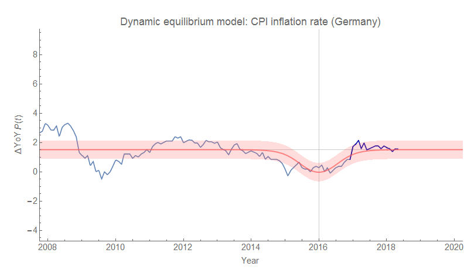
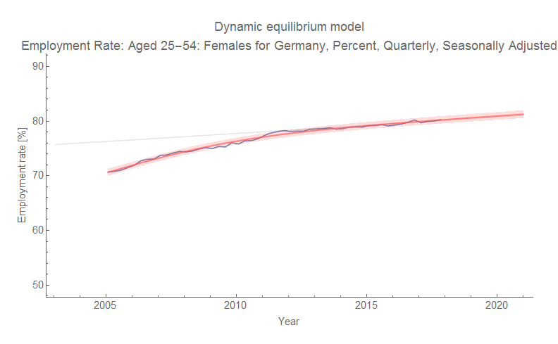

I fit the model for the CPI in Germany and came up with the same general story as most of the rest of the countries I've been looking at. The only thing I don't really understand is a sudden drop in inflation (deflation) the mid-80s. Otherwise most of the shocks are associated with recessions. Here is CPI, year-over-year inflation, as well as two zoomed-in graphs of the post Great Recession period. As always, click to embiggen.

One thing to note is that I used the US model code which ignores data after the forecast date (used to compare the latest data with forecasts, and usually shown in black). However, I technically had all the data so this is really more of a reserved subset out-of-sample forecast than a genuine forecast. Therefore I changed the color to dark blue.

This was going to be another post about the relationship between inflation and the labor force, but alas I was only able to find data organized by gender going back to 2005:

So instead, there will be another post on Japan and the relationship between the labor force and inflation.
