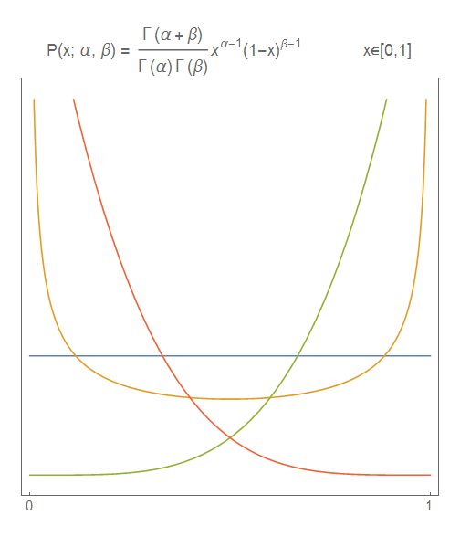
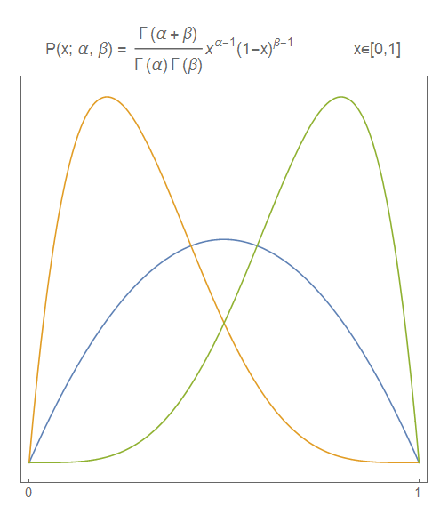
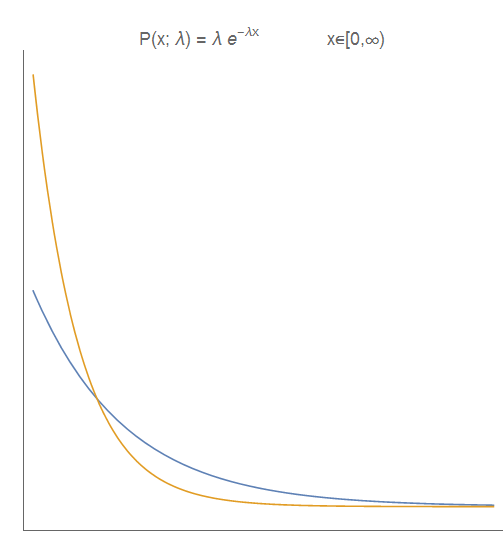
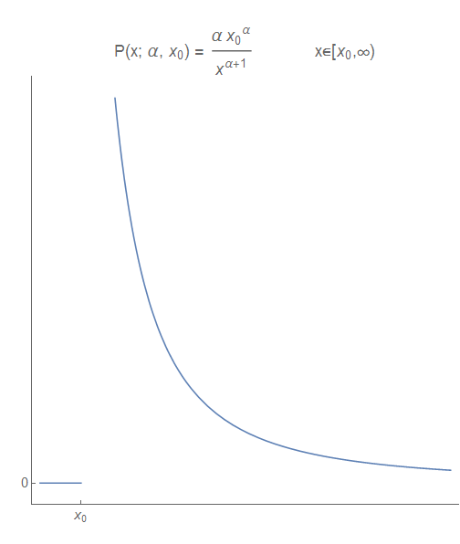
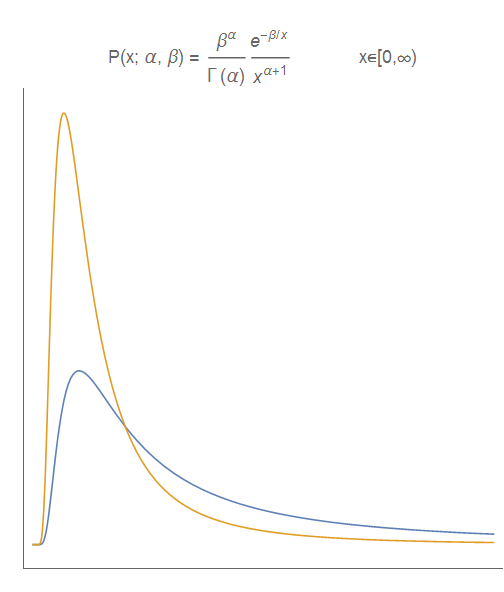
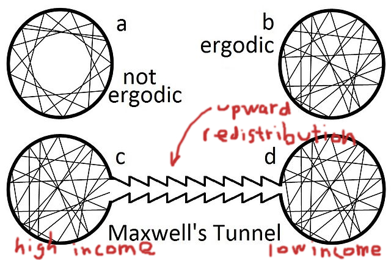

Nick Rowe is really great at putting together explanations of economic models in a very intuitive form, and I would have loved to have had him as a professor. But sometimes "thinking like an economist" and "thinking like a physicist" clash so badly it makes my eye twitch involuntarily. [Nick put together a simple model](http://worthwhile.typepad.com/worthwhile_canadian_initi/2018/05/a-very-simple-model-of-too-much-city.html) where he wanted to show that it was possible that people cluster in cities even though they'd prefer not to. He considered a scenario where there was a possible city in the east and a possible city in the west. He considered it to be a two-point domain; I imagined it as two islands, and I guess as long as there were more than half the people on one it was "a city".

Nick then introduces utility and proceeds to show that you can get any result you want. This made me think: how would I approach the idea of the formation of cities in the simplest model possible?

Well, first off I would look at a continuous domain rather than a discrete point set (because the idea of cities is that people form areas of higher density, not just choose one place over another). In math, we write this as \[0,1\]. Think of it as modeling Canada along the Trans-Canada Highway from Montreal (1) to Vancouver (0) — corresponding to Nick's cities in the east and west, respectively.

If I assume I know nothing about humans (agents), my best guess is that they'd be uniformly distributed on \[0,1\]. That's the maximum entropy (least informative prior) distribution on a finite domain given no constraints. But what if we observe cities? That macro observation provides a constraint on our micro (agent) model. If _x_ is the position between zero and one, then the macro observation results in a constraint on the expected values of ⟨_x_⟩ and and ⟨1−_x_⟩. The maximum entropy distribution on \[0,1\] with those constraints is called the [beta distribution](https://en.wikipedia.org/wiki/Beta_distribution):

Depending on the parameters (i.e. macro observables), you can get any results you want just like in the economic version. The uniform distribution on \[0,1\] is also a special case of  the beta distribution for _α_ \= _β_ \= 1. Note that you could treat the problem like how Nick does where instead of _x_ being position along the Trans-Canada Highway, it is the population of one of the two cities on the original discrete point set (with the other population being 1 − _x_). His possible solutions (most people live in one or the other city, or evenly split) would look like this:

Since these are maximum entropy distributions, we actually are assuming we know nothing else besides what we observe (i.e. the cities). We don't know if agents like this arrangement or hate it. But we do know that it is entirely possible that it can arise from random, inconsistent (as Gary Becker put it, "irrational") choices with only slightly different weights on the state space (i.e. where or which city to live in).

What else is maximum entropy (MaxEnt) reasoning good for? Part of the reason for writing this post was the connection between Nick Rowe's post and email discussion I was having. Is the income (or wealth) distribution what it is simply because income is (roughly) bounded at the bottom, but unbounded at the top? Well, that's part of it. The maximum entropy distribution on \[0, ∞) \[1\] with an observed average ⟨_x_⟩ (i.e. average income, 1/_λ_) is an exponential distribution:

However, this distribution has fixed inequality with a Gini coefficient of 0.5. If income was exponentially distributed, then inequality wouldn't change. That's not what we see in the real world.

Now [Vilfredo Pareto](https://en.wikipedia.org/wiki/Vilfredo_Pareto) made some of the first observations about income distributions, and there's a maximum entropy distribution named after him that can have different Gini coefficients. It's not on \[0, ∞), but rather \[_x₀_, ∞) with a minimum value _x₀_:

The constraint in this case is on the expected value ⟨log _x_⟩ (i.e. the average log income), and the Gini coefficient is 1/(2 _α_ - 1) with alpha of about 1.7 matching the US Gini data. But while this is a decent description of the ("fat") tail (i.e. the highest incomes), it doesn't do well with the lower income. Is there a maximum entropy distribution that does a bit better at all scales? This actually took a bit of effort to show, but the piece of knowledge that we'd want to add (the constraints) is really about how quickly agents acquire money: the time to observe _α_ events that come at a rate _β_ described by a Poisson process (which generates the above exponential distribution). This is called a gamma distribution, but it's not really what we're looking for. If the time to acquire a lot of money is extremely short, you have high income; if it is long, you have low income. So the expected time _T_ to get _M_ money yields an income of _M_/_T_ (i.e. a salary in units of dollars per year or wage of dollars per hour). If _T_ is gamma distributed, then 1/_T_ is [_inverse_ gamma distributed](https://en.wikipedia.org/wiki/Inverse-gamma_distribution). It looks like this:

We have our Pareto tail, but with a more sensible distribution at the lower end. We're also back to \[0,∞) instead of having an explicit minimum value _x₀_.

Now I didn't just pull this distribution out of the air; it was computed from a model that included agents exchanging, "betting" on a market, as well as taxes that redistribute wealth by [Bouchaud and Mezard](https://arxiv.org/abs/cond-mat/0002374) almost 20 years ago. [A more recent paper](https://papers.ssrn.com/sol3/papers.cfm?abstract_id=2794830) (also discussed in that email) by Berman _et al_ changes up the taxes such that income is redistributed upward (think economic rent, or just plutocracy) and gets different results \[2\].

Anyway, I hope you can see the sort of things the maximum entropy approach are good for (and not good for: income distributions don't really fall out simply in the approach except for an effective Pareto distribution at the high end). And I hope it elucidates the way at least this physicist looks at problems e.g. assuming only things you know or observe, thinking in terms of scales.

**Footnotes:**

\[1\] Unlike economists, mathematicians know that infinity isn't an actual number and so it doesn't make sense to include it in a domain (set). The square brackets mean "included", so that \[0,1\] includes 1, but \[0,1) doesn't. The latter domain has every number as close as possible to 1 as you can imagine, but just not 1.

\[2\] I do not like the way this paper is framed at all. You cannot claim to be surprised by non-ergodicity when you set up your model to remove its ergodicity. We added a piece to the model that keeps people in one part of the state space, and are now surprised that people stay in one part of the state space. Your assumptions are invalidating the ergodic hypothesis.

No really; they said they were surprised:

> _"Our findings invalidate the ergodic hypothesis. The fitted reallocation rate is not robustly positive for any dataset we analyze. Indeed, for one dataset we find it to be consistently negative for the last thirty years or so. We cannot overstate our surprise at this finding."_

I'm guessing Ole Peters wrote that line as he has a knack for putting something in a model [and not realizing he put it in the model](https://informationtransfereconomics.blogspot.com/2016/06/regulators.html). I'm also putting "ergodicity" and "non-ergodicity" on my list of red flags that someone is about to embark on some dubious economic theory.
