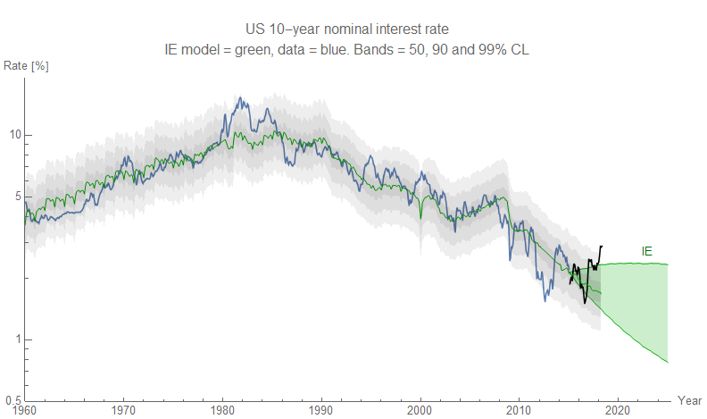
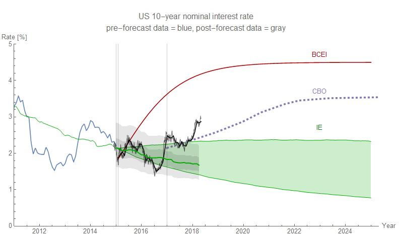

So I'm continuing to track [the 10-year interest rate forecast from nearly 3 years ago](https://informationtransfereconomics.blogspot.com/2015/08/comparison-of-interest-rate-predictions.html). While the forecast did well before the 2016 election, today we're above a 3-sigma deviation from the estimated model error (the 99.9% percentile, or 1 in 1000). Of course with nearly 800 data points, we might expect to see at least \*one\* 3-sigma event. A similar deviation happened in the early 80s (Sep 1981 to Jun 1982) making this the second period of such a deviation.

This is extremely interesting because that time period represents exactly the time period where the Fed raised [the discount rate to its maximum level](https://fred.stlouisfed.org/series/INTDSRUSM193N), which (according to the standard narrative) kicked off the the second dip of the double-dip recession. However, [like in the 80s](https://informationtransfereconomics.blogspot.com/2018/03/its-80s.html), there appear to be signs of an upcoming recession [in other data that might be a leading indicator](https://informationtransfereconomics.blogspot.com/2018/04/jolts-forecasts-and-leading-indicators.html).

I will admit it is speculative, but given the timing/timeline of the previous 3-sigma event it may become clear the US is in recession in the next 6 months (NBER won't officially declare it until a few quarters later).

Now you might wonder how raising interest rates to only about 2% could trigger a recession today in the same way raising interest rates to 14% did in the 80s. I admit I don't have a good answer to this except to say increasing labor force participation in the 80s probably provided a sufficient tailwind that Fed had to do do much more.

In any case, this makes for an excellent test of the model. Interest rates should come back down in the near term (about 6 months). A possible mechanism to bring them down is recession. The longer they stay at the 99.9% of their range or further, the more likely the model can be rejected.

Here's a zoomed in and non-log scale version of the graph at the top of the page (the green band was the forecast of the green line while the gray bands represent 50% and 90% confidence limits on the model error from the observed path):

