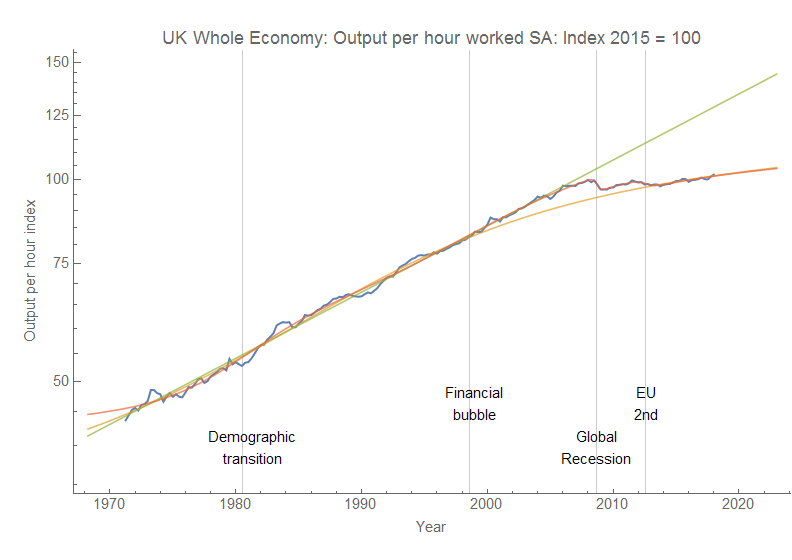
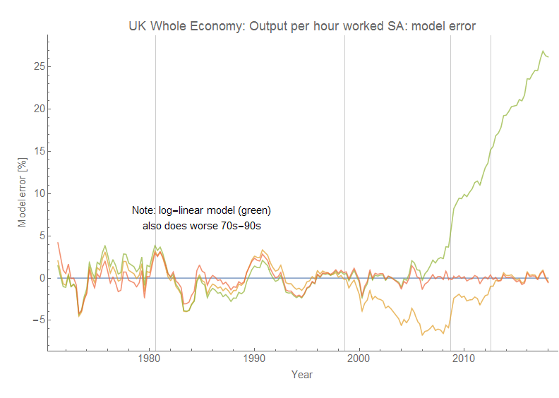
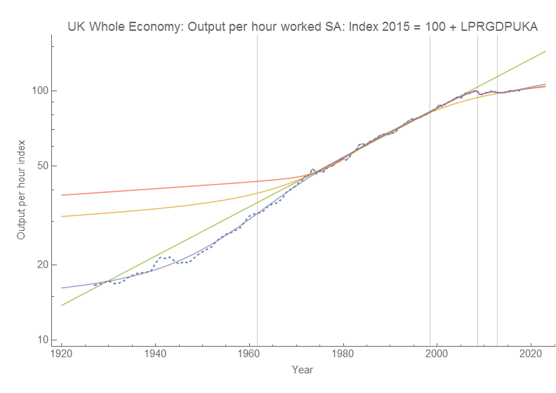
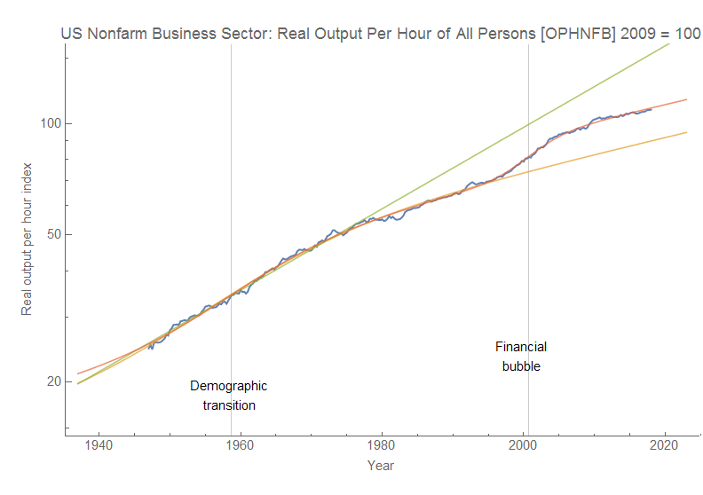
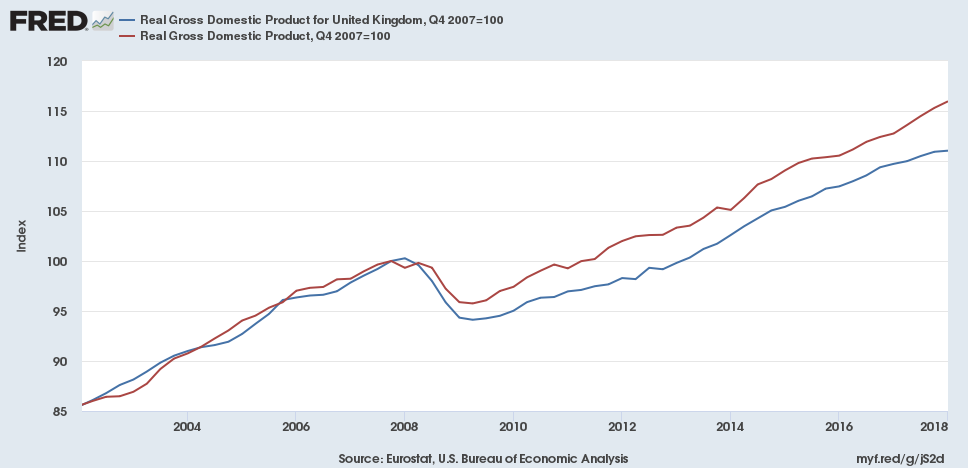

The UK presents an excellent case for the ambiguity in interpreting data without a model. I saw this tweet about labor productivity in the UK:

> And here's the ugly - output per hour worked is now just 1.2 per cent higher than it was at the end of 2007. Had the pre-crisis trend continued – it would be more than 25 per cent higher than it is today [pic.twitter.com/sHe9OSK3Eu](https://t.co/sHe9OSK3Eu)
>
> — ResolutionFoundation (@resfoundation) [May 15, 2018](https://twitter.com/resfoundation/status/996381504467910656?ref_src=twsrc%5Etfw)

Of course, there's an implicit model where productivity is expected to grow at a constant rate such that log _P_ ~ _α t_ + _c_. On a log-plot it's even more astounding of a shift. However, I'll also show that model (green) alongside [a dynamic information equilibrium model](https://papers.ssrn.com/sol3/papers.cfm?abstract_id=3094757) with a single non-equilibrium shock (yellow) and a more complex model with four shocks (red):

The dynamic equilibrium model is essentially

log _P_ ~ _α t_ + _c + Σₐ σₐ_
with logistic functions for the _σₐ_.

The implicit model of constant growth says just that: productivity growth was constant from the 70s up until the Great Recession — at which point it fell. Nothing affected that growth rate. As far as productivity was concerned, nothing happened for forty years. Forty years of an economy just chugging along with a constant rate of improvement.

I hope my repetition of the model assumption that nothing changed made you ask: _Wait, **nothing** happened!?_

The dynamic equilibrium models take into account that something happened in the 70s and 80s to cause inflation to surge, and growth to be much higher than today (see the analysis [at the end of the post here](https://informationtransfereconomics.blogspot.com/2018/01/24-growth-forever.html)). I call it the "demographic transition" where women entered the workforce, but we can be agnostic about the actual cause right now. The more complex one notes there was major growth in real estate and the financial industry ("financial bubble") and that the Great Recession actually had an aftershock in the EU which impacted the UK.

The interesting piece is that both of the dynamic equilibrium models not only improve the agreement with the data after the recession — _they improve the agreement before it_. The percent error for the three models are in this graph with the same color coding:

 The point here is not just to brag about the dynamic equilibrium model, but to show that interpreting macroeconomic data — even when that interpretation looks as obviously log-linear before 2007 as it does — is difficult and fraught with ambiguities. We should be careful when we think the data "obviously" shows something.

...

**Update 16 May 2018**

I found [another productivity time series](https://fred.stlouisfed.org/series/LPRGDPUKA#0) that could be matched up (via a log-linear transform) with the UK productivity data, and we can see that the simple log-linear model is more confined to literally the period for which the quarterly data is available before the Great Recession (1970-2008). Including other data makes the mid-20th century shock in the more complex model larger and earlier (purple) \[1\], but overall tells the same story:

Interestingly, the US does not appear to have the same Great Recession shock [in comparable data](https://fred.stlouisfed.org/series/OPHNFB):

Note that this could be because in the US the shock to hours _H_ was comparable to the shock to _RGDP_ (so that _RGDP/H_ ~ constant) whereas the same did not happen in the UK. The shock to UK RGDP was somewhat larger than to the US, but the shock to unemployment was smaller (click to expand):

...

**Footnotes:**

\[1\] The shock parameter fits [typically under- or over-estimate the size of shocks](https://informationtransfereconomics.blogspot.com/2018/04/overshooting-bitcoin-case-study.html) when the data does not contain a bit more than half the shock.
