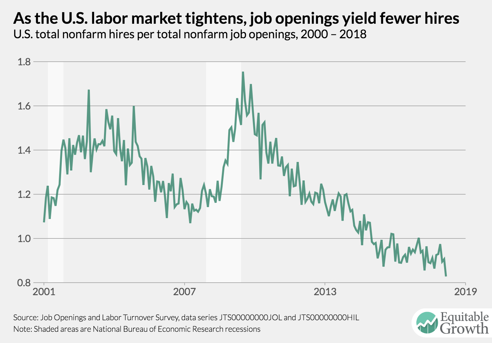
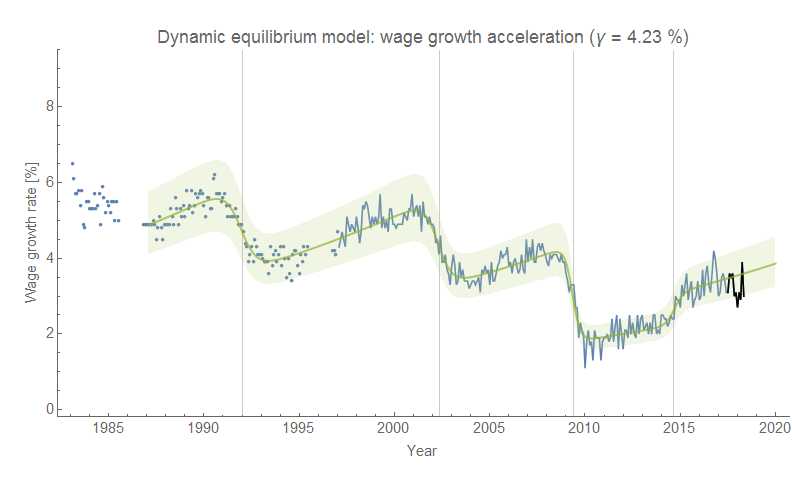
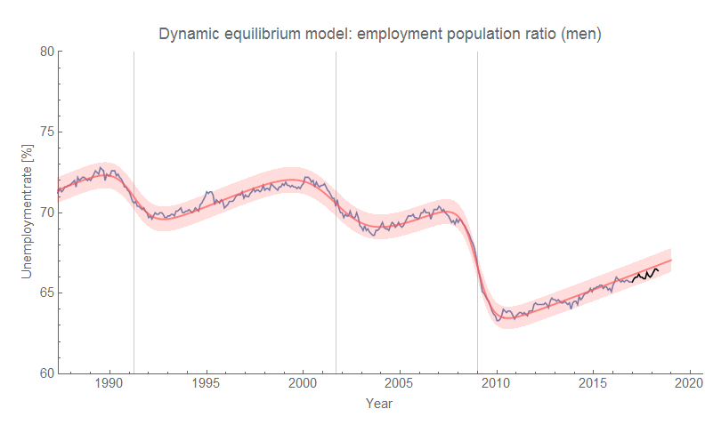

Nick Bunker's [labor market analysis](http://equitablegrowth.org/research-analysis/puzzling-over-u-s-wage-growth/) are the go-to for detailed, nuanced — and yet "mainstream" — views. By this I mean that if you're not all that into listening to crackpots, he's definitely a good way to go. But then, I'm a crackpot with my own theory of how labor markets work ([paper here](https://papers.ssrn.com/sol3/papers.cfm?abstract_id=3094757)).

Bunker is attempting to explain why wages haven't risen as much as they have in the past, and halfway down he notes the "vacancy yield" (hires per vacancy, or _H/V_):

> _Hiring has not been particularly strong during this recovery in the U.S. labor market, particularly when measured against the number of vacant jobs. Part of the decline in hires per job vacancy—a metric known as the vacancy yield or the job-fill rate—is due to the tightening of the labor market, but even accounting for the low unemployment-to-vacancy ratio hiring is down. (See Figure 2.)_

Of course, [back in September 2017](https://informationtransfereconomics.blogspot.com/2017/09/search-and-matching-ii-theory.html) I modeled _H/V_ and made a forecast that shows the decline in _H/V_ is about what we should expect (and the decline is actually a bit less than we'd expect which might be due to the [leading edge of an upcoming recession](https://informationtransfereconomics.blogspot.com/2018/05/market-business-cycle-forecasts-update.html)):

I show a counterfactual recession as a dashed line and the post-forecast data as a black line. However, Bunker also notes this:

> _But only certain kinds of hiring are down. Hiring of workers who were previously unemployed or out of the labor market is in-line with the previous labor market recovery. The hiring that is down is the hiring of already-employed workers._

You could read this as a lower risk tolerance: fewer people with jobs out looking for new, better jobs — a kind of hunkering down against the uncertain future. A similar sentiment may be measured in [the conceptions data](https://informationtransfereconomics.blogspot.com/2018/03/dynamic-equilibrium-model-fertility-as.html).

In any case, this made me want to look at [separations in the JOLTS data](https://fred.stlouisfed.org/series/JTSTSR) (which I had for some reason neglected). It tells a similar story [to job openings](https://informationtransfereconomics.blogspot.com/2018/05/market-business-cycle-forecasts-update.html) (vacancies) — a possible leading edge of a turnaround (click to enlarge):

**\*  \*  \***

PS I also wanted to note that wage growth is also about where it should be [based on this model](https://informationtransfereconomics.blogspot.com/2018/02/dynamic-equilibrium-in-wage-growth.html):

Speculation: is this lack of wage growth evidence of sexism? As male labor force participation falls, the rate of wage growth falls with it:

Is wage growth falling because men get better raises than women, but are becoming less and less of the workforce?
