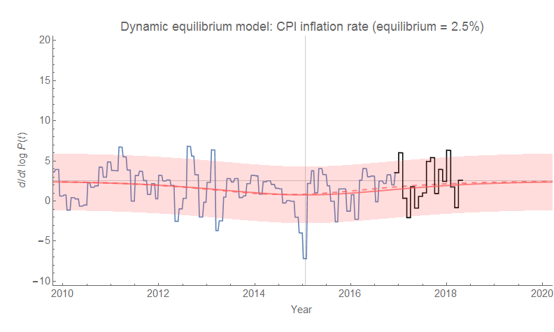
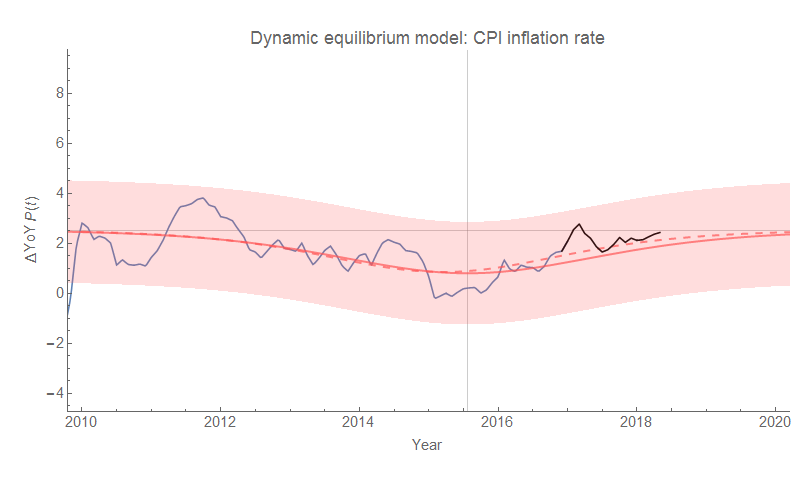

I forgot that [CPI data (all items)](https://fred.stlouisfed.org/series/CPIAUCSL) was going to come out today when I wrote [my post from yesterday](https://informationtransfereconomics.blogspot.com/2018/05/labor-force-participation-and-gravity.html) (inflation oscillations as "gravity waves" due to labor force changes), but I'm glad I didn't wait because the update is pretty much what the forecast said (and [has been saying for the past year](https://informationtransfereconomics.blogspot.com/2017/07/dynamic-equilibrium-model-cpi-all-items.html)). The original forecast [overshot](https://informationtransfereconomics.blogspot.com/2018/04/overshooting-bitcoin-case-study.html) the size of the post-Recession shock by a small amount (original forecast is the solid line, updated shock size is the dashed line), but it was well within the model error. Here are the continuously compounded and year over year CPI inflation forecasts as well as the CPI level forecast (where that shock over-estimate makes the most difference):

