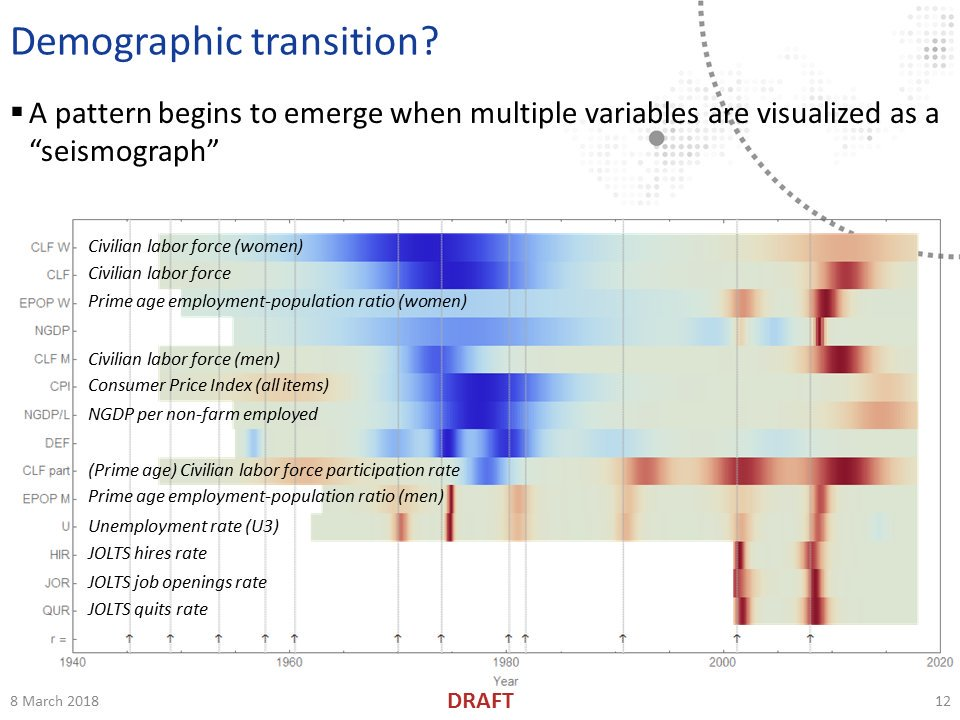
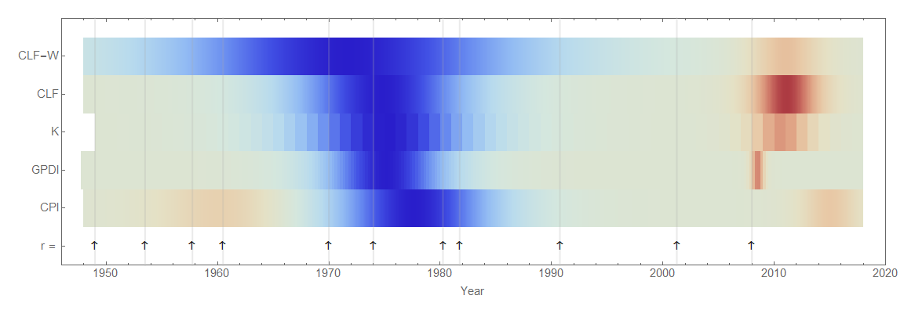
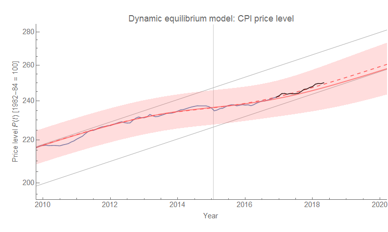

Sri Thiruvadanthai‏ questioned the "[quantity theory of labor](https://informationtransfereconomics.blogspot.com/2017/03/the-quantity-theory-of-labor-and.html)" model [on Twitter](https://twitter.com/infotranecon/status/997629876105498624), showing some relationships between the labor force and investment \[1\] with the latter being causal. However in my "[Twitter talk](https://twitter.com/infotranecon/status/971881574810533890)" (also available as pdf [from a link here](https://informationtransfereconomics.blogspot.com/2017/05/explore-more-about-information.html)), the general causal structure of the 60s-70s period is lead by impacts on women's participation in the labor force:

However, this did not look at investment; so I've added two measures ([Gross Private Domestic Investment](https://fred.stlouisfed.org/series/GPDI), as well as [the (nominal) Capital Stock](https://fred.stlouisfed.org/series/RKNANPUSA666NRUG)). Women entering the labor force (as well as the general increase in the labor force) also precede \[2\] the shocks to investment and the capital stock (click to expand):

I will put up a "seismograph" version when I get a chance.

...

**Update 21 May 2018**

Here it is (click to expand):

One modification I did make was to decrease the scale of the "Great Recession" shock in GPDI because it made the 70s expansion difficult to make out (low contrast). This should actually be telling; the size of the expansion in GPDI relative to its typical growth rate is small, making it one of the smallest shocks.

...

**Footnotes:**

\[1\] I was unable to figure out exactly which measure of investment he was using, though it was in a ratio with GDP. One issue with dividing measures that might have independent temporal structures is that it can produce a result with a [much different temporal structure as an artifact](https://informationtransfereconomics.blogspot.com/2017/04/housing-prices-over-long-run-are-we-in.html):

Combined with using 10 year moving averages and e.g. 20 quarter changes, the exact timing and causal structure can get confusing. I tried to show this in some graphs where I show both the 20 quarter percent change compared to the instantaneous (continuously compounded rate of change) for the CLF total and for women:

\[2\] By precedes, I am using the "2-sigma" shock duration (middle 95%) as demarcation lines for the beginning and end. The "Great Recession" shock does peak in investment first. However, the shock to inflation (which is small) **_still lags the shock to the labor force_** ([the former in 2013-2014](https://informationtransfereconomics.blogspot.com/2017/03/the-quantity-theory-of-labor-and.html) (PCE) or [even 2015](https://informationtransfereconomics.blogspot.com/2018/05/validating-my-cpi-inflation-forecast.html) (CPI), the latter in 2011):

Here's the Great Recession shock to investment preceding the shock to the labor force:

**Update:** That was the 1-sigma width above. However, the 2-sigma width does show the shock to CLF preceding the shock to investment. Incorporating uncertainty in the estimate of the width does not completely eliminate the possibility that it was a change in labor force participation that preceded the Great Recession (!)

