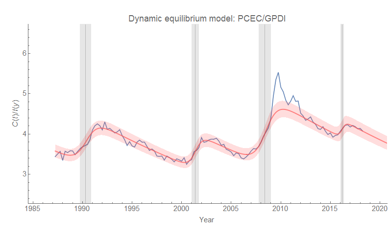
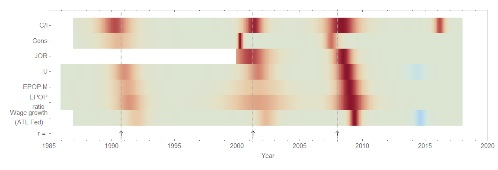
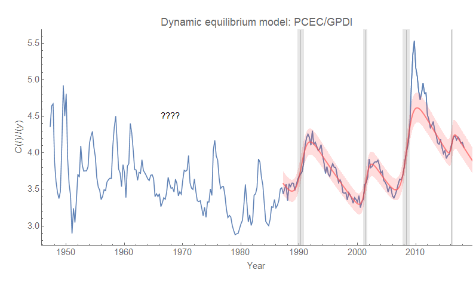
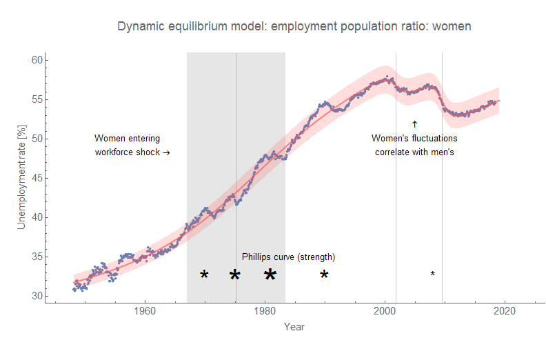
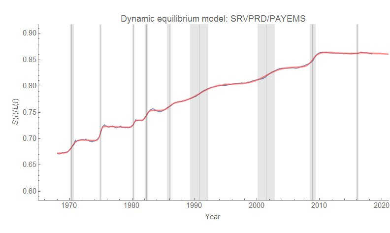
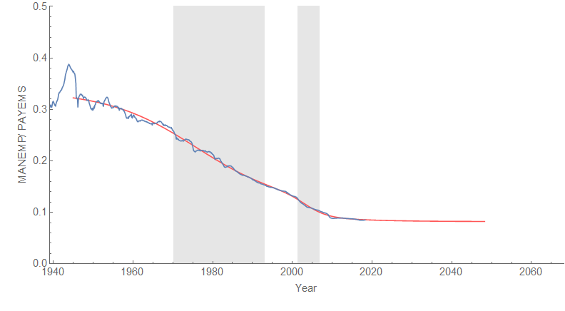

Steve Roth looked at [Yaneer Bar-Yam (of NECSI) _et al_'s paper](http://necsi.edu/research/economics/econunivers_2.pdf) \[pdf\], [writing some notes on it on his blog](http://www.asymptosis.com/what-causes-recessions-a-physicists-complex-systems-model.html). I'm not sure about the rest of the paper, but the ratio of [consumption](https://fred.stlouisfed.org/series/PCEC) to [investment](https://fred.stlouisfed.org/series/GPDI) as a leading indicator of recession piqued my interest.

In the dynamic information equilibrium framework, if we posit that consumption and investment are in information equilibrium ($C \rightleftarrows I$), then the ratio $C/I$ should follow ([per my paper](https://papers.ssrn.com/sol3/papers.cfm?abstract_id=3094757)):

which in basic terms means that we should see lines of constant slope on a log graph possibly interrupted by "shocks" $\sigma_{i}$. Using the same methodology as my paper, this is in fact what can be seen:

The model is generally good, except for a bit of [overshooting](https://informationtransfereconomics.blogspot.com/2017/11/unemployment-rate-step-response-over.html) in the Great Recession. And compared to some other purported leading indicators I've looked at on this blog, it's not too bad! It definitely seems to lead the early 90s recession, and roughly tied with conceptions for the Great Recession \[1\] (click to enlarge for all images):

However, $C/I$ has a somewhat inconsistent relationship over time, sometimes leading and sometimes lagging (which is part of Steve's point). But it also falls apart if we look at earlier data:

This was interesting to me because the transition is where I've also posited a qualitative change in the behavior of the economy — in the wake of the end of the demographic shift of women into the workforce:

In the 90s and 2000s, women's labor force participation stops generally rising and becomes more correlated with the business cycle (as well as men's labor force participation). _The_ $C/I$ _ratio does this as well._ In fact, Bar-Yam _et al_ also note a transition from an exponential to a cyclical behavior around the same time for another time series (their Figure 5). This also matches up with the transition from the "Phillips curve" economy to the "asset bubble" economy [I've described before](https://informationtransfereconomics.blogspot.com/2018/01/24-growth-forever.html).

It's that latter part that makes me doubt the cyclic nature of the indicator and these recessions in the paper. The asset booms and busts since the 90s correspond to the dot-com and housing bubbles — these involved entirely different causes and mechanisms making it exceedingly unlikely that they represent a first and second oscillation of one "cycle" that is supposed to continue \[2\].

More likely, the $C/I$ ratio will just continue to decline until it is hit by another "shock" ([possibly a recession in the 2019-2020 time frame](https://informationtransfereconomics.blogspot.com/2018/05/market-business-cycle-forecasts-update.html) based on other indicators) with random timing ([see this discussion](https://informationtransfereconomics.blogspot.com/2016/10/keen-chaos-and-equilibrium.html) of the "linear with random shocks" approach versus "nonlinear/chaotic dynamics").

...

**Update 4 June 2018**

Another ratio came up today ([Justin Fox](https://twitter.com/foxjust/status/1003739265245827072) via [Noah Smith](https://twitter.com/Noahpinion/status/1003741196102000645)) that I labeled $S/L$: service sector payrolls over total non-farm payrolls (FRED [SRVPRD](https://fred.stlouisfed.org/series/SRVPRD)/[PAYEMS](https://fred.stlouisfed.org/series/PAYEMS)). The growth rate (dynamic equilibrium $\alpha$) is about −0.0007/y (−0.07% per year) which is close enough to zero.

Overall, this appears to be the flip side of the loss of [manufacturing employment](https://informationtransfereconomics.blogspot.com/2018/05/robots-versus-shipping-containers.html) (I didn't resolve the individual recessions in this one):

**Footnotes:**

\[1\] The different measures are:

C/I = Consumption over investment ratio
Cons = Conceptions
JOR = JOLTS Job Opening Rate
U = Unemployment
EPOP M = Prime age employment population ratio (men)
EPOP ratio = Prime age employment population ratio
Wage growth (ATL Fed) = Atlanta Fed's wage growth data

\[2\] Notably, Bar-Yam _et al_ leave out data after 2015 (which would have been available in December of 2017) which would show the bump up in 2016 (possibly associated with the mini-boom of the mid-2010s which included a bump up in wages as well as bump down in unemployment).
