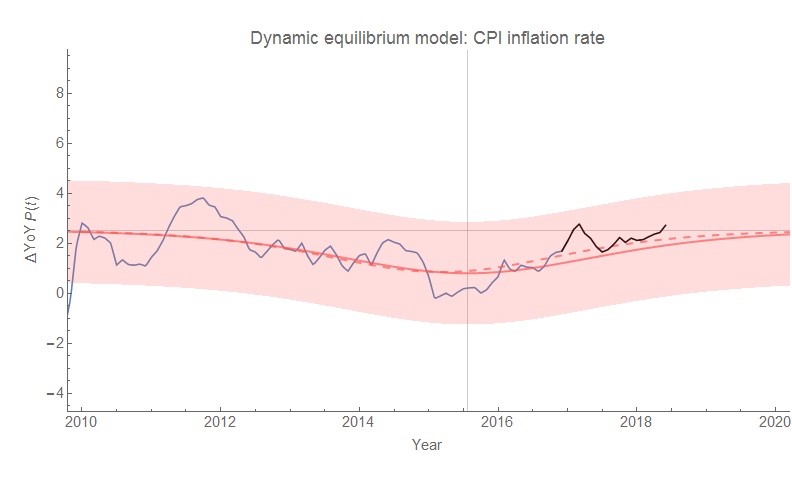
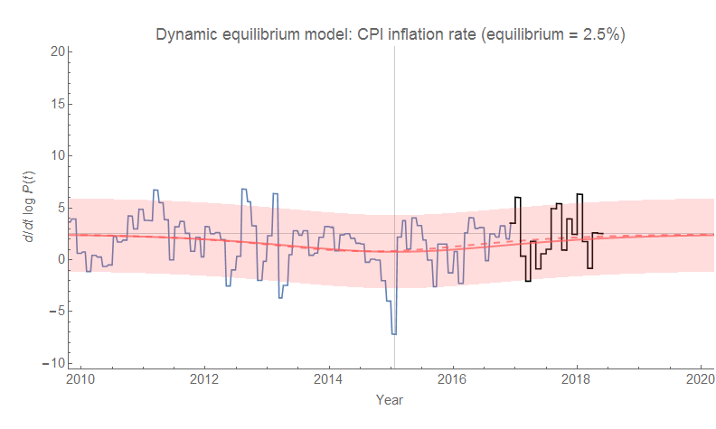

I made a forecast of [CPI (all items)](https://fred.stlouisfed.org/series/CPIAUCSL) that I've been [tracking since 2017](https://informationtransfereconomics.blogspot.com/2017/07/dynamic-equilibrium-model-cpi-all-items.html), and it's still doing fine with the latest data (showing the ending of "lowflation" in the wake of the Great Recession [due to a drop in labor force participation](https://informationtransfereconomics.blogspot.com/2018/01/is-low-inflation-ending.html)):

**Update**

