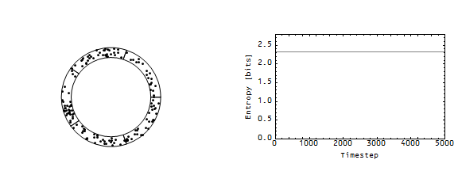

Nick Rowe is an excellent educator, and always has really nice "parables" to explain some point; [this recent one](http://worthwhile.typepad.com/worthwhile_canadian_initi/2018/06/the-parable-of-the-fruit-trees.html) is about the excess demand for money (the medium of exchange) causing recessions.

But it's a just-so story. The only way agents can satisfy their demand for goods is through monetary exchange of money earned through monetary exchange, and satisfying that demand is defined as equilibrium. Therefore non-equilibrium (i.e. recession) is effectively defined as insufficient monetary exchange (i.e. excess demand for money).

Actually, I could use the same exact system (with the same effects) but have a recession defined completely differently: agents huddling in a particular corner of state space.

When Nick says the agents get an excess demand for money, [I'd say agents decide to occupy a particular corner of the available opportunity set](https://informationtransfereconomics.blogspot.com/2017/09/ideal-and-non-ideal-information.html) (state space) that involves holding (not spending) as much money, cutting off a segment of it. Agents no longer fully explore the state space and entropy is no longer maximized. This generalizes to exactly the same generalization Nick makes:

> _It is not an excessive desire to accumulate assets that causes recessions; it is an excessive demand for one particular asset (the medium of exchange) relative to other assets. It's about the composition of their portfolios of assets, not about the total size of that portfolio._

There is a maximum entropy distribution (subject to some constraints) over assets (portfolio), and deviations from it represent a loss of (information) entropy. I've suggested before that this kind of correlation in state space is a possible description of a recession. Notably, I don't define this as a recession. I just look at the consequences and note that it describes a recession without getting into the details of why agents have decided to correlate in a corner of state space. 

Here's an example where one agent on the Wicksellian circle decides to have an excess demand for "money" (you can imagine goods flowing in the opposite direction):

The key point here is that we've abstracted what Nick defines as an excess demand for money (observable only as a recession) as a correlation in state space. Nick defines a specific correlation in state space as an excess demand for money, whereas we leave it open.

That's because looking at the data, it's hard to say exactly what it is humans are doing as an economy heads into a recession. [Job Openings take a hit](https://informationtransfereconomics.blogspot.com/2018/06/jolts-data-and-2019-recession.html) (as well as hires) before unemployment begins to rise. Of course, that could be defined as firms having an excess demand for money (i.e. not spending it on employees). However, that doesn't add much information unless somehow giving firms money would cause them to put out more job openings. Does it? That seems like an empirical question, not one answered by a logical parable. And of course you could characterize [a decline in conceptions](https://informationtransfereconomics.blogspot.com/2018/03/dynamic-equilibrium-model-fertility-as.html) as an excess demand for money (i.e. not spending it on a baby). 

But now we have a question of why the excess demand for money shows up first in conceptions and then later in hires and job openings (with the latter coming in different orders in different recessions). Why does this excess demand for money show up **_last_** [in wages firms pay employees](https://informationtransfereconomics.blogspot.com/2018/02/dynamic-equilibrium-in-wage-growth.html)? Firms first hold back on hiring, and then hold back on raises (actually it's wage acceleration) — but both could be characterized as an "excess demand for money" by firms. Nick's definition of a recession is now seriously lacking in explanatory power for the details. Is demand for some kinds of money (i.e. reduced spending on certain things) different from other kinds? The correlation in state space framework doesn't necessarily restrict exactly how the firms correlate: they could first correlate in hiring decisions and then later in wage decisions. Different parts of state space are going to be different and there's no reason to expect them to behave in the same way.

In Nick's example (assuming that world actually existed for a moment), what if data showed the recession first showed up as a decline in banana production, and then later apples and cherries? As constructed, the model could only explain a recession where the onset of the recession was the same across each fruit. You could add in _ad hoc_ delays to the production of each good (i.e. apples take longer to grow than bananas, so banana production is more pro-cyclical).

[I've noted this before](https://informationtransfereconomics.blogspot.com/2015/11/frameworks.html), but I see this as a general problem with people who study macro — mainstream to heterodox, econophysics to complexity: defining a recession. Your conceptual framework should not define what a recession is. A recession is one of the main subjects of study of the field of macro. Defining what a recession is assumes the answer. Now in some cases assuming the answer and trying to work out what the theory has to look like to produce that answer is a useful theoretical tool. But it's a useful theoretical tool for **_finding_** the answer, not **_explaining_** the answer.

In the previous link, I came up with what I thought was a good analogy to assuming what a recession is in order to explain it:

> _If I said I was a doctor studying Alzheimer's and my conceptual framework included a tenet that Alzheimer's disease was defined by amyloid plaque build-up (rather than, say, the stereotypical symptom of memory loss) and lo and behold I put up some micrographs of amyloid plaque build-up in a neuron and said that caused Alzheimer's ... exactly what is my conceptual framework helping me understand?_

Nick defines a recession as the excess demand for money, and lo and behold his parable shows that an excess demand for money produces a recession!

But recessions in data are defined by a bunch of people squinting at it (NBER) or heuristics like two consecutive quarters of negative GDP growth. If a recession is an excess demand for money, why does it only last two quarters? That's a joke, but you can see what I'm getting at. The excess demand for money explanation basically shifts the question to why people have excess demand for money for short periods where it manifests in reduced spending in different amounts on different things at different times. That is to say: it's no explanation.
