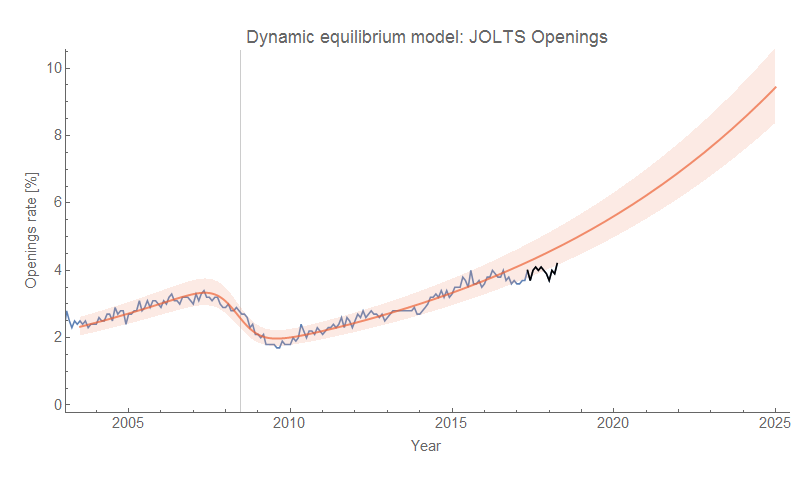
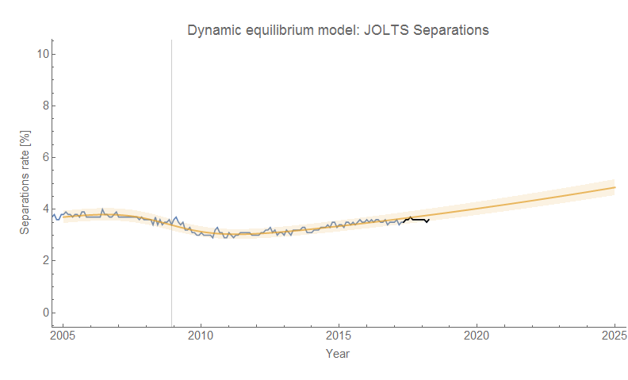
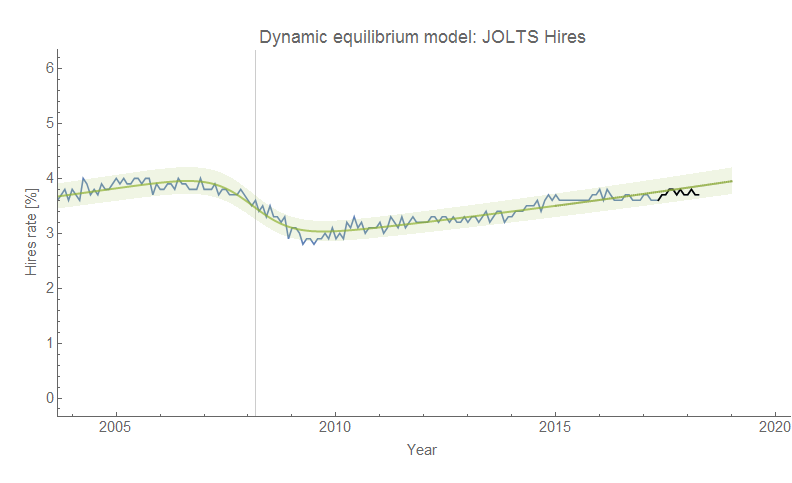
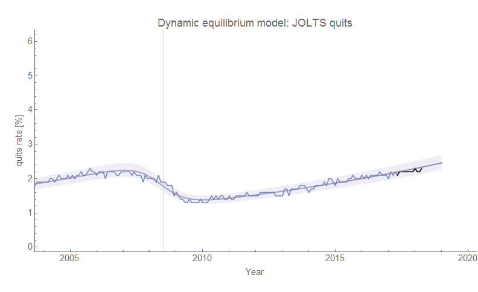
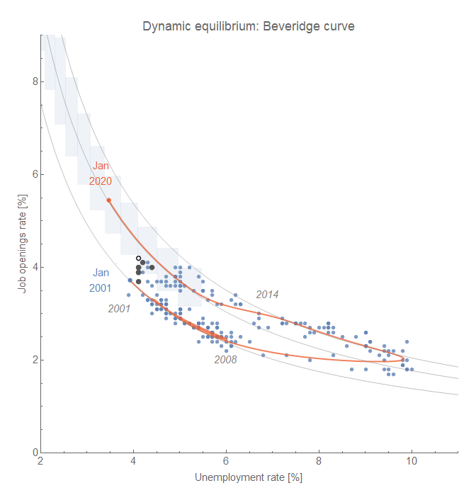

Another month, another [JOLTS data release](https://fred.stlouisfed.org/release?rid=192). However it looks like this time I can with a certain level of confidence say that the "2019" recession \[1\] is underway. It's still not as visible in the hires or quits data (only as biased model error), but job openings (vacancies) are definitely showing a deviation. Job openings appears to have lead the early 2000s recession (but that conclusion is uncertain as JOLTS data is only available from December 2000). Since this is a bold prediction, let me show the updates for all the JOLTS data series I've been watching. Click to enlarge the images.

**Job Openings**

**Separations**

**Hires**

**Quits**

And here are a couple of animations of counterfactual recession centers from June 2018 to June 2019:

To be specific, my prediction is that the current JOLTS job openings data is going to continue to deviate forming a shock (a logistic step function after subtracting the log-linear component) that will become visible (i.e. [detectable with e.g. this algorithm](https://informationtransfereconomics.blogspot.com/2017/04/determining-recessions-with-algorithm.html)) in the unemployment rate [as originally described here](https://informationtransfereconomics.blogspot.com/2017/07/jolts-leading-indicators.html) but also [in my paper](https://papers.ssrn.com/sol3/papers.cfm?abstract_id=3094757). The exact timing of the NBER recession is uncertain (since it seems to depend more on the unemployment rate, which lagged the JOLTS indicators in the previous recession), but the time scale appears to be 2-4 quarters (6 months to a year). The unemployment shock center matches up with the NBER recession centers [within a month or two on average](https://informationtransfereconomics.blogspot.com/2016/10/defining-recessions.html).

[per ALFRED](https://alfred.stlouisfed.org/series?seid=JTSJOR)[this happened last March for the quits and hires rates](https://informationtransfereconomics.blogspot.com/2018/03/jolts-data-day.html)

**Update:**

[also discussed in my paper](https://papers.ssrn.com/sol3/papers.cfm?abstract_id=3094757)

**Footnotes:**

\[1\] I put quotes around the 2019 because the recession is technically already visible in the Job Openings data, but NBER will likely say it began (i.e. the business cycle peaked) in some quarter of 2019 as the unemployment rate shock is probably at least 6 months in the future.
