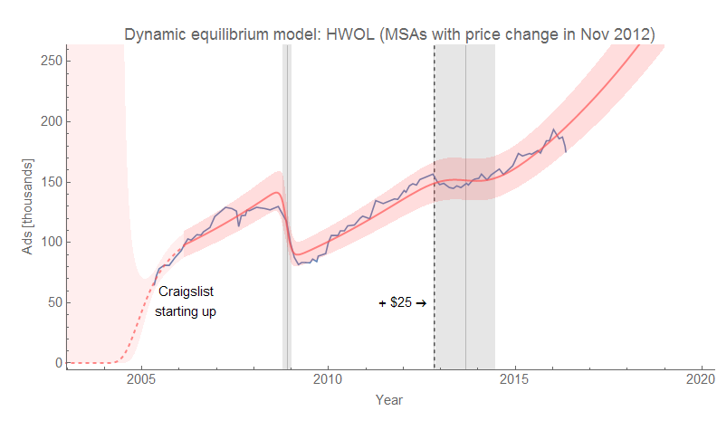
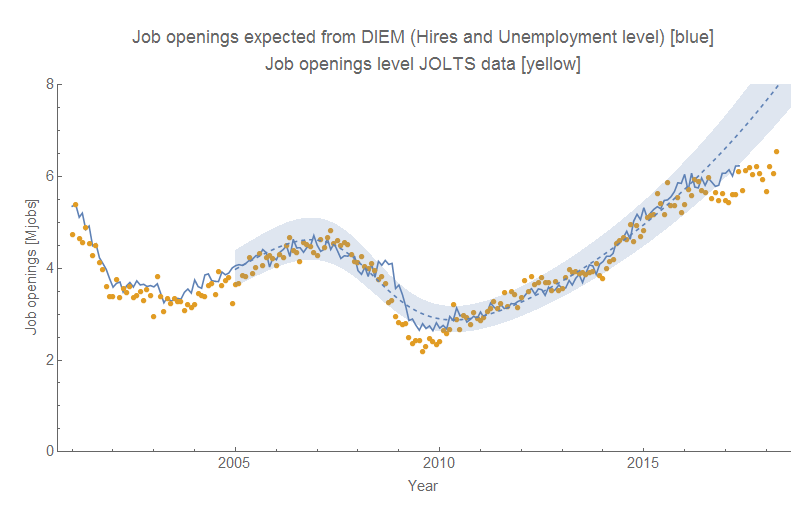
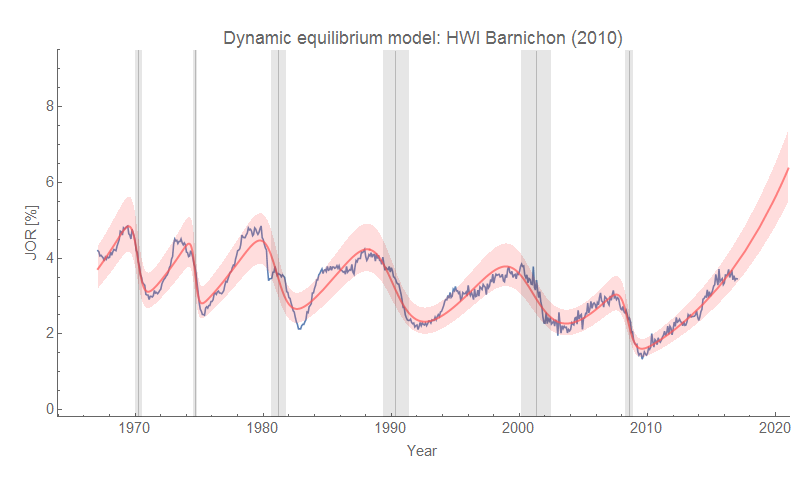
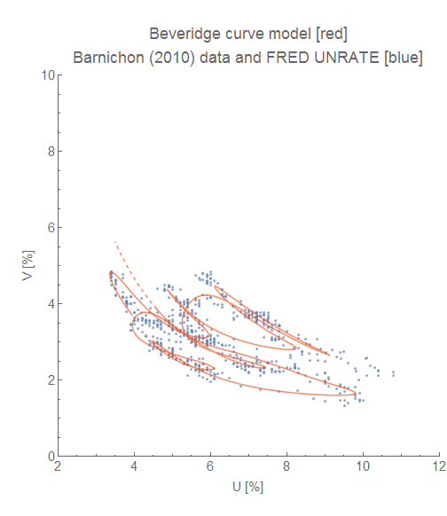
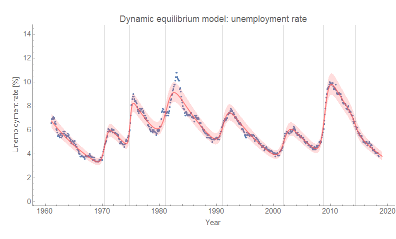

On Twitter, I've gotten into an extended discussion with ["Neoliberal Sellout" @IrvingSwisher](https://twitter.com/IrvingSwisher/status/1004540288935845888) ("NS") about [my bold claim](https://informationtransfereconomics.blogspot.com/2018/06/jolts-data-and-2019-recession.html) that we are seeing the leading edge of a recession in the JOLTS job openings data using the [dynamic information equilibrium model](https://papers.ssrn.com/sol3/papers.cfm?abstract_id=3094757) (DIEM).

Calibration is a general issue in time series data that involves different collection methods or models. It becomes a more significant issue if the calibration is done with knowledge of the model you are testing using the calibrated data! For example, if we corrected the aforementioned HWOL data using the DIEM as a prior, that would be extremely problematic. But that isn't what has been done here.

The main issue (I think — I might be wrong) is whether a) we can trust changes in the JOLTS data as representing information about the business cycle, and b) whether specifically "job openings" maintains a constant definition over time. Let me address these points.

**The "Help Wanted OnLine" (HWOL) case study**

NS [points to a study](https://www.federalreserve.gov/econresdata/notes/feds-notes/2016/a-cautionary-note-on-the-help-wanted-online-data-20160623.html) of the "Help Wanted On-Line" (HWOL) index created by the Conference Board. The study documents how changes in Craigslist's pricing affected the HWOL metric, and it's true that price change appears as a non-equilibrium shock in the DIEM:

Actually, the DIEM is remarkably precise in ascertaining the timing of the shock (the gray band represents the beginning and ending of the shock) as November 2012 (dashed line). However, this shock doesn't represent information about the business cycle — it is a measurement issue. This is NS's point: the data's deviation from the job openings DIEM I used to make a bold claim about an upcoming recession may well be a measurement problem rather than a signal about the business cycle.

This is a reasonable point, and as I show in the model analysis above, something that is not related to the business cycle (except possibly indirectly in that being swamped with ads, Craigslist needed to raise the price to keep their servers from crashing from the traffic) indeed shows up as what might be interpreted as the onset of the "2013 recession".

It could well be that the deviation observed in the JOLTS data is a JOLTS specific shock — note that it appears to affect all the JOLTS series (hires, quits, etc [are also showing a correlated model error](https://informationtransfereconomics.blogspot.com/2018/06/jolts-data-and-2019-recession.html)), so it's not a job openings-specific shock. But this is where additional evidence comes in such [the trend towards yield curve inversion](http://econbrowser.com/archives/2018/06/spreads-watch) as well as the general fact that the timing of recessions is consistent with a Poisson process with a mean time between recessions on the order of 8 years — therefore the probability we will see one in the next couple years is rising. If this was 2011 and T-bill spreads were above 3%, I'd probably put much less confidence in the prediction (however, I'd still make it because predictions are a really nice test of models). But with the 10 year - 3 month spread below 1% and on a declining trend since 2014, I'm much more confident the deviation visible in the JOLTS job openings data represents the leading edge of a recession rather than issues with JOLTS data collection methodology.

**Measuring job openings**

NS also has issues with measuring job openings/vacancies in particular (concatenating some tweets):

> _... The definition of job openings is not at all constant. An index that links across cycles must rely on varying definitions and makes strong assumptions about how they must be linked. That makes the time series have a long history but still makes for a young vector ... Prior methods for constructing a job vacancy measure in other countries have often had to be discontinued or re-constructed. It’s hard to keep a constant methodology that keeps up with technological shifts while avoiding cyclical distortion. ... It may prove empirically negligible (hard to say given changing def’ns) but vacancy measurement is vulnerable to tracking biz cycle here. Might be robust for other purposes but the Craigslist-HWOL is instructive ..._

The DIEM fits with previous data from Barnichon (2010) \[1\] that uses entirely different mix of data sources (i.e. mostly newspapers as there was no world wide web) and therefore necessarily requiring different definitions of "vacancy". The model also describes the other JOLTS series (hires, quits, separations) as well as the unemployment rate \[2\] and employment rates across several countries. This is not to say we should therefore believe the DIEM, but rather we should put little weight on the hypothesis that it's just a coincidence the JOLTS job openings data is also well-described by the DIEM with a comparable level of error to other time series because the job openings data suffers from a series of methodological problems specific to the job openings data that somehow results in a time series that looks for all the world as if it doesn't suffer from those methodological problems. We can call it the "immaculate mis-calibration": despite being totally mis-calibrated, the JOLTS job openings data looks as if it is a well-calibrated, reasonably accurate measure of the labor market.

Additionally, the estimate of the dynamic equilibrium is robust to the "business cycle" (i.e. recession shocks) due to the entropy minimization described in the paper. The prediction of the recession is based on the deviation from this dynamic equilibrium, not the "cyclical" (actually random) shocks in the model -- these are exponentially suppressed.

However we have the further check on the JOLTS job openings data: [we can use the model](https://informationtransfereconomics.blogspot.com/2017/09/search-and-matching-ii-theory.html) to solve for the job openings given the unemployment level and the number of hires. The hires number is less dependent on the methodological issues involved with vacancies (online vs print ads, what constitutes "active recruiting") since it more directly asks if a firm has hired an employee, and NS specifically states the unemployment data is reasonably valid. This check tells us the JOLTS job openings data (yellow) is reasonably close to what we would expect as reconstructed by the model (blue):

Additionally, using the model with this "expected" data series constructed from the hires and unemployment levels, we still see the deviation from the DIEM (blue dashed) for which we posit a shock and a recession.

**Summary**

Overall, this addresses most of NS's points. I'm not entirely sure what the end result we're aiming for is. We should always keep an open mind. I'm not arguing that the model is correct and we shouldn't question it — I'm arguing that the model predicts a shock to JOLTS JOR that will be associated with a rise in the unemployment rate (that we typically associate with a recession). That is to say I am perfectly aware that this prediction may be wrong, and that will be determined by future data. If it is wrong, then we can do a post-mortem and many of the points NS raised will become more salient. If the prediction is correct, NS's points will still be salient for future predictions but less so for this (hypothetically) successful prediction.

Whether or not we believe the prediction going into the "experiment" is in a sense irrelevant. You might select _H0_ = _model is true_ versus _H0_ = _model is false_ based on this, but I (and most other people) pretty much always select the latter as good methodology (i.e. not giving my model the benefit of being the null hypothesis). This is a prediction that was made in order to test the model. That the prediction might be wrong _is precisely the point of making the prediction_.

Basically, NS is arguing why the prediction will be wrong — itself a prediction. This is fine and it's definitely part of Feynman's "leaning over backwards" to present everything that could go wrong (which is why I've written this post to document the points NS makes \[3\]). But it prejudges the future data to say this information invalidates the prediction before the prediction is tested.

**Footnotes:**

\[1\] DIEM for Barnichon (2010) data (click to enlarge):

Also, the resulting Beveridge curve (click to enlarge):

\[2\] The unemployment rate (click to enlarge):

\[3\] What's somewhat ironic is that I could use NS's points _post hoc_ to rationalize why the prediction failed! I'm not going to do that because I'm genuinely interested in a model that demonstrates something true and valid about the real world. I am not interested in the model if it doesn't do that — and it's not like it has some political ideology behind it (it's basically nihilism, which doesn't need mathematical models) that would cause me to hold onto it. While I have put a lot of work into information equilibrium, I don't have any problem moving on to something else. That's actually been how most of my life has gone: working on something for 5-10 years and moving on to something else — QCD, synthetic aperture radar, compressed sensing, economic theory. It's not like I'd even have to give up blogging because very few people care about the information equilibrium models and forecasts. Most of you come for the methodology discussions and macro criticism.
