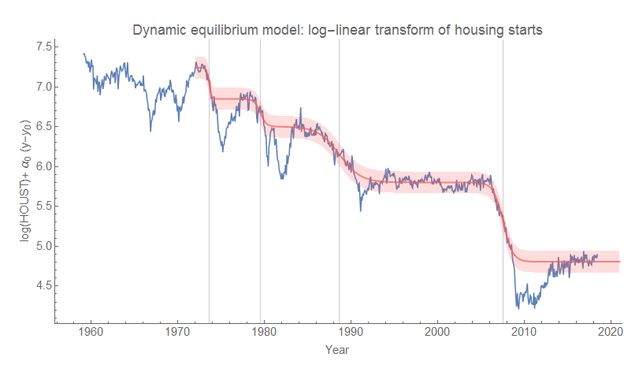

**A:**

For example, I am currently playing around with [housing starts data](https://fred.stlouisfed.org/series/HOUST) and the [dynamic information equilibrium model](https://papers.ssrn.com/sol3/papers.cfm?abstract_id=3094757) (DIEM). It really only looks like the data from about 1990 on can be described by the model (which interestingly matches up with a similar situation with [the ratio of consumption to investment](https://informationtransfereconomics.blogspot.com/2018/06/consumption-over-investment.html)).

However, I noticed something in the data -- if you delete the leading edges of recessions, the DIEM works further back. It's possible that [a step response is involved](https://informationtransfereconomics.blogspot.com/2017/11/unemployment-rate-step-response-over.html); here's the log-linear transform of the data:

It's totally bad methodology to just willy-nilly delete segments of data by eye, and I wouldn't create a forecast with this model result that I'd take seriously. I won't even transform back to the original data representation to help prevent this graph from being used for other purposes. But sometimes I notice _prima facie_ interesting things, and as this blog effectively operates as my [lab notebook](https://en.wikipedia.org/wiki/Lab_notebook) \[1\] I try to document them. They could turn out to be nothing! Why? _Bad methodology!_

**Footnotes**

\[1\] There's apparently an "[open notebook](https://en.wikipedia.org/wiki/Open-notebook_science)" movement that I guess I've been a part of since 2013.
