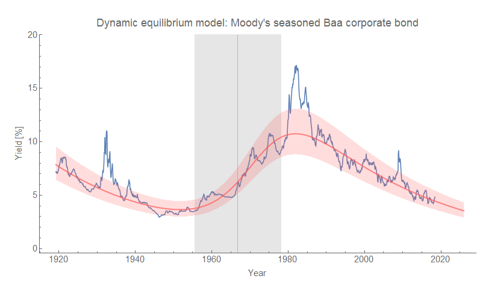
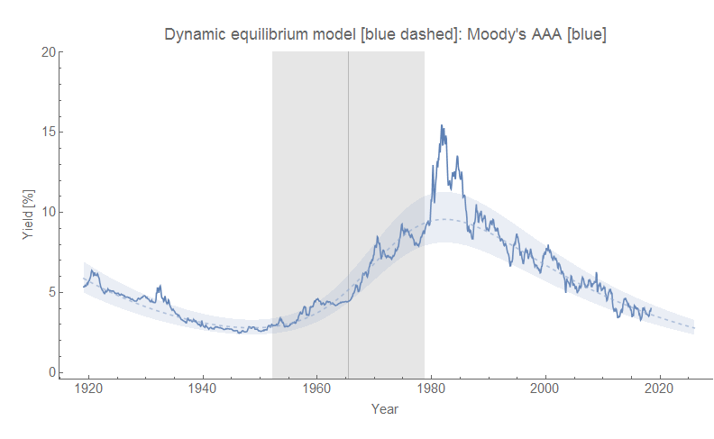
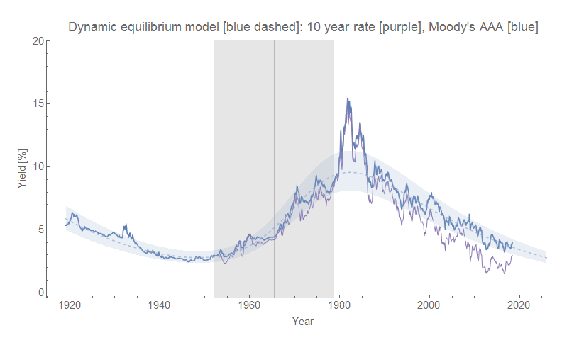
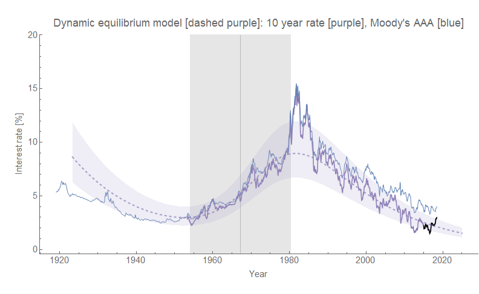
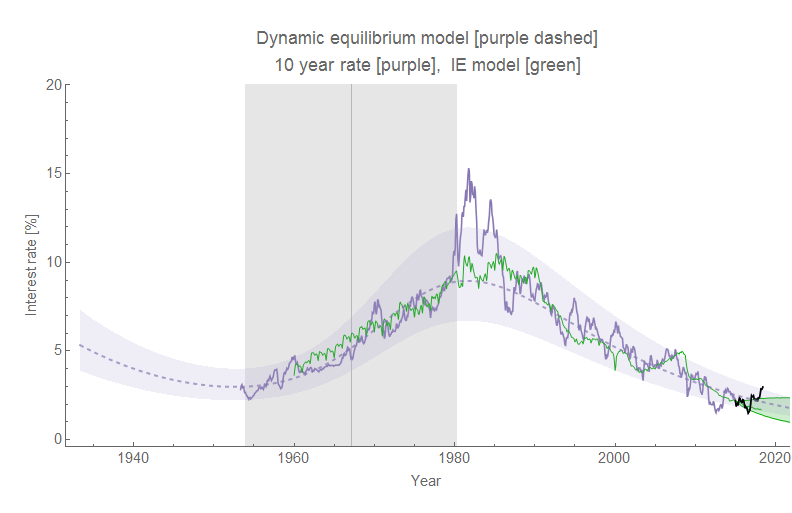
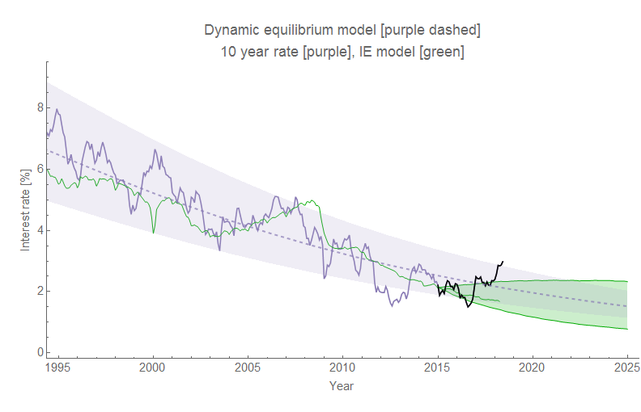

One of the forecasts I've been tracking for nearly 3 years [is the 10-year Treasury interest rate](https://informationtransfereconomics.blogspot.com/2015/08/comparison-of-interest-rate-predictions.html). With the recent interest rate hikes, the data has headed off on a [3-sigma deviation from the model](https://informationtransfereconomics.blogspot.com/2018/05/three-sigma-deviation-in-10-year-rate.html). As discussed in the post on it, it may well be the sign of [the upcoming recession](https://informationtransfereconomics.blogspot.com/2018/06/jolts-data-and-2019-recession.html) (yield curve inversion). That was in the back of my mind when I tried the dynamic equilibrium model on the Moody's seasoned Baa corporate bond yield data (I recently referred to [this post](https://growthecon.com/blog/BGP-Empirics/) which had the time series in it, prompting me to take a look).

The model basically fits the data except for the freak-outs in the Great Depression, the 80s, and the Great Recession.

When I saw these results, I immediately thought back to when I tried this same trick using 10-year Treasury data, but never blogged about the results because it was so uncertain (the shock is incomplete as the data on FRED only goes back to the 1950s). The AAA corporate bond is close enough to the 10 year that it could be a proxy as well as serve as a higher probability Bayesian prior for the 10-year rate model.

We can see the recent rise in interest rates is still on a deviation from the model (outside the 90% confidence interval), but it's much less significant. However, if we compare the IE model (green) with the dynamic equilibrium model they are largely consistent \[1\]:

Zooming in to the same region as [the forecast I've been tracking](https://informationtransfereconomics.blogspot.com/2018/05/three-sigma-deviation-in-10-year-rate.html):

Again, consistent. In a sense, this is a good check on the methodology since they should be consistent (the dynamic information equilibrium model is a more generic version of an IE model because the latter specifies what the market is while the former just says the observable is a "price" of some kind — see \[1\]). [Notationally](https://informationtransfereconomics.blogspot.com/2016/09/basic-definitions-in-information.html), IE claims "_p_ : _A_ ⇄ _B_" while dynamic equilibrium just claims "_p_" for some _A_ and _B_ \[2\].

**Footnotes:**

\[1\] This of course makes sense because the interest rate is acting as a price in both models, it's just that the information equilibrium model specifies the price of what (i.e. nominal output is demand for "money", with the interest rate being the price of "money") while the dynamic equilibrium approach is agnostic — only making an assumption that the supply of whatever and its demand are both growing at some rate (if we took it to be the IE specification, these growth rates would be NGDP growth _ν_ and M0 growth _μ_ such that the dynamic equilibrium is (_k −_ 1) _μ_ \= _ν −_ _μ_).

\[2\] Dynamic equilibrium can also just claim "_A/B_".
