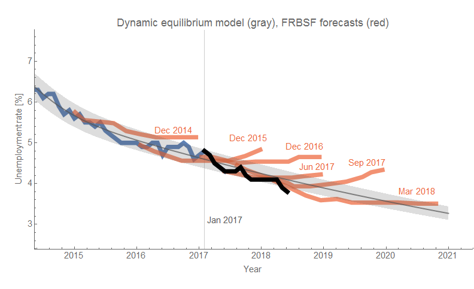

The latest unemployment data came out last Friday, and despite the current president wanting to take credit (read [Justin Wolfer's twitter thread](https://twitter.com/JustinWolfers/status/1002534790388682752)) it's really just a continuation of [the dynamic information equilibrium model trend](https://papers.ssrn.com/sol3/papers.cfm?abstract_id=3094757).

It's true it is a bit below the 90% confidence region, but we should expect at about two of the 17 post-forecast points to fall out side it (which is roughly what's happened). If fewer than 10% of the points fell outside the region, we've likely estimated our errors too conservatively (or there is a model that could do better). Plus, there are the annual data revisions from BLS that come with the January numbers.

Overall, the continued decline in the unemployment rate is expected and the possible turnaround with the next recession will be first seen in e.g. [JOLTS data](https://informationtransfereconomics.blogspot.com/2018/05/vacancy-yield-and-labor-market-analysis.html).
